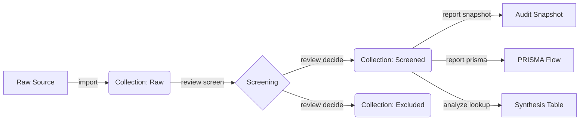

<!-- BADGES_START -->
     
<!-- BADGES_END -->

# Zotero CLI: The Systematic Review Forge


> **The Researcher's Command Line Interface.**
> Rigorous Systematic Literature Reviews (SLR), made scriptable.

`zotero-cli` is a high-performance platform built on two symbiotic pillars:

### 1. Direct Zotero Management (The Engine)
For power users who need atomic control over their library without the GUI.
*   **Item & Collection Ops:** Full lifecycle management (create, rename, recursive delete).
*   **Tagging:** Batch taxonomy processing and cleanup.
*   **Storage Offloading:** Move heavy PDF attachments to local storage (NAS/External) while keeping metadata linked.
*   **Local API:** A FastAPI server to bridge your library with local scripts and dashboards.

### 2. Systematic Review Support (The Protocol)
Advanced features mapped to the **Kitchenham/Wohlin** research methodology.
*   **Search & Collect:** Direct arXiv integration and multi-source ingestion (BibTeX, RIS, CSV).
*   **Interactive Screening:** High-velocity Title/Abstract screening via a custom TUI.
*   **SDB v1.1 (Standardized Decision Block):** Immutable, machine-readable audit trails for every screening decision stored in Zotero notes.
*   **Hybrid Workflow:** Inject screening decisions from external researchers via CSV import.
*   **Reporting:** Automated PRISMA 2020 statistics and Mermaid visualization.

## 🌟 The SLR Workflow (v2.0)

We support the rigorous **Kitchenham/Wohlin** review protocol.



## 📚 Command Reference

Detailed documentation is available for each command noun:

| Noun | Description | Key Verbs |
| :--- | :--- | :--- |
| **[`init`](docs/commands/init.md)** | Configuration | `(default)` |
| **[`slr`](docs/commands/slr.md)** | SLR Workflow | `screen`, `decide`, `audit`, `lookup`, `graph`, `shift` |
| **[`analyze`](docs/commands/analyze.md)** | (Deprecated) | Use `slr` |
| **[`review`](docs/commands/review.md)** | (Deprecated) | Use `slr` |
| **[`audit`](docs/commands/audit.md)** | (Deprecated) | Use `slr audit` |
| **[`item`](docs/commands/item.md)** | Paper/Item Ops | `inspect`, `move`, `update`, `delete`, `pdf`, `hydrate` |
| **[`collection`](docs/commands/collection.md)** | Folder Ops | `list`, `create`, `rename`, `delete`, `backup`, `clean`, `duplicates` |
| **[`import`](docs/commands/import.md)** | Ingest | `arxiv`, `file (IEEE/Springer/Canonical)` |
| **[`report`](docs/commands/report.md)** | Output | `prisma`, `snapshot`, `screening`, `status` |
| **[`tag`](docs/commands/tag.md)** | Taxonomy | `list`, `add`, `remove`, `purge` |
| **[`list`](docs/commands/list.md)** | Generic List | `items`, `collections`, `groups` |
| **[`storage`](docs/commands/storage.md)** | Maintenance | `checkout` |
| **[`serve`](docs/commands/serve.md)** | Integration | `(default)` |
| **[`system`](docs/commands/system.md)** | Maintenance | `backup`, `restore`, `normalize`, `info` |

## 🚀 Key v2.0 Features

*   **Standardized CSV:** A unified canonical format for importing from IEEE, Springer, and BibTeX.
*   **System Portability:** Full library or scoped collection backup to `.zaf` (LZMA compressed).
*   **Drift Detection:** `analyze shift` detects if items have moved between snapshots.
*   **Set Integrity:** `review prune` ensures your Included and Excluded sets are disjoint.
*   **Audit Dashboard:** `report status` provides a Rich TUI dashboard of your screening progress.

---

## Quick Start

### 1. Install
```bash
pip install zotero-cli
```

### 2. Configure
```bash
zotero-cli system info  # Check if config is found
```

## Development & Contribution

We follow strict **SOLID** principles, 100% Mypy compliance, and mandatory E2E verification.

```bash
git clone https://github.com/fchicout/zotero-cli.git
cd zotero-cli
pip install -e ".[dev]"
pytest --cov=src
```

## License
MIT License. See [LICENSE](LICENSE) for details.