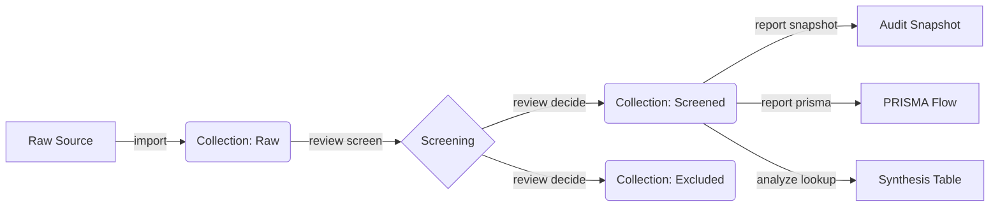

# zotero-cli


> **The Researcher's Command Line Interface.**
> Rigorous Systematic Literature Reviews (SLR), made scriptable.

**zotero-cli** transforms Zotero from a reference manager into a **Systematic Review Engine**. It follows the **Noun-Verb** pattern for a clean, predictable automation experience.

## 🌟 The SLR Workflow (v2.0)

We support the rigorous **Kitchenham/Wohlin** review protocol.



## 📚 Command Reference

Detailed documentation is available for each command noun:

| Noun | Description | Key Verbs |
| :--- | :--- | :--- |
| **[`review`](docs/commands/review.md)** | SLR Workflow | `screen`, `decide`, `audit`, `sync-csv`, `migrate` |
| **[`item`](docs/commands/item.md)** | Paper/Item Ops | `inspect`, `move`, `update`, `delete`, `pdf` |
| **[`collection`](docs/commands/collection.md)** | Folder Ops | `list`, `create`, `rename`, `delete`, `clean`, `duplicates` |
| **[`import`](docs/commands/import.md)** | Ingest | `arxiv`, `bib`, `ris` |
| **[`report`](docs/commands/report.md)** | Output | `prisma`, `snapshot`, `screening`, `status` |
| **[`analyze`](docs/commands/analyze.md)** | Analytics | `audit`, `lookup`, `graph` |
| **[`tag`](docs/commands/tag.md)** | Taxonomy | `list`, `add`, `remove`, `purge` |
| **[`list`](docs/commands/list.md)** | Generic List | `items`, `collections`, `groups` |
| **[`find`](docs/commands/find.md)** | Discovery | `arxiv` |
| **[`system`](docs/commands/system.md)** | Diagnostics | `info`, `groups` |

## 🚀 Guided Tours

Learn how to use **zotero-cli** through narrative scenarios:

1.  **[The First Search](docs/tours/01-first-search.md):** From ArXiv query to initial collection.
2.  **[The Title/Abstract Sprint](docs/tours/02-screening-sprint.md):** Using the TUI to screen 500 papers in one sitting.
3.  **[The Audit Trail](docs/tours/03-audit-trail.md):** Generating snapshots and PRISMA reports for your paper's appendix.

---

## Quick Start

### 1. Install
```bash
pip install zotero-cli
```

### 2. Configure
```bash
zotero-cli system info  # Check if config is found
```

## Development & Contribution

We follow strict **SOLID** principles and high test coverage requirements.

```bash
git clone https://github.com/fchicout/zotero-cli.git
cd zotero-cli
pip install -e ".[dev]"
pytest --cov=src
```

## License
MIT License. See [LICENSE](LICENSE) for details.
