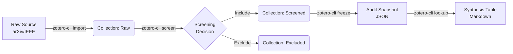

# zotero-cli


> **The Researcher's Command Line Interface.**
> Rigorous Systematic Literature Reviews (SLR), made scriptable.

**zotero-cli** transforms Zotero from a reference manager into a **Systematic Review Engine**. It automates the "tedious but critical" tasks: screening 1,000 abstracts, freezing audit trails, and generating PRISMA-ready data tables.

## 🌟 The SLR Workflow (v0.4.0)

We support the rigorous **Kitchenham/Wohlin** review protocol out of the box.



### 1. ⚡ Interactive Screening (`screen`)
Stop clicking. Start reading. A TUI "Tinder-for-Papers" interface to speed up Title/Abstract screening by 5x.
```bash
zotero-cli screen --source "raw_arXiv" --include "screened" --exclude "excluded"
# [I]nclude, [E]xclude, [S]kip items with single keystrokes.
# Automatically attaches JSON audit notes (e.g., {"decision": "EXCLUDE", "code": "EC1"})
```

### 2. 🧊 Audit Freezing (`freeze`)
Science must be reproducible. Create an immutable JSON snapshot of your review state, including every decision note.
```bash
zotero-cli freeze --collection "screened" --output "snapshot_2026-01-12.json"
# Captures items + child notes + attachment metadata.
```

### 3. 📊 Synthesis Tables (`lookup`)
Generate your "Selected Studies" table directly from Zotero keys. No manual copy-pasting.
```bash
zotero-cli lookup --keys "KEY1,KEY2" --fields "arxiv_id,title,year" --format table
```

---

## 🚀 Quick Start

### Installation
```bash
pip install zotero-cli
```

### Configuration
```bash
export ZOTERO_API_KEY="your_key"
export ZOTERO_TARGET_GROUP="https://zotero.org/groups/123"
```

---

## 📚 Feature Reference

| Category | Command | Description |
| :--- | :--- | :--- |
| **SLR Ops** | `screen` | **(NEW)** Interactive TUI for rapid paper screening. |
| | `decision` | **(NEW)** Record a screening decision (CLI/Agent mode). |
| | `freeze` | **(NEW)** Snapshot a collection to JSON for audit. |
| | `lookup` | **(NEW)** Bulk fetch metadata table for synthesis. |
| **Import** | `import` | Bulk import from arXiv query. |
| | `bibtex` / `ris` | Import standard bibliography files. |
| **Manage** | `audit` | Check for missing PDFs, DOIs, or Abstracts. |
| | `duplicates` | Find potential duplicates across collections. |
| | `attach-pdf` | Auto-fetch PDFs via Unpaywall. |
| **Graph** | `graph` | Generate Graphviz DOT files of citation networks. |

## Development

```bash
git clone https://github.com/fchicout/zotero-cli.git
cd zotero-cli
pip install -e ".[dev]"
pytest
```

## License
MIT License.