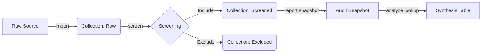

# zotero-cli


> **The Researcher's Command Line Interface.**
> Rigorous Systematic Literature Reviews (SLR), made scriptable.

**zotero-cli** transforms Zotero from a reference manager into a **Systematic Review Engine**. It automates the "tedious but critical" tasks: screening 1,000 abstracts, freezing audit trails, and generating PRISMA-ready data tables.

## 🌟 The SLR Workflow (v1.0.0)

We support the rigorous **Kitchenham/Wohlin** review protocol out of the box.



### 1. ⚡ Interactive Screening (`screen`)
Stop clicking. Start reading. A TUI "Tinder-for-Papers" interface to speed up Title/Abstract screening by 5x.
```bash
zotero-cli screen --source "raw_arXiv" --include "screened" --exclude "excluded"
# [I]nclude, [E]xclude, [S]kip items with single keystrokes.
```

### 2. 📥 Universal Import (`import`)
Ingest papers from any source.
```bash
zotero-cli import file papers.bib --collection "MySearch"
zotero-cli import arxiv --query "AI AND Security" --collection "MySearch"
```

### 3. 📊 PRISMA Reporting (`report`)
Generate PRISMA 2020 statistics and Mermaid-based flowcharts automatically.
```bash
zotero-cli report prisma --collection "screened" --output-chart "prisma.png"
```

### 4. 🧹 Maintenance (`manage`)
Keep your library clean and compliant.
```bash
zotero-cli manage clean --collection "Trash"
zotero-cli manage duplicates --collections "Search1,Search2"
```

---

## 🚀 Quick Start

### 📚 Tutorials
*   **[Getting Started: Installation & Setup](./docs/tutorials/01-getting-started.md)** - For absolute beginners.
*   **[Your First Systematic Review](./docs/tutorials/02-slr-workflow.md)** - How to use the screening engine.

### Installation
```bash
pip install zotero-cli
```

### Configuration
```bash
export ZOTERO_API_KEY="your_key"
export ZOTERO_USER_ID="your_id"
```

---

## 📚 Command Reference

**Global Flags:**
*   `--user`: Force the use of your Personal Library (ignores `ZOTERO_TARGET_GROUP`).

| Category | Command | Subcommand | Description |
| :--- | :--- | :--- | :--- |
| **Workflow** | `screen` | | Interactive TUI for screening. |
| | `decide` | | Record a decision (CLI mode). |
| **Ingest** | `import` | `file` | Import .bib, .ris, .csv files. |
| | | `arxiv` | Import from arXiv query. |
| | | `manual` | Add a single paper manually. |
| **Discovery** | `info` | | Display current configuration & context. |
| | `list` | `collections` | List all collections. |
| | | `groups` | List user groups. |
| | | `items` | List items (filtered) in a collection. |
| | `inspect` | | Show deep details/children of an item. |
| | `find` | `arxiv` | Search arXiv (read-only). |
| **Output** | `report` | `prisma` | Generate PRISMA stats & charts. |
| | | `snapshot` | Create JSON audit trail. |
| **Manage** | `manage` | `tags` | List, rename, delete tags. |
| | | `pdfs` | Fetch or strip PDFs. |
| | | `duplicates` | Find duplicate items. |
| | | `move` | Move items between collections. |
| | | `clean` | Empty a collection. |
| | | `migrate` | Upgrade audit notes to SDB v1.1. |
| **Analyze** | `analyze` | `audit` | Check for missing metadata/PDFs. |
| | | `lookup` | Bulk metadata fetch. |
| | | `graph` | Generate citation graph. |

## Development

```bash
git clone https://github.com/fchicout/zotero-cli.git
cd zotero-cli
pip install -e ".[dev]"
pytest
```

## License
MIT License.
