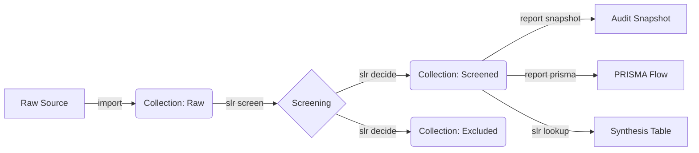

<!-- BADGES_START -->


<!-- BADGES_END -->

# Zotero CLI: The Systematic Review Forge

> **The Researcher's Command Line Interface.**

> Rigorous Systematic Literature Reviews (SLR), made scriptable.

`zotero-cli` is a high-performance platform built on two symbiotic pillars:

### 1. Direct Zotero Management (The Engine)
For power users who need atomic control over their library without the GUI.
*   **Item & Collection Ops:** Full lifecycle management (create, rename, recursive delete).
*   **Tagging:** Batch taxonomy processing and cleanup.
*   **Storage Offloading:** Move heavy PDF attachments to local storage (NAS/External) while keeping metadata linked.
*   **Local API:** A FastAPI server to bridge your library with local scripts and dashboards.

### 2. Systematic Review Support (The Protocol)
Advanced features mapped to the **Kitchenham/Wohlin** research methodology.
*   **Search & Collect:** Direct arXiv integration and multi-source ingestion (BibTeX, RIS, CSV).
*   **Interactive Screening:** High-velocity Title/Abstract screening via a custom TUI.
*   **SDB v1.2 (Standardized Decision Block):** Immutable, machine-readable audit trails for every screening decision stored in Zotero notes.
*   **Hybrid Workflow:** Inject screening decisions from external researchers via CSV import.
*   **Reporting:** Automated PRISMA 2020 statistics and Mermaid visualization.

## 🌟 The SLR Workflow (v2.4)

We support the rigorous **Kitchenham/Wohlin** review protocol.


```mermaid
graph LR
    A[Raw Source] -->|import| B(Collection: Raw)
    B -->|slr screen| C{Screening}
    C -->|slr decide| D(Collection: Screened)
    C -->|slr decide| E(Collection: Excluded)
    D -->|report snapshot| F[Audit Snapshot]
    D -->|report prisma| G[PRISMA Flow]
    D -->|slr lookup| H[Synthesis Table]
```

## 📚 Command Reference

Detailed documentation is available for each command noun:

| Noun | Description | Key Verbs |
| :--- | :--- | :--- |
| **[`init`](docs/commands/init.md)** | Config | `(default)` |
| **[`item`](docs/commands/item.md)** | Items | `list`, `inspect`, `export`, `pdf`, `hydrate`, `purge` |
| **[`collection`](docs/commands/collection.md)** | Folders | `list`, `create`, `delete`, `export`, `clean`, `duplicates`, `backup` |
| **[`rag`](docs/commands/rag.md)** | Knowledge | `ingest`, `query`, `context` |
| **[`import`](docs/commands/import.md)** | Ingest | `arxiv`, `doi`, `file (IEEE/Springer/Canonical)` |
| **[`search`](docs/commands/search.md)** | Finder | `(default)`, `--doi`, `--title` |
| **[`report`](docs/commands/report.md)** | Output | `prisma`, `snapshot`, `screening`, `status`, `pdf` |
| **[`slr`](docs/commands/slr.md)** | SLR | `screen`, `decide`, `load`, `verify`, `extract`, `snowball`, `sdb` |
| **[`system`](docs/commands/system.md)** | Operations | `info`, `groups`, `backup`, `restore` |
| **[`tag`](docs/commands/tag.md)** | Taxonomy | `list`, `add`, `remove`, `purge` |
| **[`find-pdf`](docs/commands/find-pdf.md)** | PDF Resilience | `(default)` |
| **[`storage`](docs/commands/storage.md)** | Maintenance | `checkout` |
| **[`serve`](docs/commands/serve.md)** | Integration | `(default)` |

## 🚀 Key Features

*   **Workflow Resilience:** Safe protocol clearing via `slr reset` with explicit protection for manual notes.
*   **Automated Relocation:** Automatic item movement to target collections during CSV import with `slr load`.
*   **SDB v1.2 Intelligence:** Machine-readable audit trails with persona and phase-aware metadata.
*   **System Portability:** Full library or scoped collection backup to `.zaf` (LZMA compressed).
*   **Drift Detection:** `slr shift` detects if items have moved between snapshots.
*   **Set Integrity:** `slr prune` ensures your Included and Excluded sets are disjoint.
*   **Audit Dashboard:** `report status` provides a Rich TUI dashboard of your screening progress.

---

## 📦 Installation

### Option 1: Standalone Binaries (Recommended)
Download the pre-compiled binary for your operating system. **No Python installation is required.**

*   **Windows:** Download the `.msi` installer or `.zip` from [Latest Releases](https://github.com/fchicout/zotero-cli/releases/latest).
*   **Linux (Ubuntu/Debian):** Download the `.deb` package.
*   **Linux (Fedora/RHEL):** Download the `.rpm` package.
*   **Generic Linux:** Download the `zotero-cli-linux-amd64.tar.gz`.

### Option 2: Installation from Source (Python 3.10+)
If you prefer to run the tool within a Python environment:

```bash
git clone https://github.com/fchicout/zotero-cli.git
cd zotero-cli
pip install .
```

> *Note: Official PyPI distribution is coming soon. Use source installation for the latest SLR features.*

### ⚙️ Configuration
```bash
zotero-cli system info  # Check if config is found
```

## 👨‍🍳 Researcher's Cookbook

Translate your research intentions directly into execution.

### 1. The "Clean Start" (Ingestion & Validation)
**Intent:** *"Get everything about Deep Learning from ArXiv, put it in 'Raw', and tell me what's missing metadata or PDFs."*
```bash
# Ingest papers directly from ArXiv into a specific collection
zotero-cli import arxiv "deep learning" --collection "Raw"

# Audit the collection for missing PDFs, DOIs, or Abstracts
zotero-cli slr validate --collection "Raw"
```

### 2. The "High-Velocity Screen" (Protocol Execution)
**Intent:** *"I want to screen these 500 papers using my keyboard and record machine-readable audit trails."*
```bash
# Launch the interactive TUI to screen papers. 
# Decisions are stored as immutable JSON notes (SDB v1.2) automatically.
zotero-cli slr screen --source "Raw" --include "Phase1" --exclude "Excluded"
```

### 3. The "Smart Discovery" (Deep Search)
**Intent:** *"List all the papers that Dr. Silas rejected specifically because they were 'Short Papers' (EC1)."*
```bash
# Filter your library using the SDB intelligence engine. 
# Dynamic UI highlights the exclusion criteria and persona.
zotero-cli item list --excluded --criteria EC1 --persona "Dr. Silas"
```

### 4. The "Retroactive Sync" (Automation)
**Intent:** *"Import screening decisions from my colleague's CSV, update Zotero, and move the accepted items to the 'Final' folder."*
```bash
# Enrich metadata from CSV and automate the physical organization of items
zotero-cli slr load results.csv --reviewer "Elena" --move-to-included "Final" --force
```

### 5. The "Scientific Evidence" (Reporting)
**Intent:** *"Give me the exact numbers for my PRISMA flowchart and generate a citation graph."*
```bash
# Calculate PRISMA 2020 statistics across the entire library
zotero-cli report prisma

# Export a DOT file of the citation relationships between collections
zotero-cli slr graph --collections "Phase1,Phase2" > graph.dot
```

### 6. The "Portable Vault" (System Backup)
**Intent:** *"Back up my entire research project, including all those heavy PDFs, into a single compressed file I can send to my supervisor."*
```bash
# Create a full system backup (.zaf) containing items, collections, tags, and attachments.
# Optimized with LZMA compression for storage portability.
zotero-cli system backup --output my_research_2026.zaf
```

## Development & Contribution

We follow strict **SOLID** principles, 100% Mypy compliance, and mandatory E2E verification.

```bash
git clone https://github.com/fchicout/zotero-cli.git
cd zotero-cli
pip install -e ".[dev]"
pytest --cov=src
```

## License
MIT License. See [LICENSE](LICENSE) for details.