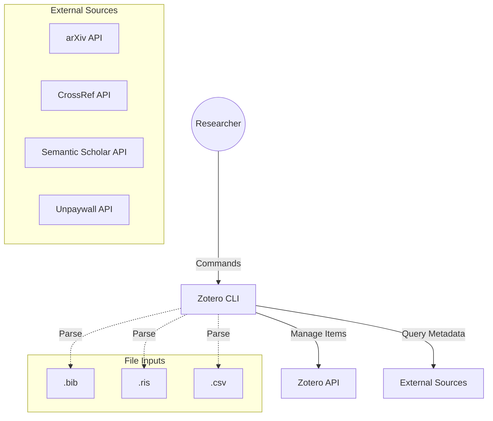

# Architecture & Design

## System Context (C4 Context)



## Internal Design (Components)

The application follows a **Hexagonal Architecture** (Ports & Adapters) variant.

### Layers

1.  **CLI Layer (`zotero_cli.cli`)**
    *   **Responsibility:** Argument parsing, user feedback (stdout/stderr), and invoking the Application Facade.
    *   **Components:** `main.py` (Argparse).

2.  **Application Layer (`zotero_cli.client`)**
    *   **Responsibility:** Orchestration. Connects the CLI requests to the Domain Services.
    *   **Components:** `PaperImporterClient`.

3.  **Domain Layer (`zotero_cli.core`)**
    *   **Responsibility:** Business logic, data models, and interfaces.
    *   **Models:** `ResearchPaper`, `ZoteroItem`.
    *   **Services:**
        *   `MetadataAggregatorService`: Merges data from multiple sources.
        *   `CitationGraphService`: Builds Graphviz DOT files.
        *   `DuplicateFinder`: Identifies dupes by DOI/Title.
        *   `CollectionAuditor`: Verifies item completeness.

4.  **Infrastructure Layer (`zotero_cli.infra`)**
    *   **Responsibility:** Implementation of interfaces (Gateways).
    *   **Adapters:**
        *   `ZoteroAPIClient`: Wrapper around `requests` for Zotero.
        *   `ArxivLibGateway`: Wrapper for `arxiv` package.
        *   `BibtexLibGateway`: Wrapper for `bibtexparser`.
        *   `RisLibGateway`: Wrapper for `rispy`.

## Data Flow: Metadata Aggregation

When importing a paper or attaching a PDF, we use a "Best Effort" strategy to gather metadata.

```mermaid
sequenceDiagram
    participant User
    participant CLI
    participant Aggregator
    participant S2 as Semantic Scholar
    participant CR as CrossRef
    participant UP as Unpaywall
    
    User->>CLI: import "DOI:10.1234/x"
    CLI->>Aggregator: get_enriched_metadata("10.1234/x")
    par Parallel Fetch
        Aggregator->>S2: Get Metadata
        Aggregator->>CR: Get Metadata
        Aggregator->>UP: Get PDF URL
    end
    S2-->>Aggregator: {Title, Abstract, Refs}
    CR-->>Aggregator: {Year, Publication}
    UP-->>Aggregator: {PDF_URL}
    Aggregator->>Aggregator: Merge & Deduplicate
    Aggregator-->>CLI: ResearchPaper(Merged)

## Data Contracts

### 1. Snapshot Artifact (`report snapshot`)
The snapshot command produces a single JSON file that serves as an immutable audit trail for a collection.

**Schema Version:** 1.0

```json
{
  "meta": {
    "timestamp": "ISO-8601 UTC",
    "collection_name": "string",
    "collection_id": "string",
    "total_items_found": "int",
    "items_processed_successfully": "int",
    "items_failed": "int",
    "tool_version": "string",
    "schema_version": "1.0",
    "status": "success | partial_success"
  },
  "failures": [
    {
      "key": "string",
      "title": "string",
      "error": "string"
    }
  ],
  "items": [
    {
      "key": "string",
      "version": "int",
      "item_type": "string",
      "title": "string",
      "abstract": "string",
      "doi": "string",
      "arxiv_id": "string",
      "url": "string",
      "date": "string",
      "authors": ["string"],
      "collections": ["string"],
      "tags": ["string"],
      "children": [
        { "raw_zotero_json_object": "..." }
      ]
    }
  ]
}
```

```
