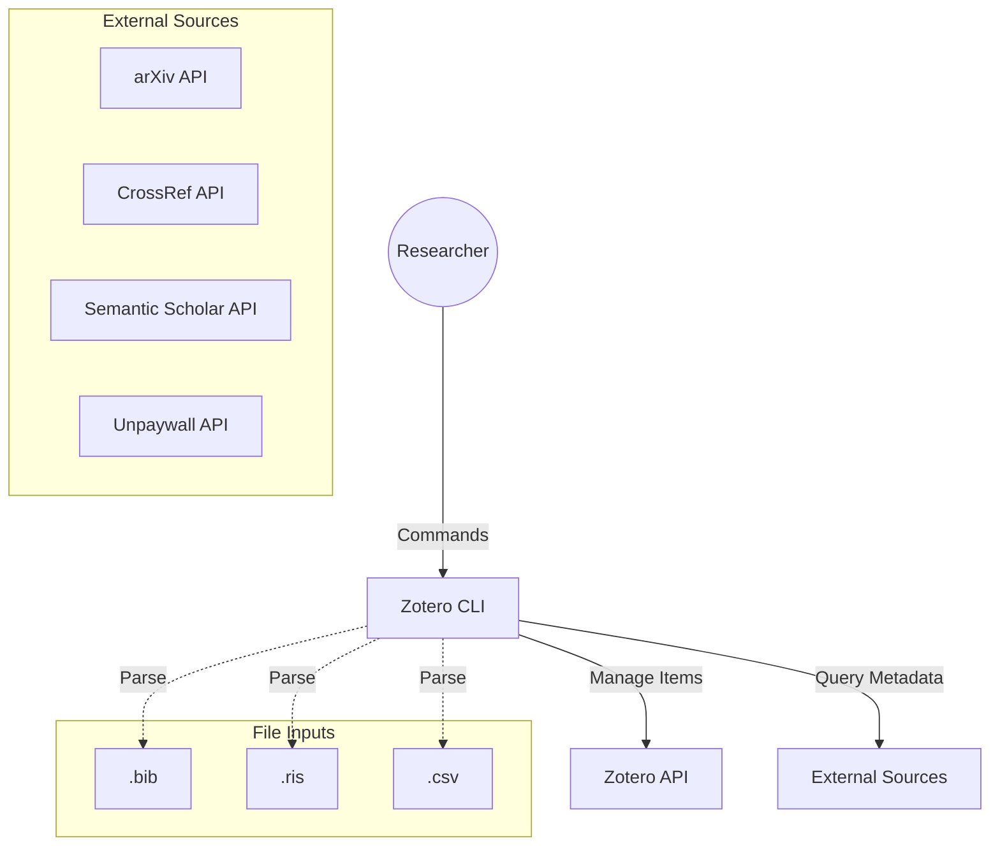
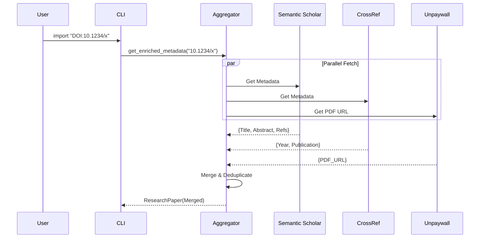

# Architecture & Design

## System Context (C4 Context)


```mermaid
graph TD
    User((Researcher))
    CLI[Zotero CLI]
    Zotero[Zotero API]
    ExtSources[External Sources]
    
    User -->|Commands| CLI
    CLI -->|Manage Items| Zotero
    CLI -->|Query Metadata| ExtSources
    
    subgraph External Sources
        ArXiv[arXiv API]
        CrossRef[CrossRef API]
        S2[Semantic Scholar API]
        Unpaywall[Unpaywall API]
    end
    
    subgraph File Inputs
        BibTeX[.bib]
        RIS[.ris]
        CSV[.csv]
    end
    
    CLI -.->|Parse| BibTeX
    CLI -.->|Parse| RIS
    CLI -.->|Parse| CSV
```

## Internal Design (Components)

The application follows a **Hexagonal Architecture** (Ports & Adapters) variant.

### Layers

1.  **CLI Layer (`zotero_cli.cli`)**
    *   **Responsibility:** Argument parsing, user feedback (stdout/stderr), and invoking the Application Facade.
    *   **Components:** `main.py` (Argparse).

2.  **Application Layer (`zotero_cli.client`)**
    *   **Responsibility:** Orchestration. Connects the CLI requests to the Domain Services.
    *   **Components:** `PaperImporterClient`.

3.  **Domain Layer (`zotero_cli.core`)**
    *   **Responsibility:** Business logic, data models, and interfaces.
    *   **Models:** `ResearchPaper`, `ZoteroItem`.
    *   **Services:**
        *   `MetadataAggregatorService`: Merges data from multiple sources.
        *   `CitationGraphService`: Builds Graphviz DOT files.
        *   `DuplicateFinder`: Identifies dupes by DOI/Title.
        *   `IntegrityService`: Verifies item completeness.

4.  **Infrastructure Layer (`zotero_cli.infra`)**
    *   **Responsibility:** Implementation of interfaces (Gateways).
    *   **Adapters:**
        *   `ZoteroAPIClient`: Wrapper around `requests` for Zotero.
        *   `ArxivLibGateway`: Wrapper for `arxiv` package.
        *   `BibtexLibGateway`: Wrapper for `bibtexparser`.
        *   `RisLibGateway`: Wrapper for `rispy`.

## Data Flow: Metadata Aggregation

When importing a paper or attaching a PDF, we use a "Best Effort" strategy to gather metadata.


```mermaid
sequenceDiagram
    participant User
    participant CLI
    participant Aggregator
    participant S2 as Semantic Scholar
    participant CR as CrossRef
    participant UP as Unpaywall
    
    User->>CLI: import "DOI:10.1234/x"
    CLI->>Aggregator: get_enriched_metadata("10.1234/x")
    par Parallel Fetch
        Aggregator->>S2: Get Metadata
        Aggregator->>CR: Get Metadata
        Aggregator->>UP: Get PDF URL
    end
    S2-->>Aggregator: {Title, Abstract, Refs}
    CR-->>Aggregator: {Year, Publication}
    UP-->>Aggregator: {PDF_URL}
    Aggregator->>Aggregator: Merge & Deduplicate
    Aggregator-->>CLI: ResearchPaper(Merged)
```

## Data Contracts

### 1. Snapshot Artifact (`report snapshot`)
The snapshot command produces a single JSON file that serves as an immutable audit trail for a collection.
Written by `core/services/snapshot_service.py::SnapshotWriter`; diffed between two runs by
`core/services/slr/snapshot.py::SnapshotDiffService` (`slr report shift`'s `detect_shifts`). These two
classes both used to be named `SnapshotService` — same name, different modules, different jobs — which was
confusing enough to become its own issue (#148); they were renamed to make the split explicit.

This is intentionally a separate, lighter-weight format from `system backup`'s ZAF archives
(`core/services/backup_service.py::BackupService`): ZAF is a full-fidelity zip (attachments + manifest +
checksums) meant for disaster recovery/restore, whereas this JSON artifact exists purely to be diffed by
`slr report shift` — pulling a full ZAF just to compare which collections an item belongs to would be
needless overhead. The two are not meant to converge.

**Schema Version:** 1.0

```json
{
  "meta": {
    "timestamp": "ISO-8601 UTC",
    "collection_name": "string",
    "collection_id": "string",
    "total_items_found": "int",
    "items_processed_successfully": "int",
    "items_failed": "int",
    "tool_version": "string",
    "schema_version": "1.0",
    "status": "success | partial_success"
  },
  "failures": [
    {
      "key": "string",
      "title": "string",
      "error": "string"
    }
  ],
  "items": [
    {
      "key": "string",
      "version": "int",
      "item_type": "string",
      "title": "string",
      "abstract": "string",
      "doi": "string",
      "arxiv_id": "string",
      "url": "string",
      "date": "string",
      "authors": ["string"],
      "collections": ["string"],
      "tags": ["string"],
      "children": [
        { "raw_zotero_json_object": "..." }
      ]
    }
  ]
}
```

## Distribution: Consuming `zotero-cli` as a Library

`zotero-cli` is not published to PyPI - `.github/workflows/release.yml` only builds PyInstaller `--onefile` binaries for GitHub Releases, there is no `twine`/PyPI publish step. `pyproject.toml` uses a standard `setuptools.build_meta` backend, so the package is structurally installable; it just isn't published anywhere a `pip install zotero-cli` could reach.

For a Python consumer that needs `zotero-cli`'s `core/` domain services directly (e.g. Corbenic-SLR's screening UI calling `MergeService`/`SLRDedupeService` in-process, per Issue #153's API-hygiene work), the chosen path is a **git dependency pinned to a release tag**, not a PyPI publish:

```bash
pip install "git+https://github.com/fchicout/zotero-cli@v2.8.1"
# or, in a uv-managed project's pyproject.toml:
[tool.uv.sources]
zotero-cli = { git = "https://github.com/fchicout/zotero-cli", tag = "v2.8.1" }
```

This needs zero new release infrastructure - every release already gets a `vX.Y.Z` git tag (see `docs/PROCESS.md`) that a consumer can pin to directly, and `pyproject.toml`'s existing `setuptools.build_meta` backend builds correctly from a git checkout with no changes. The tradeoff is that dependency resolution is tied to git refs/tags rather than a PyPI index with semver ranges - acceptable here since Corbenic-SLR and zotero-cli are developed by the same team in lockstep, not independent third-party consumers.

**Known caveat for library consumers:** `pyproject.toml`'s base `dependencies` list includes the full RAG/embedding stack (`torch`, `sentence-transformers`, etc.) unconditionally - there is no lighter "core services only" extras group today. A consumer that only needs e.g. `MergeService`/`SLRDedupeService` still pulls the full ML dependency tree via a plain git install. Splitting that out into an optional extras group is real, separate scope (would need dependency-injection changes in `infra/ai_provider_factory.py` to make those imports lazy/optional) and is not part of this decision - tracked as a future concern if it becomes a practical problem for Corbenic-SLR's install footprint.

If Corbenic-SLR and `zotero-cli` ever move into a shared monorepo/workspace layout, a path/workspace dependency would be worth revisiting; that is not the current plan.
