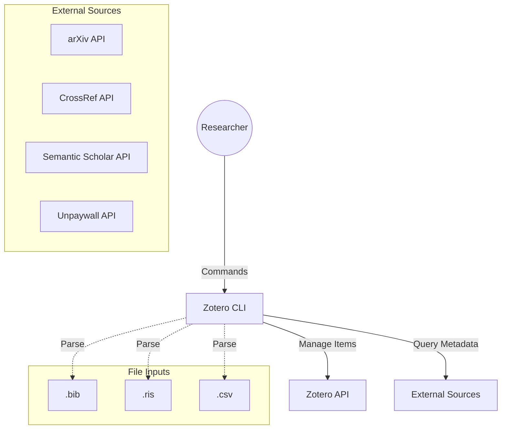
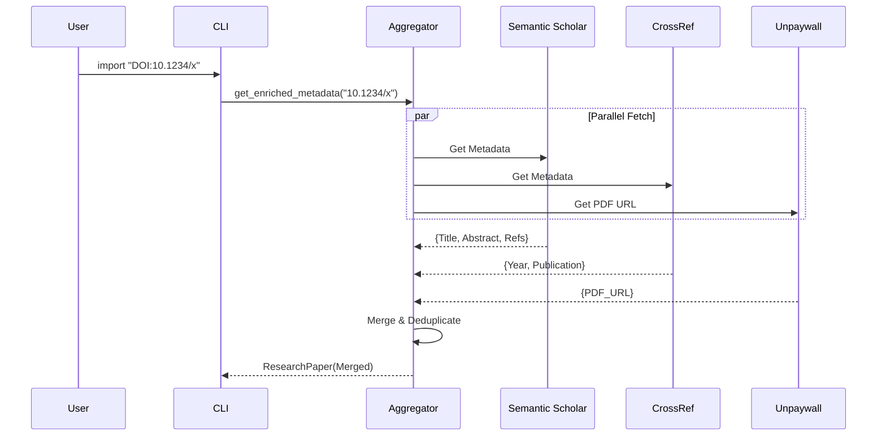

# Architecture & Design

## System Context (C4 Context)


```mermaid
graph TD
    User((Researcher))
    CLI[Zotero CLI]
    Zotero[Zotero API]
    ExtSources[External Sources]
    
    User -->|Commands| CLI
    CLI -->|Manage Items| Zotero
    CLI -->|Query Metadata| ExtSources
    
    subgraph External Sources
        ArXiv[arXiv API]
        CrossRef[CrossRef API]
        S2[Semantic Scholar API]
        Unpaywall[Unpaywall API]
    end
    
    subgraph File Inputs
        BibTeX[.bib]
        RIS[.ris]
        CSV[.csv]
    end
    
    CLI -.->|Parse| BibTeX
    CLI -.->|Parse| RIS
    CLI -.->|Parse| CSV
```

## Internal Design (Components)

The application follows a **Hexagonal Architecture** (Ports & Adapters) variant.

### Layers

1.  **CLI Layer (`zotero_cli.cli`)**
    *   **Responsibility:** Argument parsing, user feedback (stdout/stderr), and invoking the Application Facade.
    *   **Components:** `main.py` (Argparse).

2.  **Application Layer (`zotero_cli.client`)**
    *   **Responsibility:** Orchestration. Connects the CLI requests to the Domain Services.
    *   **Components:** `PaperImporterClient`.

3.  **Domain Layer (`zotero_cli.core`)**
    *   **Responsibility:** Business logic, data models, and interfaces.
    *   **Models:** `ResearchPaper`, `ZoteroItem`.
    *   **Services:**
        *   `MetadataAggregatorService`: Merges data from multiple sources.
        *   `CitationGraphService`: Builds Graphviz DOT files.
        *   `DuplicateFinder`: Identifies dupes by DOI/Title.
        *   `IntegrityService`: Verifies item completeness.

4.  **Infrastructure Layer (`zotero_cli.infra`)**
    *   **Responsibility:** Implementation of interfaces (Gateways).
    *   **Adapters:**
        *   `ZoteroAPIClient`: Wrapper around `requests` for Zotero.
        *   `ArxivLibGateway`: Wrapper for `arxiv` package.
        *   `BibtexLibGateway`: Wrapper for `bibtexparser`.
        *   `RisLibGateway`: Wrapper for `rispy`.

## Data Flow: Metadata Aggregation

When importing a paper or attaching a PDF, we use a "Best Effort" strategy to gather metadata.


```mermaid
sequenceDiagram
    participant User
    participant CLI
    participant Aggregator
    participant S2 as Semantic Scholar
    participant CR as CrossRef
    participant UP as Unpaywall
    
    User->>CLI: import "DOI:10.1234/x"
    CLI->>Aggregator: get_enriched_metadata("10.1234/x")
    par Parallel Fetch
        Aggregator->>S2: Get Metadata
        Aggregator->>CR: Get Metadata
        Aggregator->>UP: Get PDF URL
    end
    S2-->>Aggregator: {Title, Abstract, Refs}
    CR-->>Aggregator: {Year, Publication}
    UP-->>Aggregator: {PDF_URL}
    Aggregator->>Aggregator: Merge & Deduplicate
    Aggregator-->>CLI: ResearchPaper(Merged)
```

## Data Contracts

### 1. Snapshot Artifact (`report snapshot`)
The snapshot command produces a single JSON file that serves as an immutable audit trail for a collection.
Written by `core/services/snapshot_service.py::SnapshotWriter`; diffed between two runs by
`core/services/slr/snapshot.py::SnapshotDiffService` (`slr report shift`'s `detect_shifts`). These two
classes both used to be named `SnapshotService` — same name, different modules, different jobs — which was
confusing enough to become its own issue (#148); they were renamed to make the split explicit.

This is intentionally a separate, lighter-weight format from `system backup`'s ZAF archives
(`core/services/backup_service.py::BackupService`): ZAF is a full-fidelity zip (attachments + manifest +
checksums) meant for disaster recovery/restore, whereas this JSON artifact exists purely to be diffed by
`slr report shift` — pulling a full ZAF just to compare which collections an item belongs to would be
needless overhead. The two are not meant to converge.

**Schema Version:** 1.0

```json
{
  "meta": {
    "timestamp": "ISO-8601 UTC",
    "collection_name": "string",
    "collection_id": "string",
    "total_items_found": "int",
    "items_processed_successfully": "int",
    "items_failed": "int",
    "tool_version": "string",
    "schema_version": "1.0",
    "status": "success | partial_success"
  },
  "failures": [
    {
      "key": "string",
      "title": "string",
      "error": "string"
    }
  ],
  "items": [
    {
      "key": "string",
      "version": "int",
      "item_type": "string",
      "title": "string",
      "abstract": "string",
      "doi": "string",
      "arxiv_id": "string",
      "url": "string",
      "date": "string",
      "authors": ["string"],
      "collections": ["string"],
      "tags": ["string"],
      "children": [
        { "raw_zotero_json_object": "..." }
      ]
    }
  ]
}
```

## Background Job Queue: Execution Model (Issue #150)

`JobQueueService` (`core/services/job_queue_service.py`, SQLite-backed via `SqliteJobRepository`) is used by `PDFFinderService` and `SnowballDiscoveryWorker` to persist and retry async work. This section settles how an external consumer (e.g. an app that shows async job status from this queue) is meant to integrate with it, once for every job-queue-backed feature rather than per-feature.

**1. Execution model: `zotero-cli` does not grow a daemon.** `system jobs run --count N` (and `--watch`, a progress monitor that drains until the queue is empty then exits) remain the only ways to process jobs; there is deliberately no `--daemon`/continuous-loop mode. This matches the project's existing identity as a CLI tool + library, not a hosted service - the one already-existing exception, `serve`, is explicitly opt-in and gated by a human-invocation-only safety boundary (see "Agent safety boundaries" in `CLAUDE.md`) precisely because a long-running, unauthenticated process is a meaningfully larger operational commitment (crash recovery, log rotation, restart policy) than a CLI invocation. Consumers that need continuous draining (e.g. an app's own backend) own that scheduling themselves - e.g. a Celery-style periodic task invoking `system jobs run --count N` - treating `zotero-cli` purely as a CLI/library dependency, consistent with the git-dependency distribution model below.

**2. API surface: `GET /jobs` and `GET /jobs/{id}`** (`api/routes/jobs.py`) expose read-only job status through `serve`'s existing FastAPI layer, so a consumer observes status through the service/API layer rather than reading `jobs.sqlite` directly - the same boundary already established for the rest of `api/routes/`.

**3. Multi-tenancy: `library_id` scoping, not incidental isolation.** Before this issue, `jobs.sqlite`'s location was derived from the active config file's directory with no scoping inside the table itself - two SLR projects sharing (or, more likely, both omitting) `--config` would have silently pooled their jobs together with no way to tell them apart. `JobQueueService` now takes a `library_id` (resolved by `ServiceFactory.get_job_queue_service` as `config.library_id or config.user_id or "default"`) that tags every job it enqueues and filters every read; a `NULL` `library_id` (jobs enqueued before this migration existed) is treated as legacy/unscoped and stays visible to every queue rather than becoming silently orphaned. The `/jobs/{id}` route applies the same scoping, returning 404 rather than another library's job.

**4. WAL mode is deliberate.** `SqliteJobRepository` now explicitly sets `PRAGMA journal_mode=WAL` on connect, so a status-polling reader (the API route, or a human running `system jobs list`) doesn't block behind an in-flight writer (a worker popping/completing a job) the way the default rollback-journal mode would once this queue is driven by a web backend instead of a single local CLI invocation.

## Distribution: Installing `zotero-cli` as a Package

`zotero-cli` is published on PyPI as **`zotero-command-line`**. The `zotero-cli` name on PyPI belongs to an unrelated project whose last release was in 2016, and PyPI rejects new names that differ from an existing one only by separators or look-alike characters (`zoterocli` normalizes to the same name as `zotero-cli`). Only the distribution name differs: the command is still `zotero-cli` and the import package is still `zotero_cli`.

```bash
pip install zotero-command-line            # or: uv tool install zotero-command-line
pip install "zotero-command-line[rag]"     # adds the RAG/semantic-search stack
```

A consumer that needs `zotero-cli`'s `core/` domain services directly (e.g. an app calling `MergeService`/`SLRDedupeService` in-process, per Issue #153's API-hygiene work) depends on it like any other package, `zotero-command-line>=X.Y`. Pinning a git tag still works for unreleased commits:

```bash
pip install "git+https://github.com/fchicout/zotero-cli@vX.Y.Z"
# or, in a uv-managed project's pyproject.toml:
[tool.uv.sources]
zotero-command-line = { git = "https://github.com/fchicout/zotero-cli", tag = "vX.Y.Z" }
```

**Publishing:** pushing a `vX.Y.Z` tag runs `.github/workflows/release.yml`. After the binaries are built and the GitHub release is created, the `publish-pypi` job:
- checks that the tag matches `pyproject.toml`'s version;
- builds the sdist and wheel with `uv build`;
- smoke-tests the wheel in a clean virtualenv (`zotero-cli --help` and `scripts/smoke_imports.py`);
- uploads with `uv publish`.

That job runs with a read-only `GITHUB_TOKEN`, no build cache, and actions pinned by commit SHA. The PyPI API token lives only in the `pypi` GitHub environment, which accepts only `v*` tags.

**Optional dependencies (Issue #180):** the RAG/embedding stack (`torch`, `sentence-transformers`, `huggingface-hub`, `numpy`, `einops`, `accelerate`, `openai`, `google-generativeai`) is an optional `rag` extra rather than a base dependency, so the default install doesn't pull in the ML dependency tree. Every import of these packages in `src/` is function-local, so a consumer who hits a RAG code path without the extra gets a clear `ImportError`, not a crash elsewhere. PDF text extraction uses `pdfminer.six` (pure Python, MIT) as a base dependency, because `item`/`collection export --format md`, a non-RAG feature, depends on it. It replaced `markitdown` (Issue #403), which was installed without its PDF extra and pulled in onnxruntime/magika/numpy. `system selftest` converts an embedded PDF, and the release workflow runs it on every binary.
