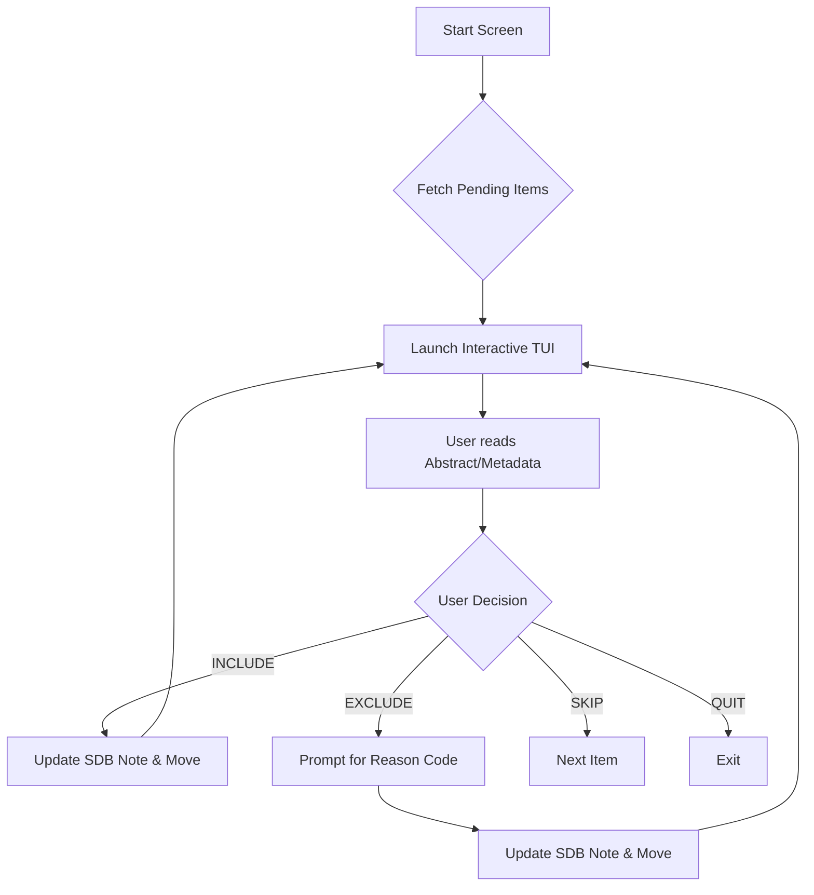
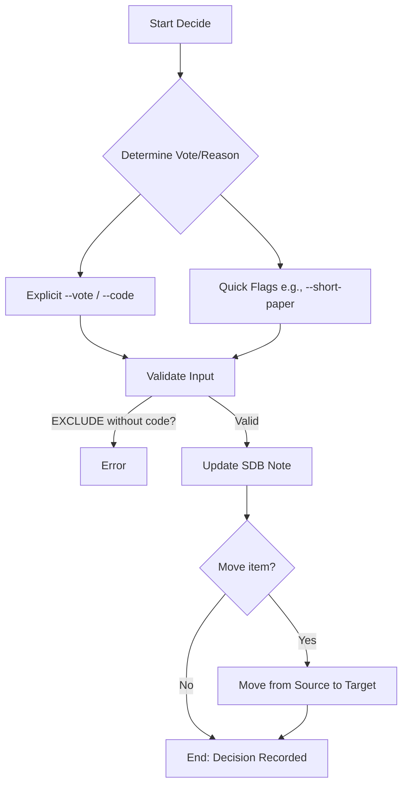
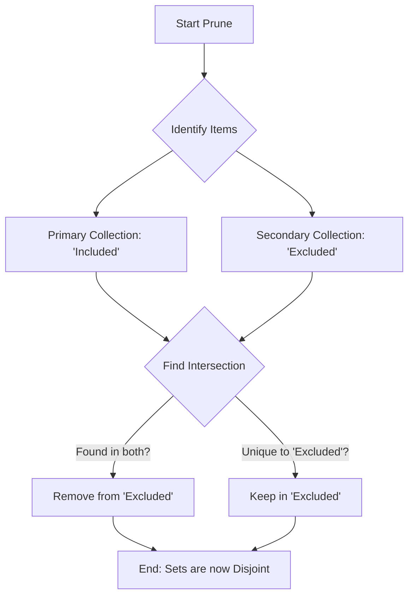

# Command: `slr`

Systematic Literature Review (SLR) lifecycle management. This command provides a semantic namespace for managing screening, data loading, validation, and advanced research aids.

## Structure
The `slr` command is organized into a flat 2-level structure:
`zotero-cli slr <verb> [options]`

---

## Verbs

### `report`
SLR reporting and funnel analytics. This sub-namespace aggregates all analytical and reporting utilities.

**Subcommands:**
*   `status`: Displays SLR funnel progress dashboard.
*   `prisma`: Generates PRISMA flow diagrams.
*   `shift`: Detects items that moved between snapshots.
*   `graph`: Generates citation graph in DOT format.
*   `snapshot`: Creates a frozen JSON audit trail snapshot of a collection.
*   `screening`: Generates a Markdown Screening Report.
*   `exclusion-summary`: Summarizes rejection reason codes and percentages.
*   `consensus`: Highlights double-screening discrepancy conflicts.

**Usage:**
```bash
zotero-cli slr report <subcommand> [options]
```

---

### `source`
SLR Search Source Ingestion & Infrastructure.

**Subcommands:**
*   `init`: Automates initializing SLR folders inside `raw_<name>`.
*   `add`: Mass search result ingester targeting raw source collections.
*   `list`: Scans active SLR sources showing metadata completeness % and PDF presence.

**Usage:**
```bash
zotero-cli slr source <subcommand> [options]
```

---

### `screen`
Starts the interactive Terminal User Interface (TUI) for screening items.

**Logic Flow:**


**Usage:**
```bash
zotero-cli slr screen --source "RAW_COLLECTION" --include "INC_COLLECTION" --exclude "EXC_COLLECTION"
```

**Scenario-Based Example:**
- **Problem:** I have 200 papers in "Unscreened" and need to review them quickly.
- **Action:** `zotero-cli slr screen --source "Unscreened" --include "Accepted" --exclude "Rejected"`

---

### `decide`
Records a single screening decision for an item via CLI. Supports SDB v1.2 with phase isolation and evidence capture.

**Logic Flow:**


**Usage:**
```bash
zotero-cli slr decide --key "ITEMKEY" --vote "INCLUDE|EXCLUDE" --code "REASON_CODE" [--phase "full_text"] [--evidence "Found text about X..."]
```

**Scenario-Based Example:**
- **Problem:** I am reading an abstract and realized it's a survey paper.
- **Action:** `zotero-cli slr decide --key "ABCD1234" --vote "EXCLUDE" --code "EXC02" --reason "Is a survey paper" --phase "title_abstract"`

---

### `load`
Retroactively imports screening decisions from a CSV file. Matches items by Key, DOI, or Title.

**Logic Flow:**
```mermaid
graph TD
    A[Start Load] --> B[Read CSV]
    B --> C{Find Zotero Item?}
    C -- Matched by Key/DOI? --> D[Update Screening Notes]
    C -- Not Found? --> E[Skip / Log Unmatched]
    D --> F{Move Item?}
    F -- --move-to-included? --> G[Add to 'Included' Collection]
    F -- --move-to-excluded? --> H[Add to 'Excluded' Collection]
    G --> I[End: Status Updated]
    H --> I
```

**Usage:**
```bash
zotero-cli slr load "decisions.csv" --reviewer "Persona" --phase "title_abstract" --force
```

**Scenario-Based Example:**
- **Problem:** Screened 500 papers in Rayyan and exported a CSV. Need decisions reflected in Zotero.
- **Action:** `zotero-cli slr load --file "rayyan_export.csv" --reviewer "Chicout" --phase "full_text" --move-to-included "Accepted" --force`

---

### `list`
Lists papers in the SLR funnel by status (pending, included, excluded) and phase. This command identifies papers physically in a phase's queue folder but missing an SDB note, or lists decided papers based on their SDB truth.

#### `list pending`
Identifies papers physically in a phase's queue folder but missing an SDB note for that phase.

**Usage:**
```bash
zotero-cli slr list pending [--tree <source>]
```

#### `list included`
Lists papers that have "Accepted/Included" SDB notes across the entire tree of a source.

**Usage:**
```bash
zotero-cli slr list included [--tree <source>] [--ta] [--ft|--fullscreen] [--qa <threshold>]
```

#### `list excluded`
Lists papers that have "Rejected/Excluded" SDB notes across the entire tree of a source.

**Usage:**
```bash
zotero-cli slr list excluded [--tree <source>] [--ta] [--ft|--fullscreen] [--qa <threshold>]
```

**Key Features:**
- **Note-First Truth:** Scans the entire tree of a source (Root + all 4 phase subfolders) to find audit notes.
- **Phase Aliases:** Supports `--fullscreen` as an alias for the `--ft` (full_text) phase.
- **QA Thresholds:** The `--qa` flag defaults to a threshold of 2.0 but accepts custom values to filter Quality Assessment results.
- **Grouped Output:** Results are automatically sorted and grouped by SLR phase.

---

### `reconcile`
Synchronizes physical folder locations with SDB audit notes. Automatically moves papers to their correct phase folder based on verified decisions. Enforces exclusive membership in exactly one phase folder per SLR tree.

**Usage:**
```bash
zotero-cli slr reconcile --tree "raw_source" [--qa-threshold 5.0] [--execute]
```

---

### `promote`
Atomic command to record a screening decision (Include/Exclude) and automatically move the paper into its target phase folder if accepted. Reuses the "Sticky Move" logic to carry children along.

**Usage:**
```bash
zotero-cli slr promote --key "ITEMKEY" --vote "INCLUDE" --phase "full_text" --tree "raw_source" --persona "Name"
```

---

### `snowball`
Citation snowballing workflow (Seed, Discovery, Review, and Import).

**Subcommands:**
*   `seed`: Adds seed papers to the snowballing discovery graph.
*   `discovery`: Runs background discovery worker to find citations.
*   `review`: Starts interactive TUI to review candidate matches.
*   `import`: Ingests all accepted candidates into Zotero.

**Usage:**
```bash
zotero-cli slr snowball <subcommand> [options]
```

---

### `sdb`
Management and maintenance of the Screening Database (SDB) layer embedded in Zotero notes.

**Subcommands:**
*   `inspect`: Visualizes all SDB entries (decisions, criteria, personas) attached to an item.
*   `edit`: Surgically updates a specific SDB entry.
*   `upgrade`: Batch upgrades legacy SDB notes to the latest schema (v1.2).

**Usage:**
```bash
zotero-cli slr sdb <subcommand> [options]
```

---

### `extract`
Manages data extraction schemas and operations. Supports initializing a new schema template or validating an existing schema.

**Usage:**
```bash
# Initialize a new schema template
zotero-cli slr extract --init [--output schema.yaml]

# Validate an existing schema
zotero-cli slr extract --validate [--schema schema.yaml]
```

---

### `prune`
Enforces mutual exclusivity between an 'Included' and 'Excluded' collection by removing intersections from the excluded set.

**Logic Flow:**


**Usage:**
```bash
zotero-cli slr prune --included "Accepted" --excluded "Rejected"
```

**Scenario-Based Example:**
- **Problem:** During screening, some papers were accidentally left in the "Excluded" folder after being promoted.
- **Action:** `zotero-cli slr prune --included "Full Text Included" --excluded "Full Text Excluded"`
