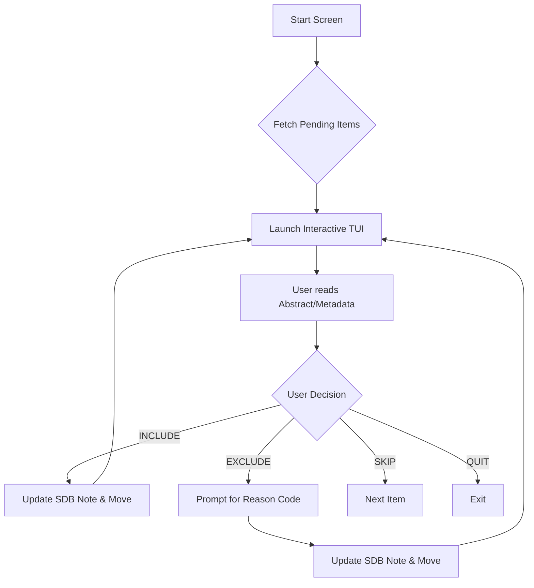
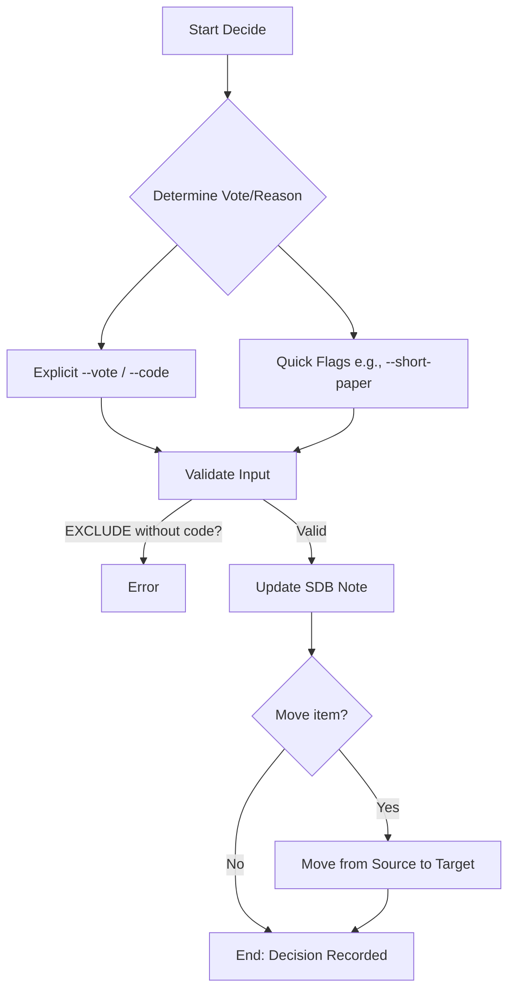
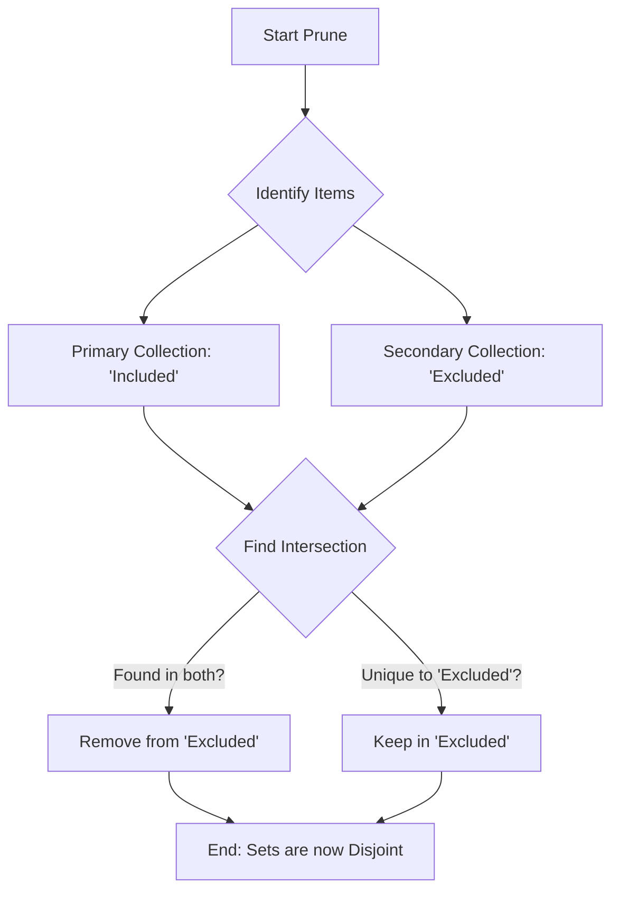

# Command: `slr`

Systematic Literature Review (SLR) lifecycle management. This command provides a semantic namespace for managing screening, data loading, validation, and advanced research aids.

## Structure
The `slr` command is organized into a flat 2-level structure:
`zotero-cli slr <verb> [options]`

---

## Verbs

### `screen`
Starts the interactive Terminal User Interface (TUI) for screening items.

**Logic Flow:**


**Usage:**
```bash
zotero-cli slr screen --source "RAW_COLLECTION" --include "INC_COLLECTION" --exclude "EXC_COLLECTION"
```

**Scenario-Based Example:**
- **Problem:** I have 200 papers in "Unscreened" and need to review them quickly.
- **Action:** `zotero-cli slr screen --source "Unscreened" --include "Accepted" --exclude "Rejected"`

### `decide`
Records a single screening decision for an item via CLI. Supports SDB v1.2 with phase isolation and evidence capture.

**Logic Flow:**


**Usage:**
```bash
zotero-cli slr decide --key "ITEMKEY" --vote "INCLUDE|EXCLUDE" --code "REASON_CODE" [--phase "full_text"] [--evidence "Found text about X..."]
```

**Scenario-Based Example:**
- **Problem:** I am reading an abstract and realized it's a survey paper.
- **Action:** `zotero-cli slr decide --key "ABCD1234" --vote "EXCLUDE" --code "EXC02" --reason "Is a survey paper" --phase "title_abstract"`

### `load`
Retroactively imports screening decisions from a CSV file. Matches items by Key, DOI, or Title.

**Logic Flow:**
```mermaid
graph TD
    A[Start Load] --> B[Read CSV]
    B --> C{Find Zotero Item?}
    C -- Matched by Key/DOI? --> D[Update Screening Notes]
    C -- Not Found? --> E[Skip / Log Unmatched]
    D --> F{Move Item?}
    F -- --move-to-included? --> G[Add to 'Included' Collection]
    F -- --move-to-excluded? --> H[Add to 'Excluded' Collection]
    G --> I[End: Status Updated]
    H --> I
```

**Usage:**
```bash
zotero-cli slr load "decisions.csv" --reviewer "Persona" --phase "title_abstract" --force
```

**Scenario-Based Example:**
- **Problem:** Screened 500 papers in Rayyan and exported a CSV. Need decisions reflected in Zotero.
- **Action:** `zotero-cli slr load --file "rayyan_export.csv" --reviewer "Chicout" --phase "full_text" --move-to-included "Accepted" --force`

### `verify`
Performs verification tasks for the SLR. Supports both LaTeX manuscript citation auditing and collection completeness validation.

**Usage:**
```bash
# Verify LaTeX citations
zotero-cli slr verify --latex "manuscript.tex"

# Verify collection completeness
zotero-cli slr verify --collection "SCREENED_COLLECTION" [--verbose]
```

**Parameters:**
*   `--latex`: Path to the main LaTeX file to audit.
*   `--collection`: Collection Name or Key to validate.
*   `--verbose`: Show detailed validation results for collections.

### `lookup`
Performs bulk metadata lookup for Zotero items using external APIs (Semantic Scholar, CrossRef, PubMed, zbMATH, ERIC, HAL).

**Usage:**
```bash
zotero-cli slr lookup --keys \"KEY1,KEY2\"
```

### `graph`
Generates a Citation Graph (DOT format) for the specified collections.

**Usage:**
```bash
zotero-cli slr graph --collections "Collection A, Collection B"
```

### `shift`
Detects drift/shifts between two library snapshots (JSON). Useful for auditing collection movements.

**Usage:**
```bash
zotero-cli slr shift --old snap1.json --new snap2.json
```

### `migrate`
Migrates existing SDB notes to the latest schema version (e.g., v1.1 to v1.2).

**Usage:**
```bash
zotero-cli slr migrate --collection "COLLECTION" [--dry-run]
```

### `sync-csv`
Synchronizes a local CSV state from Zotero screening notes. Useful for recovery or external analysis.

**Usage:**
```bash
zotero-cli slr sync-csv --collection "COLLECTION" --output "synced.csv"
```

### `prune`
Enforces mutual exclusivity between an 'Included' and 'Excluded' collection by removing intersections from the excluded set.

**Logic Flow:**


**Usage:**
```bash
zotero-cli slr prune --included "Accepted" --excluded "Rejected"
```

**Scenario-Based Example:**
- **Problem:** During the screening, some papers were accidentally left in the "Excluded" folder after being promoted. This skews PRISMA statistics.
- **Action:** `zotero-cli slr prune --included "Full Text Included" --excluded "Full Text Excluded"`

### `extract`
Manages data extraction schemas and operations. Supports initializing a new schema and validating an existing one.

**Usage:**
```bash
# Initialize a new schema template
zotero-cli slr extract --init [--output schema.yaml]

# Validate an existing schema
zotero-cli slr extract --validate [--schema schema.yaml]
```

---

### `snowball`
Citation snowballing workflow (Discovery and Review).

#### `snowball seed`
Adds seed papers to the snowballing discovery graph.
```bash
zotero-cli slr snowball seed KEY1 KEY2
```

#### `snowball discovery`
Runs the background discovery worker to find citations (Forward/Backward) for pending nodes.
```bash
zotero-cli slr snowball discovery [--limit 10]
```

#### `snowball review`
Starts the interactive TUI to review discovered citation candidates.
```bash
zotero-cli slr snowball review
```

#### `snowball import`
Ingests all `ACCEPTED` candidates from the graph into Zotero.
```bash
zotero-cli slr snowball import --collection "Discovery"
```

---

### `sdb`
Management and maintenance of the Screening Database (SDB) layer embedded in Zotero notes.

#### `sdb inspect`
Visualizes all SDB entries (decisions, criteria, personas) attached to an item in a detailed table.

**Usage:**
```bash
zotero-cli slr sdb inspect "ITEMKEY"
```

#### `sdb edit`
Surgically updates a specific SDB entry matched by persona and phase. Defaults to Dry-Run mode.

**Usage:**
```bash
zotero-cli slr sdb edit "ITEMKEY" --persona "Name" --phase "title_abstract" --set-decision "accepted"
```

**Parameters:**
*   `--persona`: (Required) The reviewer identity to match.
*   `--phase`: (Required) The screening phase to match.
*   `--set-decision`: Update decision to `accepted` or `rejected`.
*   `--set-criteria`: Update comma-separated reason codes.
*   `--set-reason`: Update detailed reason text.
*   `--set-reviewer`: Change the persona name on the record.
*   `--execute`: Actually commit changes to Zotero.

#### `sdb upgrade`
Batch upgrades legacy SDB notes within a collection to the latest schema (v1.2).

**Usage:**
```bash
zotero-cli slr sdb upgrade --collection "My Collection" [--execute]
```

---

### `reset`
Safely resets items by stripping all screening metadata (SDB notes, tags) and optionally moving them back to a raw collection.

**Usage:**
```bash
zotero-cli slr reset --collection "To Reset" [--target-collection "Raw"] [--execute]
```


