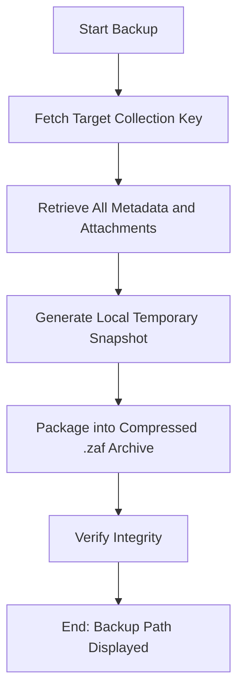

# DOC-SPEC: collection backup

## 1. Classification
- **Level:** 🟢 READ-ONLY (Export/Archive)
- **Target Audience:** Researcher / SLR Lead

## 2. Logic Flow (Visual Synthesis)

## 3. Synopsis
Creates a self-contained, portable backup archive (`.zaf`) of a specific collection, including all item metadata and PDF attachments.

## 4. Description (Instructional Architecture)
The `collection backup` command provides a robust mechanism for archiving snapshots of your research. Unlike standard Zotero exports, the Zotero Archive Format (`.zaf`) is specifically designed to preserve the full internal state of a collection, making it ideal for point-in-time preservation or for sharing a complete dataset with a collaborator. 

It traverses the entire collection hierarchy, fetches the JSON metadata for every item, and collects all associated file attachments (PDFs, notes). These are then compressed and bundled into a single `.zaf` file. 

## 5. Parameter Matrix
| Flag | Type | Description | Ergonomic Note |
| :--- | :--- | :--- | :--- |
| `--name` | String | Target collection Name or unique identifier (Key). | Required. |
| `--output` | String | Local path where the `.zaf` archive will be saved. | Required. |

## 6. Scenario-Based Examples (Cognitive Anchors)
### Scenario: Archiving a completed SLR project
**Problem:** I have finished my SLR (Key: `SLR_PROJ_2025`) and I want to save a permanent, offline version of the final included items and their PDFs.
**Action:** `zotero-cli collection backup --name "SLR_PROJ_2025" --output "Final_SLR_Archive.zaf"`
**Result:** A single portable file is created that contains everything needed to reconstruct the project state later.

## 7. Cognitive Safeguards
- **Common Failure Modes:** Attempting to backup to a directory without write permissions or to an external drive with insufficient space. 
- **Safety Tips:** Always perform a backup *before* using destructive commands like `collection clean` or `collection delete`. The `.zaf` format can be restored using the `system restore` command.
