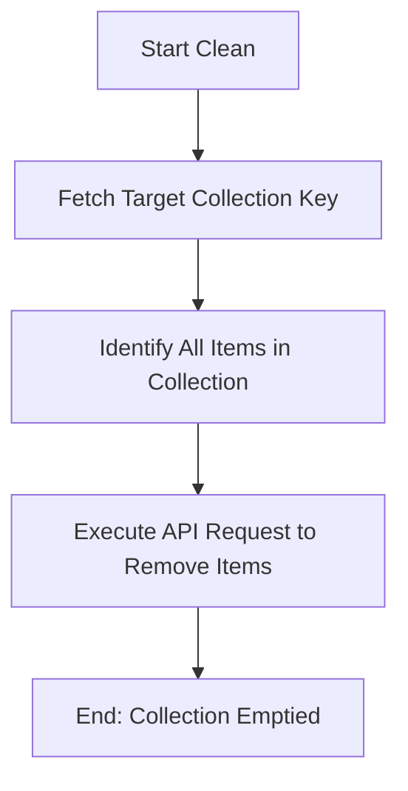

# DOC-SPEC: collection clean

## 1. Classification
- **Level:** 🔴 DESTRUCTIVE (Item Removal from Collection)
- **Target Audience:** Researcher / SLR Lead

## 2. Logic Flow (Visual Synthesis)

## 3. Synopsis
Empties a collection by removing all associated items from it. Note that this command does not delete the items from the library, only their association with this specific collection.

## 4. Description (Instructional Architecture)
The `collection clean` command is used to reset the contents of a folder without deleting the folder itself. This is particularly useful in Systematic Literature Review (SLR) workflows when you want to re-run an import or a screening phase into the same collection. 

It finds all items currently linked to the specified collection and removes that link via the Zotero API. If an item is only present in this collection and no others (and not in the root library), it will effectively be "unfiled" but not necessarily moved to the trash.

## 5. Parameter Matrix
| Flag | Type | Description | Ergonomic Note |
| :--- | :--- | :--- | :--- |
| `--collection` | String | Name or unique identifier (Key) of the collection. | Required. |
| `--verbose` | Flag | Displays detailed progress during the cleaning process. | Optional. |

## 6. Scenario-Based Examples (Cognitive Anchors)
### Scenario: Resetting a screening results folder
**Problem:** My "Screened Results" folder (Key: `SCR_456`) has outdated data from a previous attempt and I want to start fresh.
**Action:** `zotero-cli collection clean --collection "SCR_456"`
**Result:** The folder is now empty and ready for a new set of items.

## 7. Cognitive Safeguards
- **Common Failure Modes:** Confusion between `clean` and `delete`. `clean` keeps the folder structure intact, while `delete` removes the folder itself.
- **Safety Tips:** Use `collection list` to verify the collection key before cleaning. If your items are not linked to any other collection, they will become unfiled in your main library.
