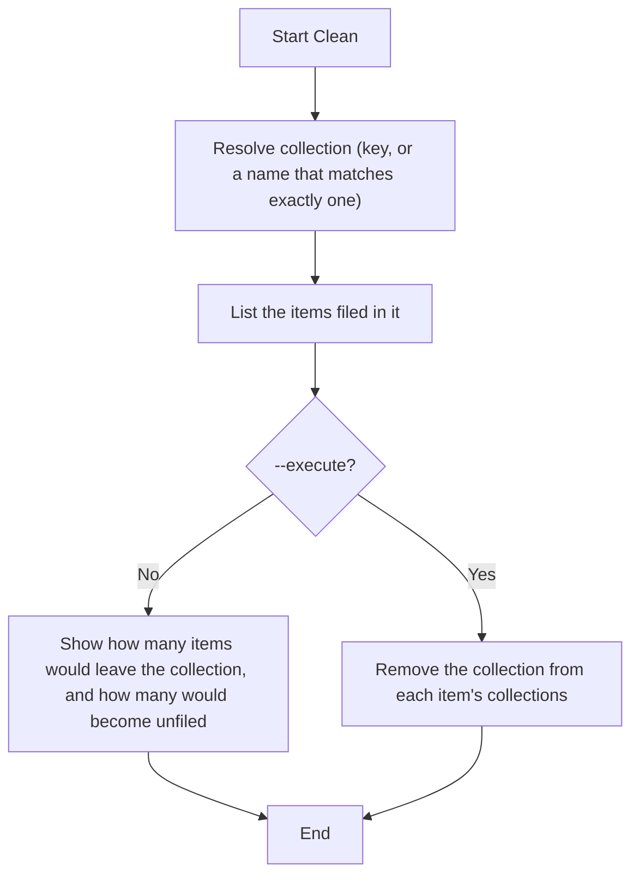

# DOC-SPEC: collection clean

## 1. Classification
- **Level:** 🟡 MODIFICATION (removes items from a collection; never deletes them). Previews by default; applies with `--execute`.
- **Target Audience:** Researcher / SLR Lead

## 2. Logic Flow (Visual Synthesis)

```mermaid
graph TD
    A["Start Clean"] --> B["Resolve collection (key, or a name that matches exactly one)"]
    B --> C["List the items filed in it"]
    C --> D{"--execute?"}
    D -- "No" --> E["Show how many items would leave the collection, and how many would become unfiled"]
    D -- "Yes" --> F["Remove the collection from each item's collections"]
    E --> G["End"]
    F --> G
```

## 3. Synopsis
Empties a collection by removing its items from it. The items are **not** deleted: they stay in your library, and those filed nowhere else appear under Unfiled Items. Previews by default; pass `--execute` to apply.

## 4. Description (Instructional Architecture)
`collection clean` resets a folder's contents without deleting the folder or any item, for example to re-run an import or a screening phase into the same collection.

Without `--execute` it only reports what would happen: how many items would leave the collection, and how many of them are in no other collection and would therefore end up under Unfiled Items. With `--execute`, it takes the collection off each item one at a time and reports any item Zotero refused to update (exit status 1).

A collection name shared by several collections (for example the SLR phase folders created under every source) is refused, and the error lists the candidate keys. To delete a collection *and* its items, use `collection delete --recursive`.

## 5. Parameter Matrix
| Flag / Parameter | Type | Description | Ergonomic Note |
| :--- | :--- | :--- | :--- |
| `--collection` | String | Collection name or key | Required. Names must match exactly one collection. |
| `--execute` | Boolean | Apply the change (default: preview only) | Optional. Default: False. |
| `--verbose` | Boolean | List every item affected | Optional. Default: False. |

## 6. Scenario-Based Examples (Cognitive Anchors)
### Scenario: Resetting a screening results folder
**Problem:** My "Screened Results" folder (Key: `SCR_456`) has outdated data from a previous attempt and I want to start fresh.
**Action:** `zotero-cli collection clean --collection "SCR_456"`, then `zotero-cli collection clean --collection "SCR_456" --execute`
**Result:** The first run shows how many items would leave the folder; the second empties it. The items remain in the library.

## 7. Cognitive Safeguards
- **Common Failure Modes:** Expecting `clean` to delete items: it never does. Use `collection delete --recursive` for that.
- **Safety Tips:** Items filed only in this collection end up under Unfiled Items. Run the preview first to see how many.
