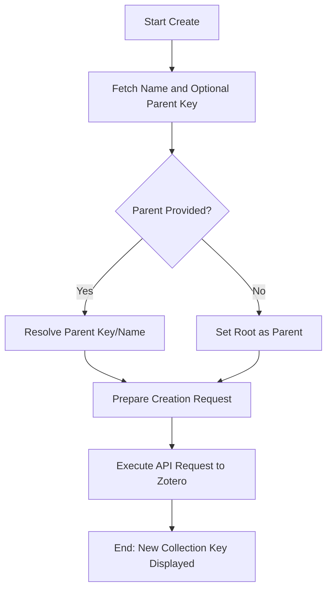

# DOC-SPEC: collection create

## 1. Classification
- **Level:** 🟡 MODIFICATION (Library Structure Update)
- **Target Audience:** Researcher / SLR Lead

## 2. Logic Flow (Visual Synthesis)

## 3. Synopsis
Creates a new collection (folder) in your library, either at the root level or nested within an existing collection.

## 4. Description (Instructional Architecture)
The `collection create` command is the fundamental tool for organizing your research. It allows you to build a folder hierarchy directly from the terminal. 

If a `--parent` is specified, the CLI will attempt to resolve it by name first. If multiple collections have the same name, it is highly recommended to use the `Collection Key` (obtained via `collection list`) as the parent identifier to ensure deterministic behavior.

## 5. Parameter Matrix
| Flag | Type | Description | Ergonomic Note |
| :--- | :--- | :--- | :--- |
| `--name` | String | The desired name for the new collection. | Required. |
| `--parent` | String | Name or Key of the existing parent collection. | Optional. If omitted, the folder is created at the root. |

## 6. Scenario-Based Examples (Cognitive Anchors)
### Scenario: Organizing papers for a specific study
**Problem:** I need a new folder named "Reinforcement Learning" under my existing "Artificial Intelligence" (Key: `AI_CORE`) folder.
**Action:** `zotero-cli collection create --name "Reinforcement Learning" --parent "AI_CORE"`
**Result:** A new sub-folder is created, and the CLI returns its unique key (e.g., `RL_ROOT`).

## 7. Cognitive Safeguards
- **Common Failure Modes:** Attempting to create a collection with a name that contains special characters that might conflict with shell environment variables. Use double quotes around the name.
- **Safety Tips:** Always verify that the parent key is correct by running `collection list` first. Creating deep nested structures can lead to complex workflows.
