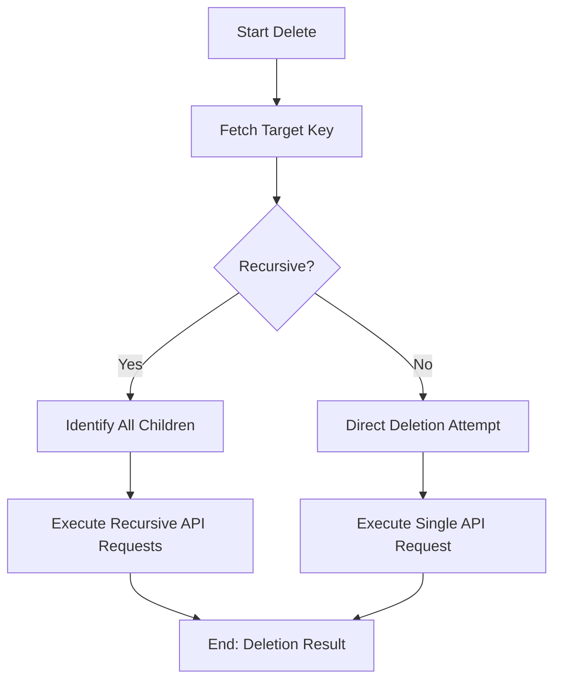

# DOC-SPEC: collection delete

## 1. Classification
- **Level:** 🔴 DESTRUCTIVE (Library Structure Deletion)
- **Target Audience:** Researcher / SLR Lead

## 2. Logic Flow (Visual Synthesis)

## 3. Synopsis
Removes a specified collection from your library. This operation is irreversible and can include recursive deletion of sub-folders and items.

## 4. Description (Instructional Architecture)
The `collection delete` command provides the necessary tooling for pruning unwanted structures from your library. It requires the unique `Collection Key` for precise identification. 

By default, the command performs a simple deletion if the collection is empty. If it contains sub-folders or items, the `--recursive` flag must be explicitly passed to confirm the removal of all underlying content. The `--version` flag is optional and can be used to ensure concurrency protection (preventing deletion if the collection has been modified since you last retrieved its metadata).

## 5. Parameter Matrix
| Flag | Type | Description | Ergonomic Note |
| :--- | :--- | :--- | :--- |
| `--key` | String | Name or unique identifier (Key) of the collection to delete. | Required. Use Key for certainty. |
| `--recursive` | Flag | Deletes the collection and all its sub-collections/items. | Required for non-empty folders. |
| `--version` | Integer | The version identifier of the collection for synchronization. | Optional. |

## 6. Scenario-Based Examples (Cognitive Anchors)
### Scenario: Cleaning up an old project
**Problem:** I have a folder "Obsolete_SLR_2023" (Key: `OLD_123`) that I no longer need.
**Action:** `zotero-cli collection delete --key "OLD_123" --recursive`
**Result:** The folder and all its contents are permanently removed from the library.

## 7. Cognitive Safeguards
- **Common Failure Modes:** Attempting to delete a folder without the `--recursive` flag when it still contains items. This will result in an API error.
- **Safety Tips:** ALWAYS run `collection list` before deletion to verify the key and ensure you are not deleting a critical parent folder. Deletion is irreversible.
