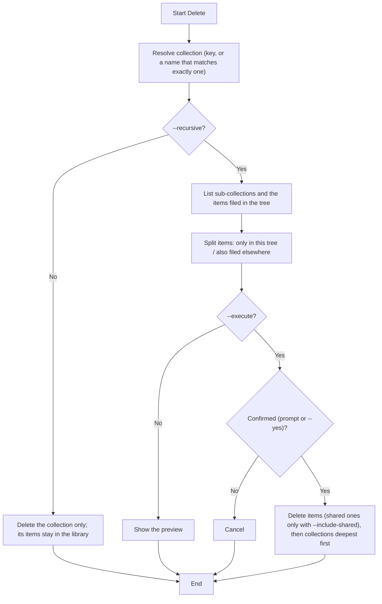

# DOC-SPEC: collection delete

## 1. Classification
- **Level:** 🔴 DESTRUCTIVE with `--recursive` (previews by default; needs `--execute` and a confirmation or `--yes`).
- **Target Audience:** Researcher / SLR Lead

## 2. Logic Flow (Visual Synthesis)

```mermaid
graph TD
    A["Start Delete"] --> B["Resolve collection (key, or a name that matches exactly one)"]
    B --> C{"--recursive?"}
    C -- "No" --> D["Delete the collection only; its items stay in the library"]
    C -- "Yes" --> E["List sub-collections and the items filed in the tree"]
    E --> F["Split items: only in this tree / also filed elsewhere"]
    F --> G{"--execute?"}
    G -- "No" --> H["Show the preview"]
    G -- "Yes" --> I{"Confirmed (prompt or --yes)?"}
    I -- "No" --> J["Cancel"]
    I -- "Yes" --> K["Delete items (shared ones only with --include-shared), then collections deepest first"]
    D --> L["End"]
    H --> L
    J --> L
    K --> L
```

## 3. Synopsis
Deletes a collection. Without `--recursive` only the collection itself goes; its items stay in your library. With `--recursive`, its sub-collections and the items filed only inside the tree are permanently deleted too.

## 4. Description (Instructional Architecture)
A plain `collection delete` removes one collection; the items that were in it stay in your library.

With `--recursive`, the command first shows what would be deleted: every sub-collection, the items filed only inside the tree, and the items that are *also* filed in a collection outside it. Nothing happens without `--execute`, and even then it asks for confirmation. `--yes` skips the question; without a terminal (scripts, CI, agents) the command refuses unless `--yes` is given.

Items filed in collections outside the tree are **kept** (they just leave the deleted collections) unless you pass `--include-shared`. Items are deleted before collections; if any item fails to delete, the collections are left in place so nothing ends up orphaned.

Deletions through the Zotero Web API are permanent: they don't go through Zotero's trash. Back up first with `collection backup`. A collection name shared by several collections is refused; the error lists the candidate keys.

## 5. Parameter Matrix
| Flag / Parameter | Type | Description | Ergonomic Note |
| :--- | :--- | :--- | :--- |
| `--key` | String | Collection name or key | Required. Names must match exactly one collection. |
| `--recursive` | Boolean | Also delete the sub-collections and the items filed only inside the tree | Optional. Default: False. |
| `--execute` | Boolean | With `--recursive`: actually delete (default: preview only) | Optional. Default: False. |
| `--yes` | Boolean | Don't ask for confirmation (for scripts) | Optional. Default: False. |
| `--include-shared` | Boolean | With `--recursive`: also delete items that are filed in other collections | Optional. Default: False. |
| `--version` | Integer | Collection version (optional if recursive) | Optional. |

## 6. Scenario-Based Examples (Cognitive Anchors)
### Scenario: Cleaning up an old project
**Problem:** I have a folder "Obsolete_SLR_2023" (Key: `OLD_123`) that I no longer need, contents included.
**Action:** `zotero-cli collection delete --key "OLD_123" --recursive`, then `zotero-cli collection delete --key "OLD_123" --recursive --execute`
**Result:** The first run lists what would be deleted; the second deletes it after you confirm. Items also filed elsewhere are kept.

## 7. Cognitive Safeguards
- **Common Failure Modes:** Running `--recursive` in a script without `--yes`: it refuses (exit 2) rather than guess.
- **Safety Tips:** Deletion is permanent. Run the preview, back up the collection, and only add `--include-shared` if you really want items that live elsewhere gone too.
