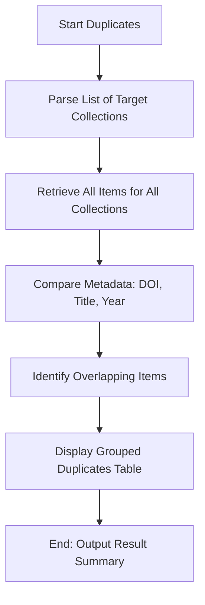

# DOC-SPEC: collection duplicates

## 1. Classification
- **Level:** 🟢 READ-ONLY (Deduplication Discovery)
- **Target Audience:** Researcher / SLR Lead

## 2. Logic Flow (Visual Synthesis)

## 3. Synopsis
Identifies duplicate items that exist across multiple specified collections, facilitating library cleanup and systematic review consistency.

## 4. Description (Instructional Architecture)
The `collection duplicates` command is essential for maintaining a clean research repository, especially when importing papers from multiple databases (like IEEE, Springer, and ArXiv). 

It takes a comma-separated list of collection names or keys and performs a comparative analysis of their contents. The command looks for matches based on standard bibliographic identifiers such as **DOI** (primary), and falls back to **Title/Year** matching for items without persistent identifiers. The output highlights items present in more than one of the specified target folders, allowing the researcher to decide which instance to keep.

## 5. Parameter Matrix
| Flag | Type | Description | Ergonomic Note |
| :--- | :--- | :--- | :--- |
| `--collections` | String | Comma-separated list of collection names or Keys. | Required. No spaces between commas. |

## 6. Scenario-Based Examples (Cognitive Anchors)
### Scenario: Identifying overlaps between search databases
**Problem:** I've imported search results from IEEE (Key: `IEEE_01`) and Springer (Key: `SPR_01`) and want to see which papers are duplicates.
**Action:** `zotero-cli collection duplicates --collections "IEEE_01,SPR_01"`
**Result:** The CLI displays a table showing papers that were found in both collections, including their titles and keys.

## 7. Cognitive Safeguards
- **Common Failure Modes:** Providing collection names that include commas or special characters without quoting. 
- **Safety Tips:** This command only *identifies* duplicates; it does not automatically merge or delete them. Use the `item delete` or `slr prune` commands to act on the findings.
