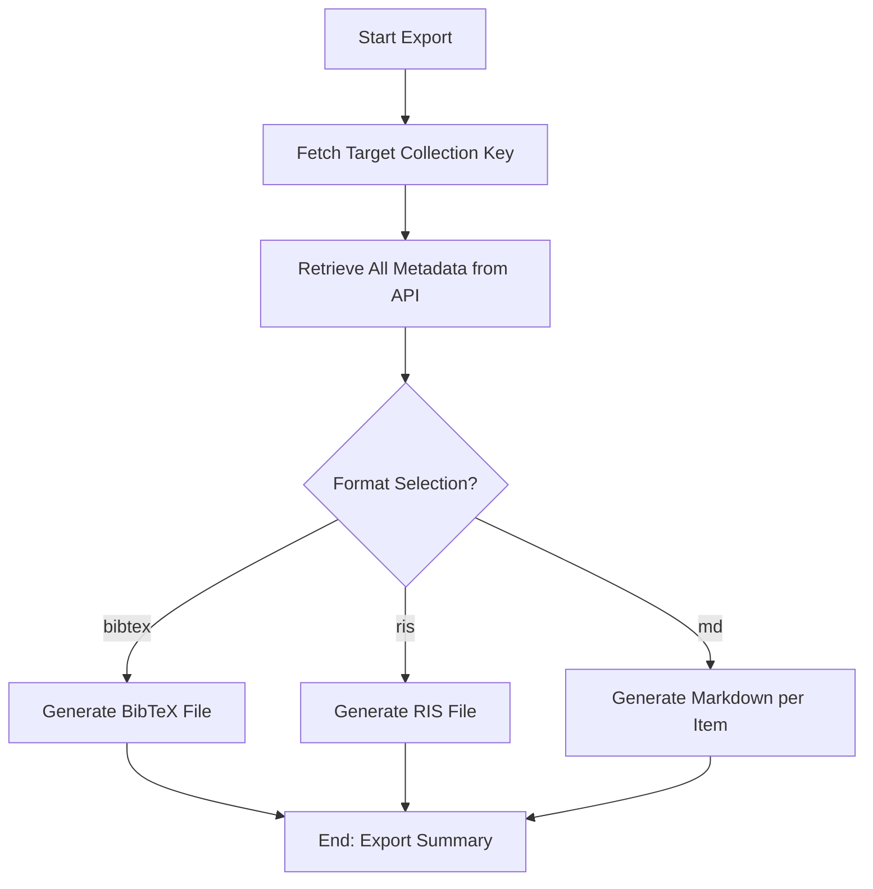

# DOC-SPEC: collection export

## 1. Classification
- **Level:** 🟢 READ-ONLY (Data Portability)
- **Target Audience:** Researcher / Author

## 2. Logic Flow (Visual Synthesis)

## 3. Synopsis
Exports the metadata and (optionally) content of a collection into various standard formats for use in citation managers, LaTeX documents, or research notes.

## 4. Description (Instructional Architecture)
The `collection export` command is designed for interoperability. It converts your structured Zotero collections into portable text formats. 

Supported formats include:
- **`bibtex`**: The standard format for LaTeX and Overleaf citations.
- **`ris`**: A common interchange format for bibliographic data used by EndNote, Mendeley, and other managers.
- **`md` (Markdown)**: Generates individual Markdown files for every item in the collection. This is particularly powerful for personal knowledge management (PKM) tools like Obsidian, Logseq, or Notion, as it creates an "Item Page" for each paper.

## 5. Parameter Matrix
| Flag | Type | Description | Ergonomic Note |
| :--- | :--- | :--- | :--- |
| `--name` | String | Target collection Name or unique identifier (Key). | Required. |
| `--format` | Choice | `bibtex`, `ris`, or `md`. | Optional. Default: `bibtex`. |
| `--output` | String | Output file path (for bib/ris) or directory (for md). | Required. |

## 6. Scenario-Based Examples (Cognitive Anchors)
### Scenario: Syncing literature with a LaTeX project
**Problem:** I need to update the `.bib` file for my paper with the latest items in my "Final Selection" folder (Key: `FIN_01`).
**Action:** `zotero-cli collection export --name "FIN_01" --format bibtex --output "references.bib"`
**Result:** The file `references.bib` is created/updated with the metadata from that folder.

## 7. Cognitive Safeguards
- **Common Failure Modes:** Attempting to export to a restricted directory or choosing a format that doesn't support specific metadata fields (like custom SLR audit notes).
- **Safety Tips:** Use the `md` format to generate a searchable "Digital Library" in Markdown. This enables you to link papers and notes locally without requiring the Zotero desktop client.
