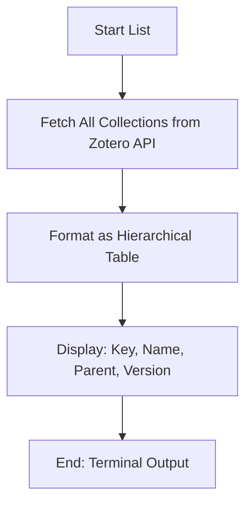

# DOC-SPEC: collection list

## 1. Classification
- **Level:** 🟢 READ-ONLY (Information Retrieval)
- **Target Audience:** Researcher / SLR Lead

## 2. Logic Flow (Visual Synthesis)

## 3. Synopsis
Displays a structured list of all collections (folders) available in the active Zotero library, including their unique keys and hierarchical relationships.

## 4. Description (Instructional Architecture)
The `collection list` command is the primary discovery tool for library structure. It provides a complete map of all folders, which is essential for identifying the `Collection Key` required by many other commands (like `import`, `slr prune`, or `rag ingest`). 

The output is presented as a formatted table that includes:
- **Key:** The unique alphanumeric identifier (e.g., `ABCD1234`) used for programmatic access.
- **Name:** The human-readable display name.
- **Parent:** Indicates if the collection is a sub-folder.
- **Version:** The synchronization version (useful for debugging cache issues).

## 5. Parameter Matrix
*This command does not currently accept additional parameters.*

## 6. Scenario-Based Examples (Cognitive Anchors)
### Scenario: Finding a collection key for a new task
**Problem:** I need to run a RAG ingestion on a specific folder, but I only know its name is "Deep Learning."
**Action:** `zotero-cli collection list`
**Result:** The table displays all collections. I locate "Deep Learning" and find its key is `G5H6J7K8`.

## 7. Cognitive Safeguards
- **Common Failure Modes:** Attempting to run in `offline` mode without a pre-existing local database synchronization.
- **Safety Tips:** If your library has a very deep hierarchy, the table will display parent keys. Use these keys to distinguish between collections with the same name.
