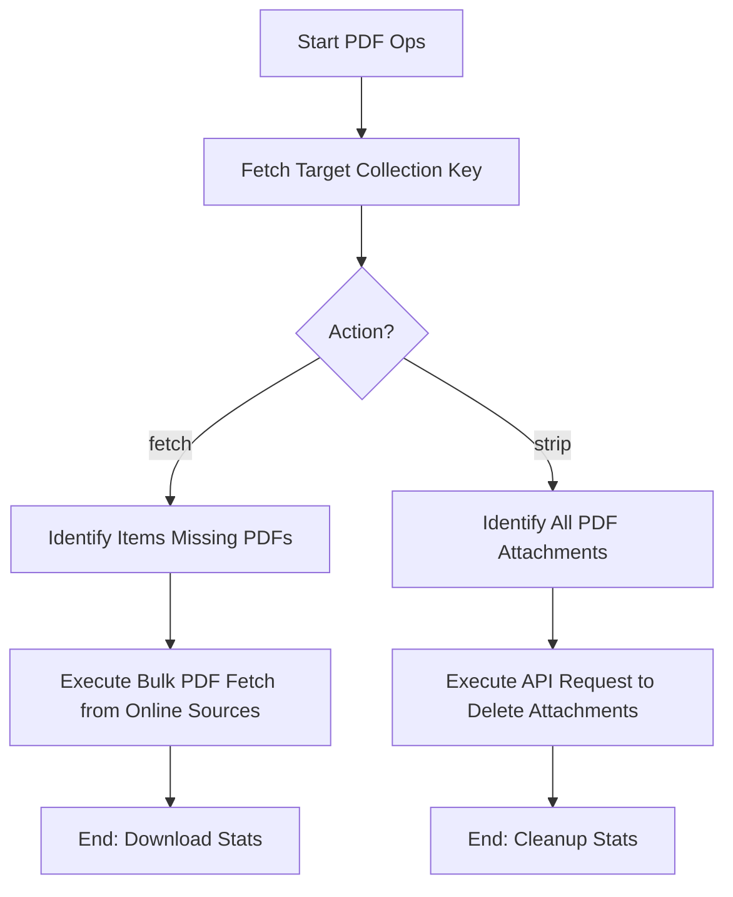

# DOC-SPEC: collection pdf

## 1. Classification
- **Level:** [🟡 MODIFICATION (Fetching) | 🔴 DESTRUCTIVE (Stripping)]
- **Target Audience:** Researcher / SLR Lead

## 2. Logic Flow (Visual Synthesis)

## 3. Synopsis
Performs bulk operations on PDF attachments across an entire collection, either fetching missing files from online sources or stripping all existing attachments.

## 4. Description (Instructional Architecture)
The `collection pdf` command is a powerful utility for managing the physical files associated with your library. It handles the two extreme ends of the attachment lifecycle: 
- **`fetch`**: Scans the specified collection for items without PDF attachments and attempts to retrieve them using DOIs and other metadata through integrated providers (like ArXiv, CrossRef). 
- **`strip`**: Permanently removes all PDF attachments from every item in a collection. This is often used to save storage space or to reset an "incorrect" set of attachments before re-running a fetch.

## 5. Parameter Matrix
| Command | Flag | Type | Description | Ergonomic Note |
| :--- | :--- | :--- | :--- | :--- |
| `fetch` | `--collection` | String | Target collection Key/Name. | Required. |
| `strip` | `--collection` | String | Target collection Key/Name. | Required. |

## 6. Scenario-Based Examples (Cognitive Anchors)
### Scenario: Mass retrieval of papers for reading
**Problem:** I've imported 200 items into my "Reading List" (Key: `READ_123`) but they only have metadata and no PDFs.
**Action:** `zotero-cli collection pdf fetch --collection "READ_123"`
**Result:** The CLI attempts to find and download PDFs for all 200 items automatically.

## 7. Cognitive Safeguards
- **Common Failure Modes:** Attempting `fetch` without a working internet connection or with items that lack a DOI/ArXiv ID. `strip` is irreversible and will permanently delete files from your Zotero storage.
- **Safety Tips:** Always ensure you have sufficient disk space before running `fetch` on large collections. Use `strip` with extreme caution.
