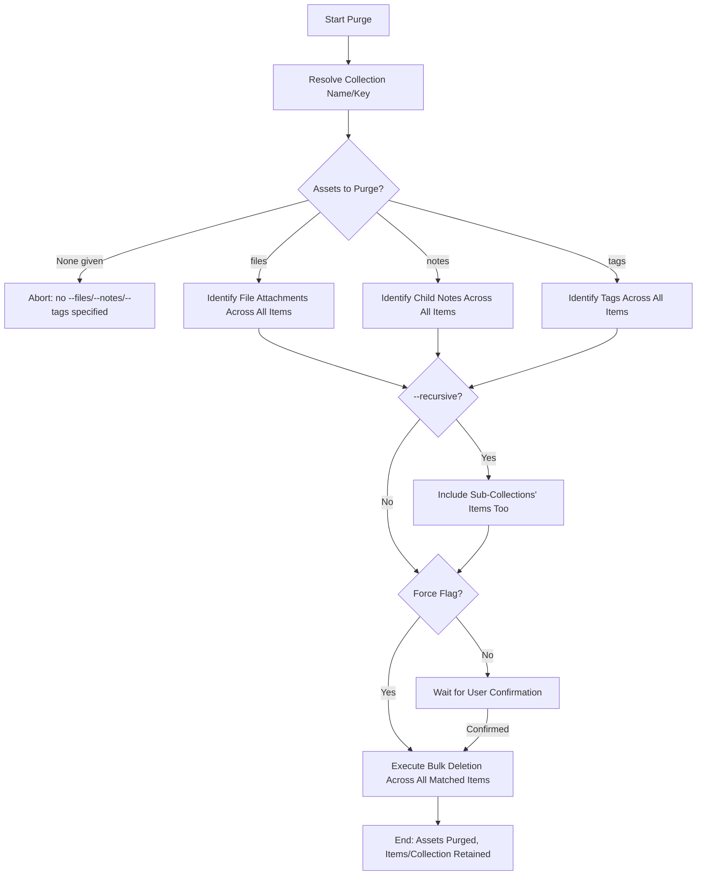

# DOC-SPEC: collection purge

## 1. Classification
- **Level:** 🔴 DESTRUCTIVE (Bulk Asset Deletion)
- **Target Audience:** Researcher / Library Manager

## 2. Logic Flow (Visual Synthesis)

## 3. Synopsis
Permanently removes specific types of child assets (files, notes, tags) from every item in a collection, without deleting the items or the collection itself.

## 4. Description (Instructional Architecture)
`collection purge` is the bulk counterpart to `item purge`: instead of targeting one item, it applies the same asset-type removal (file attachments, notes, tags) across every item in a named collection in one pass. This is useful for resetting an entire screening-phase folder's annotations between review rounds, or reclaiming storage by stripping PDFs from a folder of items you've already extracted data from.

By default the command asks for interactive confirmation before deleting anything, listing which asset types and (if `--recursive` is given) whether sub-collections are included. `--force` skips this for scripted/automated use. At least one of `--files`, `--notes`, or `--tags` must be given - the command aborts with no changes if none are specified, since there is nothing to purge otherwise.

## 5. Parameter Matrix
| Flag / Parameter | Type | Description | Ergonomic Note |
| :--- | :--- | :--- | :--- |
| `--name` | String | Collection Name or Key | Required. |
| `--files` | Boolean | Purge attachments/files from every item | Optional. Default: False. |
| `--notes` | Boolean | Purge notes from every item | Optional. Default: False. |
| `--tags` | Boolean | Purge tags from every item | Optional. Default: False. |
| `--recursive` | Boolean | Also purge assets from items in sub-collections | Optional. Default: False. |
| `--force` | Boolean | Skip interactive confirmation | Optional. Default: False. |

## 6. Scenario-Based Examples (Cognitive Anchors)
### Scenario: Clearing stale annotations before a re-screening pass
**Problem:** My "Full Text Review" folder (Key: `FT_01`) has old notes and tags from a prior review round that no longer apply.
**Action:** `zotero-cli collection purge --name "FT_01" --notes --tags`
**Result:** All notes and tags are removed from every item in the collection, providing a clean slate.

### Scenario: Reclaiming disk space across a whole SLR tree
**Problem:** I've already extracted the data I need from a source's PDFs and want to free up storage across the entire tree, including its phase subfolders.
**Action:** `zotero-cli collection purge --name "raw_ieee" --files --recursive --force`
**Result:** File attachments are removed from every item in `raw_ieee` and all of its sub-collections, with no confirmation prompt.

## 7. Cognitive Safeguards
- **Common Failure Modes:** Running the command without at least one of `--files`/`--notes`/`--tags` - it aborts with no changes. Forgetting `--recursive` when sub-collections also need purging, leaving them untouched.
- **Safety Tips:** ALWAYS verify the collection with `collection list` before purging. This command is irreversible; purged assets cannot be recovered through the CLI. Consider `collection backup` first if the data might still be needed.
