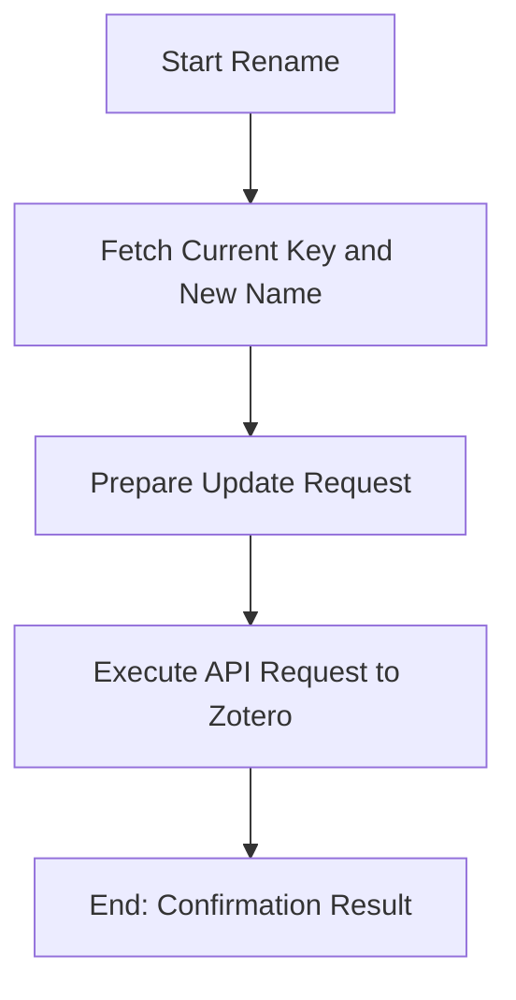

# DOC-SPEC: collection rename

## 1. Classification
- **Level:** 🟡 MODIFICATION (Library Structure Update)
- **Target Audience:** Researcher / SLR Lead

## 2. Logic Flow (Visual Synthesis)

## 3. Synopsis
Changes the display name of an existing collection in your library without affecting its contents or hierarchical position.

## 4. Description (Instructional Architecture)
The `collection rename` command is the standard way to reorganize your library structure as project names or research themes evolve. 

It requires the current `Collection Key` (or the existing name) to identify the target, and the new name as the replacement. The unique key of the collection remains the same after a rename operation, ensuring that automated scripts or integrations that rely on that key are not broken. 

## 5. Parameter Matrix
| Flag | Type | Description | Ergonomic Note |
| :--- | :--- | :--- | :--- |
| `--key` | String | Current name or unique identifier (Key) of the collection. | Required. |
| `--name` | String | The new display name for the collection. | Required. |
| `--version` | Integer | The version identifier for concurrency protection. | Optional. |

## 6. Scenario-Based Examples (Cognitive Anchors)
### Scenario: Evolving a research focus
**Problem:** My collection "Machine Learning Basic" (Key: `ML_01`) needs a more professional name for a publication.
**Action:** `zotero-cli collection rename --key "ML_01" --name "Fundamentals of Reinforcement Learning"`
**Result:** The folder is renamed, but all internal items and its unique key (`ML_01`) remain unchanged.

## 7. Cognitive Safeguards
- **Common Failure Modes:** Attempting to rename a collection using an outdated version number (if `--version` is provided). This will result in a synchronization error.
- **Safety Tips:** If you have multiple folders with the same name across different parents, always use the `Collection Key` for a guaranteed deterministic rename.
