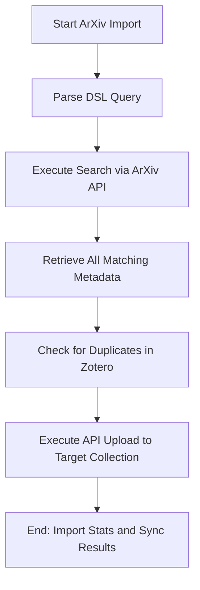

# DOC-SPEC: import arxiv

## 1. Classification
- **Level:** 🟡 MODIFICATION (Automated Ingestion)
- **Target Audience:** AI Researcher / arXiv Power-User

## 2. Logic Flow (Visual Synthesis)

## 3. Synopsis
Directly imports research papers from the arXiv repository into a Zotero collection using a powerful Domain Specific Language (DSL) query.

## 4. Description (Instructional Architecture)
The `import arxiv` command is a high-level automation tool that skips the manual downloading of bibliographic files. It connects directly to the official arXiv API to retrieve metadata for items that match your search criteria. 

The command is unique because it supports a **DSL Query** (using the `all:`, `ti:`, `au:`, etc. syntax) for precise filtering. Before importing, it performs a local check to avoid duplicating items that might already exist in your Zotero library. 

## 5. Parameter Matrix
| Flag | Type | Description | Ergonomic Note |
| :--- | :--- | :--- | :--- |
| `--query` | String | The ArXiv DSL query string. | E.g., `ti:"Attention is all you need"`. |
| `--file` | Path | Local path to a text file containing the DSL query. | Useful for complex, multi-line searches. |
| `--collection` | String | Target collection Name or Key. | Required. |
| `--limit` | Integer | Maximum number of results to fetch. | Optional. Default: 50. |
| `--verbose` | Flag | Displays the status of each item during the import process. | Optional. |

## 6. Scenario-Based Examples (Cognitive Anchors)
### Scenario: Automated tracking of new papers on a topic
**Problem:** I want to import all recent papers by "Vaswani" in the category "cs.LG" into my "Deep Learning Tracking" (Key: `DL_01`) folder.
**Action:** `zotero-cli import arxiv --query "au:Vaswani AND cat:cs.LG" --collection "DL_01" --limit 10`
**Result:** The CLI finds the 10 most relevant matches and imports them into Zotero.

## 7. Cognitive Safeguards
- **Common Failure Modes:** Providing an invalid DSL syntax which causes an API error from ArXiv. ArXiv API rate limits can also trigger failures if multiple imports are run in quick succession.
- **Safety Tips:** Use the `--limit` flag wisely. arXiv search results can be vast, and importing thousands of items at once may lead to a cluttered library and API throttling.
