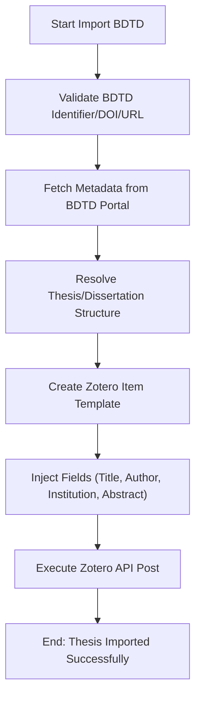

# DOC-SPEC: import bdtd

## 1. Classification
- **Level:** 🟡 MODIFICATION (Remote Metadata Import)
- **Target Audience:** Researchers / Librarians

## 2. Logic Flow (Visual Synthesis)

## 3. Synopsis
Imports metadata for Brazilian theses and dissertations directly from the BDTD (Biblioteca Digital Brasileira de Teses e Dissertações) portal into a specified Zotero collection.

## 4. Description (Instructional Architecture)
The `import bdtd` command enables seamless integration with the Brazilian digital repository for academic theses and dissertations. By providing a record handle, repository identifier, or DOI, the system queries the BDTD network, translates XML/JSON metadata formats into compliant Zotero schemas, and registers the document as a new library item with correct citation fields.

## 5. Parameter Matrix
| Flag / Parameter | Type | Description | Ergonomic Note |
| :--- | :--- | :--- | :--- |
| `--collection` | String | N/A | Required. |
| `--verbose` | Boolean | N/A | Optional. Default: False. |
| `identifier` | String | BDTD record ID, repository handle URL, or DOI | Required. |

## 6. Scenario-Based Examples (Cognitive Anchors)
### Scenario: Importing a thesis by handle URL
**Problem:** A researcher needs to cite a specific PhD dissertation hosted on UFPE's BDTD portal.
**Action:** `zotero-cli import bdtd "https://repositorio.ufpe.br/handle/123456789/51746" --collection "BR_THESES"`
**Result:** The thesis metadata is fetched, parsed, and created under the "BR_THESES" collection.

## 7. Cognitive Safeguards
- **Common Failure Modes:** Attempting to query an invalid handle URL or repository endpoint that is offline.
- **Safety Tips:** Ensure your network configuration has access to academic portals in Brazil. Always double check that the target collection exists.
