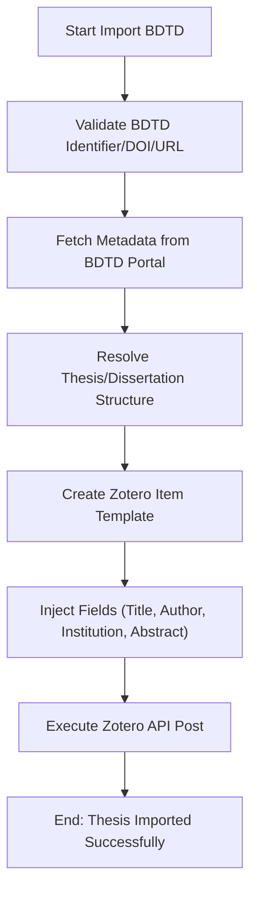

# DOC-SPEC: import bdtd

## 1. Classification
- **Level:** 🟡 MODIFICATION (Remote Metadata Import)
- **Target Audience:** Researchers / Librarians

## 2. Logic Flow (Visual Synthesis)

```mermaid
graph TD
    A["Start Import BDTD"] --> B["Validate BDTD Identifier/DOI/URL"]
    B --> C["Fetch Metadata from BDTD Portal"]
    C --> D["Resolve Thesis/Dissertation Structure"]
    D --> E["Create Zotero Item Template"]
    E --> F["Inject Fields (Title, Author, Institution, Abstract)"]
    F --> G["Execute Zotero API Post"]
    G --> H["End: Thesis Imported Successfully"]
```

## 3. Synopsis
Imports thesis/dissertation metadata directly from the BDTD (Biblioteca Digital Brasileira de Teses e Dissertações) portal into a specified Zotero collection — either a single item by identifier, or a free-text `--query` bulk import.

## 4. Description (Instructional Architecture)
The `import bdtd` command enables seamless integration with the Brazilian digital repository for academic theses and dissertations. By providing a record handle, repository identifier, or DOI, the system queries the BDTD network, translates XML/JSON metadata formats into compliant Zotero schemas, and registers the document as a new library item with correct citation fields. Alternatively, a free-text `--query` bulk-imports up to `--limit` matching theses/dissertations via BDTD's search endpoint (Issue #182) — exactly one of the identifier or `--query` must be given, not both. PDF resolution is automatic for a single-identifier import but skipped for `--query` bulk imports (too slow to scrape per record); run `item pdf fetch` afterward to attach PDFs for bulk-imported items.

## 5. Parameter Matrix
| Flag / Parameter | Type | Description | Ergonomic Note |
| :--- | :--- | :--- | :--- |
| `identifier` | String | BDTD record ID, repository handle URL, or DOI | Required unless `--query` is given. |
| `--query` | String | Free-text search query for bulk import | Required unless `identifier` is given. |
| `--limit` | Integer | Max results to import for `--query` | Optional. Default: 20. |
| `--collection` | String | N/A | Required. |
| `--verbose` | Boolean | N/A | Optional. Default: False. |

## 6. Scenario-Based Examples (Cognitive Anchors)
### Scenario: Importing a thesis by handle URL
**Problem:** A researcher needs to cite a specific PhD dissertation hosted on UFPE's BDTD portal.
**Action:** `zotero-cli import bdtd "https://repositorio.ufpe.br/handle/123456789/51746" --collection "BR_THESES"`
**Result:** The thesis metadata is fetched, parsed, and created under the "BR_THESES" collection.

### Scenario: Harvesting Brazilian theses on a topic in bulk
**Problem:** A researcher wants every BDTD thesis about "aprendizado de maquina" (machine learning) they can find, up to 20.
**Action:** `zotero-cli import bdtd --query "aprendizado de maquina" --collection "Brazilian_ML" --limit 20`
**Result:** Up to 20 matching theses/dissertations are imported without PDFs; `item pdf fetch` attaches PDFs afterward.

## 7. Cognitive Safeguards
- **Common Failure Modes:** Attempting to query an invalid handle URL or repository endpoint that is offline. Providing both an identifier and `--query` (or neither) is rejected.
- **Safety Tips:** Ensure your network configuration has access to academic portals in Brazil. Always double check that the target collection exists. For `--query` bulk imports, follow up with `item pdf fetch` to attach PDFs.
