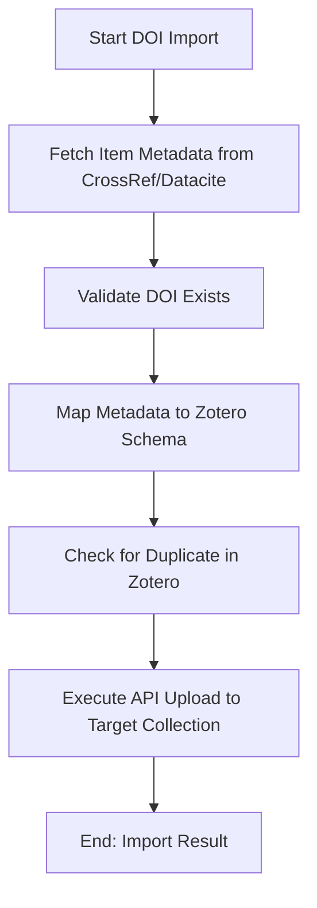

# DOC-SPEC: import doi

## 1. Classification
- **Level:** 🟡 MODIFICATION (Automated Ingestion)
- **Target Audience:** Researcher / Author

## 2. Logic Flow (Visual Synthesis)

## 3. Synopsis
Imports a single research item directly into a Zotero collection using its unique Digital Object Identifier (DOI).

## 4. Description (Instructional Architecture)
The `import doi` command is the fastest way to add a specific paper to your library when you have its identifier. It automates the entire process of metadata retrieval from canonical sources like CrossRef or Datacite, ensuring that the bibliographic fields (authors, journal name, volume, pages, etc.) are accurate and complete. 

Before uploading to the Zotero API, the CLI checks if an item with the same DOI already exists in your library. If it does, the import is skipped to maintain library hygiene. 

## 5. Parameter Matrix
| Flag | Type | Description | Ergonomic Note |
| :--- | :--- | :--- | :--- |
| `doi` | String | The Digital Object Identifier (e.g., `10.1145/123456.123456`). | Positional argument. |
| `--collection` | String | Name or unique identifier (Key) of the target collection. | Required. |
| `--verbose` | Flag | Displays the status of each item during the import process. | Optional. |

## 6. Scenario-Based Examples (Cognitive Anchors)
### Scenario: Adding a specific paper from a journal website
**Problem:** I've found a critical paper on a journal website (DOI: `10.1038/nature12373`) and want to add it to my "Climate Studies" folder (Key: `CLIM_01`).
**Action:** `zotero-cli import doi "10.1038/nature12373" --collection "CLIM_01"`
**Result:** The item is automatically created in Zotero with its full verified metadata.

## 7. Cognitive Safeguards
- **Common Failure Modes:** Attempting to import an invalid DOI or one that is not yet indexed by the primary metadata providers. 
- **Safety Tips:** If the import fails with a "DOI not found" error, verify the identifier on `doi.org`. Some DOIs can take a few days to propagate through the major APIs after publication.
