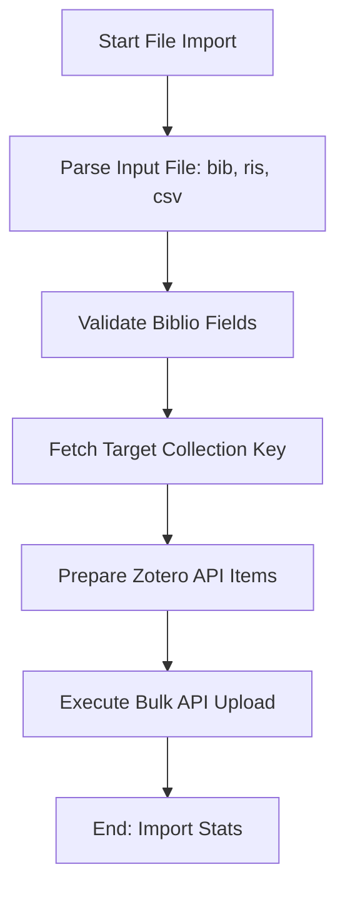

# DOC-SPEC: import file

## 1. Classification
- **Level:** 🟡 MODIFICATION (Library Population)
- **Target Audience:** Researcher / SLR Lead

## 2. Logic Flow (Visual Synthesis)

```mermaid
graph TD
    A["Start File Import"] --> B["Parse Input File: bib, ris, csv"]
    B --> C["Validate Biblio Fields"]
    C --> D["Fetch Target Collection Key"]
    D --> E["Prepare Zotero API Items"]
    E --> F["Execute Bulk API Upload"]
    F --> G["End: Import Stats"]
```

## 3. Synopsis
Bulk-imports research items from external bibliographic files (`.bib`, `.ris`, `.csv`) directly into a specified Zotero collection.

## 4. Description (Instructional Architecture)
The `import file` command is the "Ingestion Engine" for transitioning your external search results into the Zotero ecosystem. It supports the three most common academic data formats, allowing you to centralize search results from providers like IEEE Xplore, ACM Digital Library, or SpringerLink. 

The command parses the metadata from the input file, maps the fields to the Zotero data model, and performs an authenticated upload to the Zotero API. If the target collection does not exist, it is recommended to create it first using `collection create`. 

## 5. Parameter Matrix
| Flag / Parameter | Type | Description | Ergonomic Note |
| :--- | :--- | :--- | :--- |
| `--collection` | String | N/A | Required. |
| `--details` | Boolean | N/A | Optional. Default: False. |
| `--verbose` | Boolean | Deprecated alias of `--details` | Hidden; prints a warning. Removed in 4.0 (Issue #374). |
| `file` | String | Path to input file | Required. |

## 6. Scenario-Based Examples (Cognitive Anchors)
### Scenario: Importing search results from IEEE Xplore
**Problem:** I've downloaded a `results.ris` file from IEEE and I want to import all 50 papers into my "Primary Search" folder (Key: `PRI_01`).
**Action:** `zotero-cli import file "results.ris" --collection "PRI_01"`
**Result:** All 50 items are uploaded to Zotero and linked to that collection.

## 7. Cognitive Safeguards
- **Common Failure Modes:** Attempting to import files with malformed syntax or missing mandatory fields (like Title). Large files (>1000 items) may hit Zotero API rate limits; use `--details` to monitor progress.
- **BibTeX text:** LaTeX escapes in a `.bib` file's title, authors, venue and abstract are converted to real characters on import (`M{\"u}ller` becomes `Müller`, `\&` becomes `&`); DOI, URL, arXiv ID and year are stored exactly as written, and math (`$\alpha$`) and unknown commands are left alone. Parsed with `bibtexparser` and translated with [`bxc`](https://pypi.org/project/bxc/).
- **Safety Tips:** Always verify your `.bib` or `.ris` encoding (UTF-8 is preferred) to prevent character corruption during the import process.
