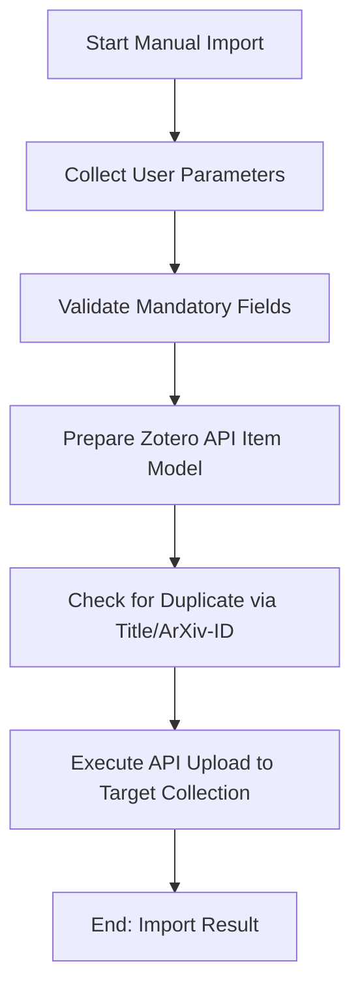

# DOC-SPEC: import manual

## 1. Classification
- **Level:** 🟡 MODIFICATION (Manual Ingestion)
- **Target Audience:** Researcher / Author

## 2. Logic Flow (Visual Synthesis)

## 3. Synopsis
Allows for the manual creation of a research item in Zotero by providing key metadata fields like Title, ArXiv ID, and Abstract from the terminal.

## 4. Description (Instructional Architecture)
The `import manual` command is designed for cases where automated ingestion via DOI or BibTeX is not available, or when working with pre-print versions of papers. It provides a structured way to add an item by explicitly defining its core bibliographic attributes. 

While simpler than bulk import commands, it ensures consistency by validating that the required fields (Title and ArXiv-ID) are present. This command is particularly useful for quickly adding papers that you have discovered through manual browsing or for papers that are not yet officially indexed by bibliographic databases. 

## 5. Parameter Matrix
| Flag | Type | Description | Ergonomic Note |
| :--- | :--- | :--- | :--- |
| `--title` | String | The full title of the paper. | Required. Use double quotes. |
| `--arxiv-id` | String | The ArXiv unique identifier. | Required. |
| `--abstract` | String | The abstract or summary of the paper. | Optional. |
| `--collection` | String | Name or Key of the target collection. | Required. |

## 6. Scenario-Based Examples (Cognitive Anchors)
### Scenario: Adding a pre-print discovered on social media
**Problem:** I've found an interesting paper title ("Beyond GPT-4") and its ArXiv ID (`2301.12345`) on X (Twitter) and want to save it to my "AI Trends" folder (Key: `AI_TRENDS`).
**Action:** `zotero-cli import manual --title "Beyond GPT-4" --arxiv-id "2301.12345" --collection "AI_TRENDS"`
**Result:** The item is created in Zotero with the provided information.

## 7. Cognitive Safeguards
- **Common Failure Modes:** Attempting to run without providing the mandatory `--title` or `--arxiv-id` flags. 
- **Safety Tips:** This command is best used for single items. For multiple items, prefer `import file` or `import arxiv` for higher efficiency.
