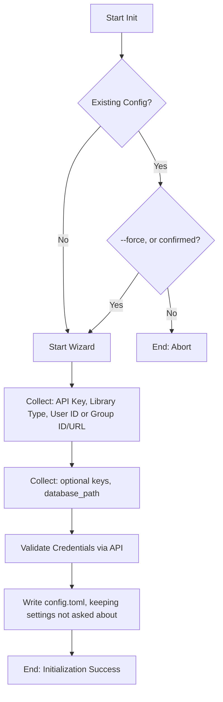

# DOC-SPEC: init

## 1. Classification
- **Level:** 🟡 MODIFICATION (Configuration Initialization)
- **Target Audience:** New User / SysAdmin

## 2. Logic Flow (Visual Synthesis)

## 3. Synopsis
Launches an interactive setup wizard to configure the Zotero CLI, establishing connection credentials and local storage paths.

## 4. Description (Instructional Architecture)
The `init` command is the gateway to using `zotero-cli`. It simplifies the configuration process by guiding the user through a series of prompts. 

The command identifies your Zotero profile (Personal or Group) and establishes an authenticated connection to the Zotero API. It also asks for `database_path`, the local `zotero.sqlite` that `--offline` reads. The result of this process is a `config.toml` file, which is used by all other commands in the library.

Run it again to change the settings: the existing file is updated, not replaced. Its current values are the defaults, and settings the wizard doesn't ask about (AI keys, `storage_path`, other tables) are kept.

## 5. Parameter Matrix
| Flag / Parameter | Type | Description | Ergonomic Note |
| :--- | :--- | :--- | :--- |
| `--force` | Boolean | Update an existing config without asking | Optional. Default: False. |

## 6. Scenario-Based Examples (Cognitive Anchors)
### Scenario: First-time setup of the CLI
**Problem:** I've just installed the `zotero-cli` and I need to connect it to my Zotero account.
**Action:** `zotero-cli init`
**Result:** The CLI asks for my API key and Library ID, then creates the configuration file.

## 7. Cognitive Safeguards
- **Common Failure Modes:** Providing an incorrect API key or ID during the wizard. The CLI will attempt to validate these via a heartbeat request to the API. 
- **Safety Tips:** Keep your API key private. The `init` command stores it in a plain-text `config.toml` file by default, so ensure your configuration directory has restricted access permissions.
