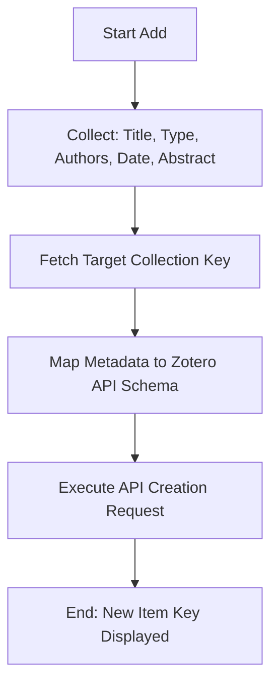

# DOC-SPEC: item add

## 1. Classification
- **Level:** 🟡 MODIFICATION (Manual Item Creation)
- **Target Audience:** Researcher / Author

## 2. Logic Flow (Visual Synthesis)

## 3. Synopsis
Manually creates a new research item in a specific Zotero collection by providing core bibliographic fields directly from the terminal.

## 4. Description (Instructional Architecture)
The `item add` command is the fundamental tool for manual entry into your library. While automated tools like `import doi` are preferred, `item add` provides the necessary flexibility for papers that lack digital identifiers, such as older printed works, internal reports, or very recent pre-prints. 

It ensures that the new item is correctly structured for the Zotero database and automatically links it to your target collection. You can specify the type of item (defaulting to `journalArticle`) and provide a comma-separated list of authors to maintain bibliographic accuracy.

## 5. Parameter Matrix
| Flag / Parameter | Type | Description | Ergonomic Note |
| :--- | :--- | :--- | :--- |
| `--abstract` | String | Abstract/Note | Optional. |
| `--authors` | String | Comma-separated authors (e.g. 'John Doe, Jane Smith') | Optional. |
| `--collection` | String | Collection name or key | Required. |
| `--date` | String | Publication Date | Optional. |
| `--title` | String | Item Title | Required. |
| `--type` | String | Item Type (Default: journalArticle) | Optional. Default: journalArticle. |

## 6. Scenario-Based Examples (Cognitive Anchors)
### Scenario: Manually adding an internal technical report
**Problem:** I have a PDF of an internal company report that isn't online and I want to add it to my "References" folder (Key: `REF_01`).
**Action:** `zotero-cli item add --title "Advanced RAG Pipelines V2" --authors "Engineering Team" --collection "REF_01" --type report`
**Result:** A new item of type "report" is created in Zotero, ready for PDF attachment via `item pdf attach`.

## 7. Cognitive Safeguards
- **Common Failure Modes:** Attempting to run without the mandatory `--title` or `--collection` flags. 
- **Safety Tips:** Use `item pdf attach` immediately after creation if you have a local file for the item. For high-volume manual entry, consider using a CSV file with the `import file` command instead.
