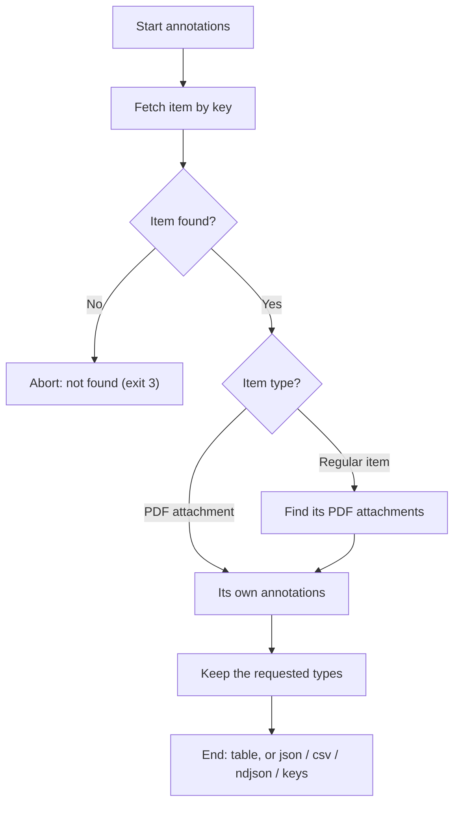

# DOC-SPEC: item annotations

## 1. Classification
- **Level:** 🟢 READ-ONLY (Reading)
- **Target Audience:** Researcher / Author

## 2. Logic Flow (Visual Synthesis)

## 3. Synopsis
Lists the highlights, notes and other annotations you made in an item's PDF attachments, in reading order.

## 4. Description (Instructional Architecture)
Zotero's PDF reader stores each highlight, note, underline, image selection, ink stroke and text box as an annotation attached to the PDF. `item annotations` reads them back: for a regular item it looks at all of its PDF attachments, for an attachment key it reads that file's annotations. Each one has its `type`, the highlighted `text`, your `comment`, `color`, `page` label and `tags`. The table shows page, type, text, comment, tags and key; `--format json`, `csv` and `ndjson` carry every field (`key`, `attachment`, `type`, `text`, `comment`, `color`, `page`, `tags`, `date_added`, `sort_index`), and `keys` prints just the annotation keys.

Online it uses the Web API; with `--offline` it reads `itemAnnotations` from the local `zotero.sqlite`. Annotations in the trash are left out in both.

## 5. Parameter Matrix
| Flag / Parameter | Type | Description | Ergonomic Note |
| :--- | :--- | :--- | :--- |
| `--key` | String | Item key (a regular item, or a PDF attachment) | One of `--key` or the positional is required. |
| `key` | String | The same key, as a positional: `item annotations ABCD1234` | Optional alternative to `--key`. |
| `--type` | Choice | Only this kind: `highlight`, `note`, `image`, `ink`, `underline` or `text`; repeat for several | Optional. Default: all kinds. |
| `--format` | Choice | Output format: `table`, `json`, `csv`, `ndjson` (one JSON object per line) or `keys` (one annotation key per line) | Optional. Default: table. |

## 6. Scenario-Based Examples (Cognitive Anchors)
### Scenario: Pulling my highlights out of a paper
**Problem:** I highlighted and commented a PDF in Zotero and want the text for my notes.
**Action:** `zotero-cli item annotations ABCD1234`
**Result:** A table of the item's annotations in reading order: page, type, the highlighted text and my comment.

### Scenario: Only the highlights, for a script
**Problem:** I want just the highlighted passages as data.
**Action:** `zotero-cli item annotations --key ABCD1234 --type highlight --format json`
**Result:** A JSON list on stdout, one object per highlight.

## 7. Cognitive Safeguards
- **Common Failure Modes:** An item with no PDF, or a PDF without annotations, prints "No annotations found" and exits 0 (an empty list in the data formats). An unknown key exits 3.
- **Safety Tips:** Read-only. Annotation text comes from the PDF itself and is untrusted: it is shown as plain text, and control characters are removed from the table, CSV and keys output.
