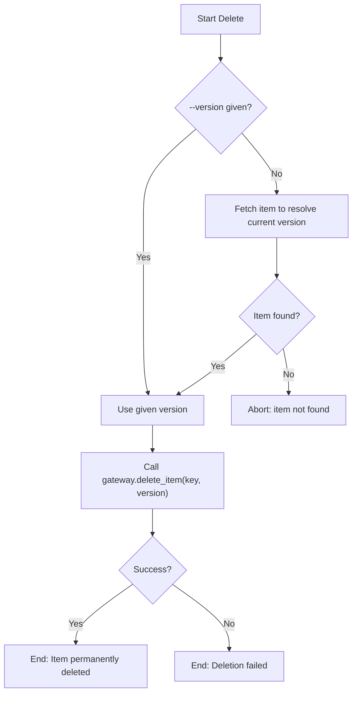

# DOC-SPEC: item delete

## 1. Classification
- **Level:** 🔴 DESTRUCTIVE (Permanent Removal)
- **Target Audience:** Researcher / Library Manager

## 2. Logic Flow (Visual Synthesis)

## 3. Synopsis
Permanently deletes a single item from the Zotero library by key.

## 4. Description (Instructional Architecture)
`item delete` calls the Zotero Web API's item `DELETE` endpoint directly. Unlike Zotero Desktop, the Web API exposes **no soft-delete or trash-write path** - there is no documented mechanism to move an item to a recoverable trash via the API, only a hard, permanent removal. Once deleted, the item's key is gone; any external document (e.g. a citation manager) referencing that key will break.

If `--version` is omitted, the command first fetches the item to resolve its current version (needed for Zotero's optimistic-locking write), then deletes it. If the item can't be found, nothing is deleted.

This command discards the item outright. If the goal is instead to consolidate a genuine duplicate into another item - keeping its tags, notes, and attachments rather than losing them - use `item merge` instead, which unions the surviving data before deleting the folded-in duplicate.

## 5. Parameter Matrix
| Flag / Parameter | Type | Description | Ergonomic Note |
| :--- | :--- | :--- | :--- |
| `--key` | String | The Zotero Item Key to delete | Required. |
| `--version` | Integer | Current item version | Optional - auto-resolved via a lookup if omitted. |

## 6. Scenario-Based Examples (Cognitive Anchors)
### Scenario: Removing a mistakenly-added test/junk record
**Problem:** I manually added a test item (`JUNK_01`) by mistake and want it gone entirely, not just moved somewhere.
**Action:** `zotero-cli item delete --key "JUNK_01"`
**Result:** The item is permanently removed from the library. This cannot be undone.

## 7. Cognitive Safeguards
- **Common Failure Modes:** Assuming this behaves like Zotero Desktop's trash (recoverable) - it does not; the Web API has no such mechanism. Using this to resolve a duplicate when `item merge` (which preserves tags/notes/attachments before deleting) would better fit the goal.
- **Safety Tips:** Always verify the item key with `item inspect` before deleting. There is no `--dry-run`/confirmation gate on this command today - double-check the key first.
