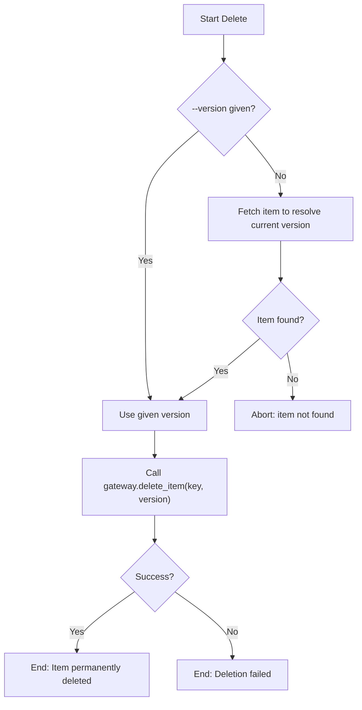

# DOC-SPEC: item delete

## 1. Classification
- **Level:** 🔴 DESTRUCTIVE (Permanent Removal)
- **Target Audience:** Researcher / Library Manager

## 2. Logic Flow (Visual Synthesis)

```mermaid
graph TD
    A["Start Delete"] --> B{"--version given?"}
    B -- "No" --> C["Fetch item to resolve current version"]
    B -- "Yes" --> D["Use given version"]
    C --> E{"Item found?"}
    E -- "No" --> F["Abort: item not found"]
    E -- "Yes" --> D
    D --> G["Call gateway.delete_item(key, version)"]
    G --> H{"Success?"}
    H -- "Yes" --> I["End: Item permanently deleted"]
    H -- "No" --> J["End: Deletion failed"]
```

## 3. Synopsis
Permanently deletes a single item from the Zotero library by key.

## 4. Description (Instructional Architecture)
`item delete` calls the Zotero Web API's item `DELETE` endpoint directly. This is a hard, permanent removal, not Zotero's recoverable trash. (Whether the Web API can also move items to the trash, as Zotero Desktop's sync does, is being verified in [#402](https://github.com/fchicout/zotero-cli/issues/402); `item trash` works in `--offline` mode.) Once deleted, the item's key is gone; any external document (e.g. a citation manager) referencing that key will break.

If `--version` is omitted, the command first fetches the item to resolve its current version (needed for Zotero's optimistic-locking write), then deletes it. If the item can't be found, nothing is deleted.

This command discards the item outright. If the goal is instead to consolidate a genuine duplicate into another item - keeping its tags, notes, and attachments rather than losing them - use `item merge` instead, which unions the surviving data before deleting the folded-in duplicate.

## 5. Parameter Matrix
| Flag / Parameter | Type | Description | Ergonomic Note |
| :--- | :--- | :--- | :--- |
| `--key` | String | The Zotero Item Key to delete | Required. |
| `--version` | Integer | Delete only if the item is still at this version | Optional - defaults to the item's current version. If the item changed since, nothing is deleted and the command exits 1. |
| `--execute` | Flag | Delete the item | Mutually exclusive with `--dry-run`. Currently the default for now (see Cognitive Safeguards) - kept for scripts that already pass it and for future-proofing once 4.0 flips the default (Issue #378, #462). |
| `--dry-run` | Flag | Preview the item and its children without deleting | Mutually exclusive with `--execute`. |

## 6. Scenario-Based Examples (Cognitive Anchors)
### Scenario: Removing a mistakenly-added test/junk record
**Problem:** I manually added a test item (`JUNK_01`) by mistake and want it gone entirely, not just moved somewhere.
**Action:** `zotero-cli item delete --key "JUNK_01" --execute`
**Result:** The item is permanently removed from the library. This cannot be undone.

### Scenario: Checking what a delete would remove first
**Problem:** I want to see the item and its attached notes/files before committing to a delete.
**Action:** `zotero-cli item delete --key "JUNK_01" --dry-run`
**Result:** The item and its children are listed; nothing is deleted.

## 7. Cognitive Safeguards
- **Common Failure Modes:** Assuming this behaves like Zotero Desktop's trash (recoverable) - it does not. Using this to resolve a duplicate when `item merge` (which preserves tags/notes/attachments before deleting) would better fit the goal.
- **Safety Tips:** Always verify the item key with `item inspect` before deleting. Passing neither `--dry-run` nor `--execute` still deletes immediately today (unchanged 3.x behaviour), but prints a deprecation warning to stderr - pass `--execute` explicitly. This becomes preview-by-default in 4.0 (Issue #378, #462).
