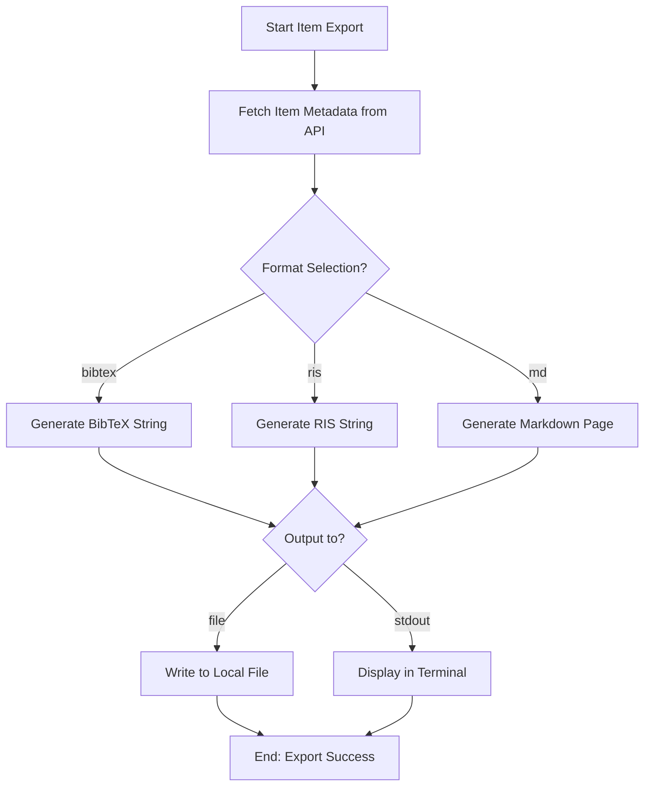

# DOC-SPEC: item export

## 1. Classification
- **Level:** 🟢 READ-ONLY (Single Item Portability)
- **Target Audience:** Researcher / Author

## 2. Logic Flow (Visual Synthesis)

## 3. Synopsis
Exports the metadata of a single Zotero item into standard formats (`bibtex`, `ris`, or `md`), either to a local file or directly to the terminal output.

## 4. Description (Instructional Architecture)
The `item export` command is designed for surgical extraction of bibliographic data. It allows you to quickly get the citation for a specific paper without exporting an entire collection. 

It is particularly useful for workflows where you need to copy a single BibTeX entry into a LaTeX file or generate a research note in Markdown for a specific item. If the `--output` flag is omitted, the command will print the result directly to your terminal (stdout), enabling quick "Copy-Paste" operations.

## 5. Parameter Matrix
| Flag | Type | Description | Ergonomic Note |
| :--- | :--- | :--- | :--- |
| `--key` | String | Unique Zotero Item Key (e.g., `ABCD1234`). | Required. |
| `--format` | Choice | `bibtex`, `ris`, or `md`. | Optional. Default: `bibtex`. |
| `--output` | String | Local path where the export will be saved. | Optional. Omit to print to terminal. |

## 6. Scenario-Based Examples (Cognitive Anchors)
### Scenario: Getting a BibTeX entry for a specific citation
**Problem:** I'm writing a paper and I just need the BibTeX code for the item with key `VA12345`.
**Action:** `zotero-cli item export --key "VA12345" --format bibtex`
**Result:** The CLI prints the formatted BibTeX entry directly to the terminal.

## 7. Cognitive Safeguards
- **Common Failure Modes:** Attempting to export an item key that doesn't exist or for which metadata is incomplete. 
- **Safety Tips:** Use the `md` format to generate a local Markdown "Digital Twin" of your Zotero item, which is perfect for linking in local note-taking apps.
