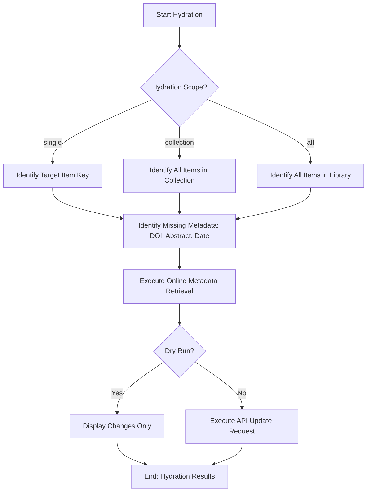

# DOC-SPEC: item hydrate

## 1. Classification
- **Level:** 🟡 MODIFICATION (Metadata Enrichment)
- **Target Audience:** Researcher / Author

## 2. Logic Flow (Visual Synthesis)

## 3. Synopsis
Automatically enriches the metadata of items by retrieving missing fields (like DOIs, abstracts, and publication dates) from online sources.

## 4. Description (Instructional Architecture)
The `item hydrate` command is the "Metadata Repair" tool for your library. It's common for imports (especially from older PDF files or arXiv) to result in incomplete items. Hydration scans these items, identifies missing persistent identifiers or abstract content, and attempts to fill them by querying external APIs like CrossRef or ArXiv. 

The command can be run on a single item, an entire collection, or your whole library. The `--dry-run` flag is highly recommended for larger scopes, as it allows you to preview the metadata changes that the CLI intends to make before committing them to your Zotero cloud database. 

## 5. Parameter Matrix
| Flag | Type | Description | Ergonomic Note |
| :--- | :--- | :--- | :--- |
| `--key` | String | Unique Zotero Item Key (e.g., `ABCD1234`). | Single item hydration. |
| `--collection` | String | Name or Key of the collection to hydrate. | Mass hydration for a folder. |
| `--all` | Flag | Scans every item in your entire Zotero library. | Comprehensive repair. |
| `--dry-run` | Flag | Preview changes without performing any API updates. | Essential safety feature. |

## 6. Scenario-Based Examples (Cognitive Anchors)
### Scenario: Enriching a collection after an ArXiv import
**Problem:** I've imported 50 items from ArXiv, but many of them are missing their formal DOI identifiers and abstracts.
**Action:** `zotero-cli item hydrate --collection "ARXIV_FOLDER" --dry-run`
**Result:** The CLI shows a summary of which items can be updated with verified DOIs and dates from CrossRef.

## 7. Cognitive Safeguards
- **Common Failure Modes:** Attempting hydration for items that have no existing metadata at all (like unfiled PDF attachments). Hydration requires a baseline Title or existing Identifier to pivot to a full record. 
- **Safety Tips:** Always use `--dry-run` when running on an entire collection to ensure that the retrieved metadata is accurate and doesn't overwrite your custom data incorrectly.
