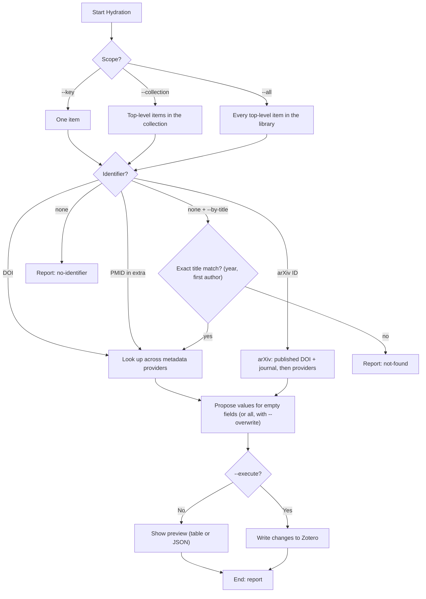

# DOC-SPEC: item hydrate

## 1. Classification
- **Level:** 🟡 MODIFICATION (Metadata Enrichment). Previews by default; writes only with `--execute`.
- **Target Audience:** Researcher / Author / Scripts and AI agents

## 2. Logic Flow (Visual Synthesis)

```mermaid
graph TD
    A["Start Hydration"] --> B{"Scope?"}
    B -- "--key" --> C["One item"]
    B -- "--collection" --> D["Top-level items in the collection"]
    B -- "--all" --> E["Every top-level item in the library"]
    C --> F{"Identifier?"}
    D --> F
    E --> F
    F -- "DOI" --> G["Look up across metadata providers"]
    F -- "arXiv ID" --> H["arXiv: published DOI + journal, then providers"]
    F -- "PMID in extra" --> G
    F -- "none + --by-title" --> I{"Exact title match? (year, first author)"}
    F -- "none" --> X["Report: no-identifier"]
    I -- "yes" --> G
    I -- "no" --> Y["Report: not-found"]
    G --> J["Propose values for empty fields (or all, with --overwrite)"]
    H --> J
    J --> K{"--execute?"}
    K -- "No" --> L["Show preview (table or JSON)"]
    K -- "Yes" --> M["Write changes to Zotero"]
    L --> N["End: report"]
    M --> N
```

## 3. Synopsis
Fills in missing metadata (abstract, date, venue, URL, creators, DOI) for items that have a DOI, an arXiv ID or a PMID, looking them up across the configured metadata providers. Previews by default; `--execute` writes.

## 4. Description (Instructional Architecture)
`item hydrate` completes sparse records, typically ones imported from BibTeX/RIS/CSV exports or from arXiv. For each item it finds an identifier in this order:
1. **DOI:** looked up across the metadata providers (Semantic Scholar, CrossRef, OpenAlex, PubMed, and others). Results from providers whose record has a *different* DOI are discarded, so a provider that misreads the identifier can't write another paper's data.
2. **arXiv ID** (from `extra` or an arxiv.org URL): arXiv supplies the DOI and journal of the published version when it exists, and the providers fill in the rest.
3. **PMID** (a `PMID: 123` line in `extra`).
4. **Title (only with `--by-title`):** an exact match on the normalized title, which must also agree on the year and the first author's last name when the item has them. Anything less certain is reported as `not-found` rather than guessed.

**What gets written.** By default only **empty** fields are filled: `doi`, `abstract`, `date` (year), `venue` (the item type's own field: `publicationTitle`, `proceedingsTitle`, `bookTitle`, ...), `url` and `creators`. Only fields that exist for the item's type are proposed, so Zotero never rejects a write. `--overwrite` also replaces non-empty values, except that the **title is never changed unless you name it in `--fields`**, and a full date isn't replaced by just its year.

**Preview, then write.** Without `--execute`, nothing is written: a table shows each item's proposed changes, and `--format json` prints the same report as JSON on stdout (status, identifier, source, and old and new value per field) for scripts or agents to review. `--dry-run` is accepted and means the same as the default.

Items are processed one at a time, and each provider paces its own requests. A failure on one item is reported (`failed`) and the run continues.

## 5. Parameter Matrix
| Flag / Parameter | Type | Description | Ergonomic Note |
| :--- | :--- | :--- | :--- |
| `--key` | String | Item Key | One of `--key`, `--collection`, `--all`. |
| `--collection` | String | Hydrate all items in a collection | Top-level items only; attachments and notes are skipped. |
| `--all` | Boolean | Hydrate the whole library | Scans the library client-side. |
| `--fields` | String | Comma-separated fields to fill: `doi`, `abstract`, `date`, `venue`, `url`, `creators`, `title` | Default: all except `title`. |
| `--overwrite` | Boolean | Also replace fields that already have a value | The title only if named in `--fields`. |
| `--by-title` | Boolean | For items without an identifier, try an exact title match | Uses OpenAlex search. |
| `--execute` | Boolean | Write the changes | Default: preview only. |
| `--dry-run` | Boolean | Preview only (the default) | Kept for existing scripts; can't be combined with `--execute`. |
| `-f`, `--format` | Choice | `table` or `json` | JSON goes to stdout; progress messages go to stderr. |

## 6. Scenario-Based Examples (Cognitive Anchors)
### Scenario: Completing records imported from a reference export
**Problem:** A collection imported from BibTeX has DOIs but no abstracts, venues or dates.
**Action:** `zotero-cli item hydrate --collection "Imported"`, then `zotero-cli item hydrate --collection "Imported" --execute`
**Result:** The first run previews the changes per item and field; the second writes them. Fields that already had values are untouched.

### Scenario: Catching up arXiv preprints that have since been published
**Problem:** Items imported from arXiv have no DOI or journal yet.
**Action:** `zotero-cli item hydrate --collection "ARXIV_FOLDER" --execute`
**Result:** Preprints whose published version arXiv knows get its DOI and journal, plus any other empty fields from the providers.

### Scenario: An agent reviewing changes before applying them
**Problem:** I want machine-readable proposals first.
**Action:** `zotero-cli item hydrate --all --format json > proposals.json`
**Result:** One JSON object per item with its status (`proposed`, `no-change`, `no-identifier`, `not-found`, `failed`) and every proposed change.

## 7. Cognitive Safeguards
- **Common Failure Modes:** Items with no DOI, arXiv ID or PMID are reported as `no-identifier`; try `--by-title`. `--execute` with `--offline` is refused, because offline mode is read-only; preview works.
- **Safety Tips:** Run without `--execute` first, especially with `--all` or `--overwrite`. Existing values are kept unless you pass `--overwrite`, and the title only changes when you ask for it by name.
