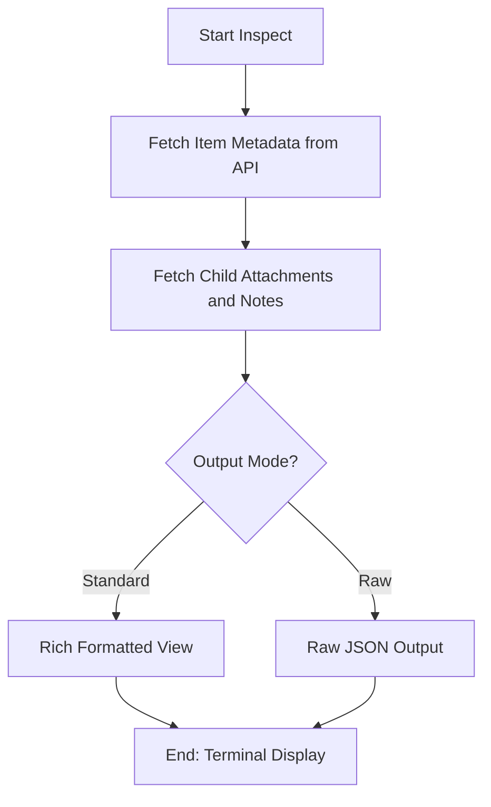

# DOC-SPEC: item inspect

## 1. Classification
- **Level:** 🟢 READ-ONLY (Detailed Metadata Display)
- **Target Audience:** Researcher / AI Analyst

## 2. Logic Flow (Visual Synthesis)

## 3. Synopsis
Provides a comprehensive view of all metadata, attachments, and child notes associated with a specific Zotero item.

## 4. Description (Instructional Architecture)
The `item inspect` command is the "Deep Dive" tool for individual research items. It allows you to see the full richness of the metadata that Zotero maintains, which is often hidden in standard list views. 

It retrieves information about the item's authors, identifiers (DOI, ISBN), publication data, and its relationships with other items (like child notes and file attachments). By default, it presents this in a human-readable "Rich" format. The `--raw` flag is particularly useful for developers or researchers who want to see the exact JSON response from the Zotero API for troubleshooting or programmatic processing.

## 5. Parameter Matrix
| Flag / Parameter | Type | Description | Ergonomic Note |
| :--- | :--- | :--- | :--- |
| `--file` | String | Path to file containing keys (one key per line) | Optional. |
| `--format` | String | Export in specific bibliographic format | Optional. |
| `--full-notes` | Boolean | Show full content of child notes | Optional. Default: False. |
| `--key` | String | Zotero Item Key(s) - comma-separated, e.g. K1,K2,K3 | Optional. |
| `--raw` | Boolean | Show raw JSON | Optional. Default: False. |

## 6. Scenario-Based Examples (Cognitive Anchors)
### Scenario: Verifying metadata after an import
**Problem:** I've imported a paper and want to ensure the DOI was correctly captured and check for any existing notes.
**Action:** `zotero-cli item inspect "ABCD1234"`
**Result:** The CLI displays a detailed view of the item, including its DOI, abstract, and list of child PDF attachments.

## 7. Cognitive Safeguards
- **Common Failure Modes:** Attempting to inspect an item key that does not exist or for which you lack read permissions. 
- **Safety Tips:** Use `item list` or `search` to find the correct key if you are unsure. For very large notes, the `--full-notes` flag may result in a lot of terminal scroll.
