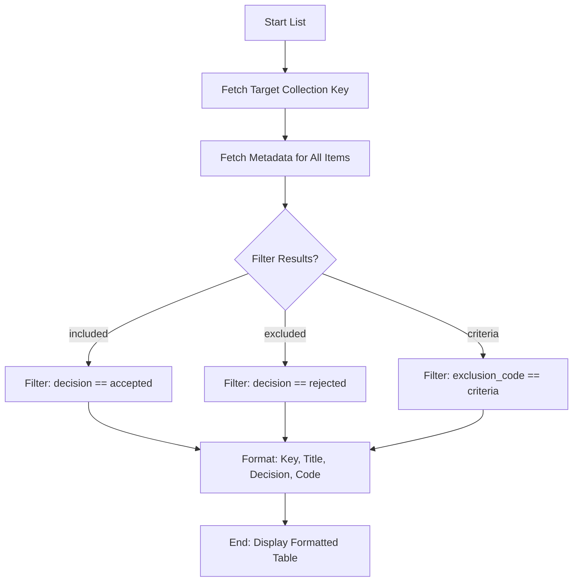

# DOC-SPEC: item list

## 1. Classification
- **Level:** 🟢 READ-ONLY (Collection Inventory)
- **Target Audience:** Researcher / SLR Lead

## 2. Logic Flow (Visual Synthesis)

## 3. Synopsis
Displays a table of research items within a collection, optionally filtering them based on screening decisions, exclusion criteria, or reviewer persona.

## 4. Description (Instructional Architecture)
The `item list` command is the "Inventory View" of your research data. It provides a structured summary of the items in a folder, which is essential for monitoring the progress of your library organization or SLR phases. 

The power of `item list` lies in its advanced filtering capabilities. You can quickly see which papers were accepted, rejected, or excluded for specific reasons. This command is also "Persona-aware," allowing you to see the results of individual reviewers in a multi-agent or collaborative project. 

## 5. Parameter Matrix
| Flag | Type | Description | Ergonomic Note |
| :--- | :--- | :--- | :--- |
| `--collection` | String | Name or Key of the collection. | Required for folder-specific inventory. |
| `--trash` | Flag | Lists items currently in the Zotero trash. | Optional. |
| `--included` | Flag | Filters for items with a decision of 'accepted'. | Useful for final review. |
| `--excluded` | Flag | Filters for items with a decision of 'rejected'. | Useful for audit checks. |
| `--criteria` | String | Filters by a specific exclusion criteria code (e.g., `E1`). | Optional. |
| `--persona` | String | Filters by a specific reviewer persona (e.g., `Hamilton`). | Optional. |

## 6. Scenario-Based Examples (Cognitive Anchors)
### Scenario: Verifying the final selection for a review
**Problem:** I want to see a list of all 25 items that were accepted in my "Final Selection" folder (Key: `FIN_01`).
**Action:** `zotero-cli item list --collection "FIN_01" --included`
**Result:** The table displays only the 25 accepted items, showing their titles and unique keys.

## 7. Cognitive Safeguards
- **Common Failure Modes:** Confusion between the `--collection` name and key. For deterministic results, always prefer using the unique Key. 
- **Safety Tips:** Use the `--top-only` flag if you want to exclude child attachments and notes from the list for a cleaner view of the main research papers.
