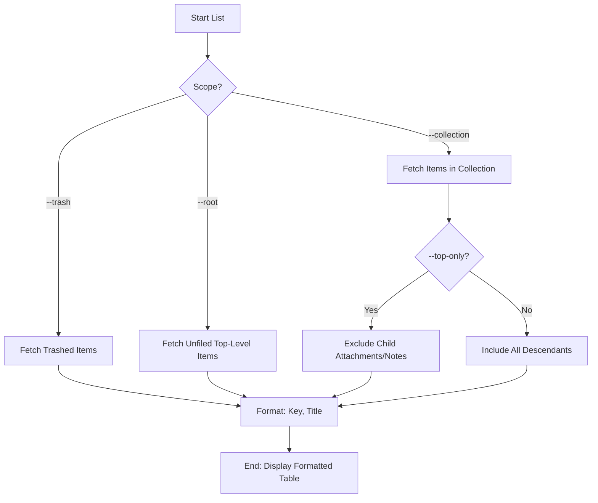

# DOC-SPEC: item list

## 1. Classification
- **Level:** 🟢 READ-ONLY (Collection Inventory)
- **Target Audience:** Researcher / SLR Lead

## 2. Logic Flow (Visual Synthesis)

```mermaid
graph TD
    A["Start List"] --> B{"Scope?"}
    B -- "--collection" --> C["Fetch Items in Collection"]
    B -- "--trash" --> D["Fetch Trashed Items"]
    B -- "--root" --> E["Fetch Unfiled Top-Level Items"]
    C --> F{"--top-only?"}
    F -- "Yes" --> G["Exclude Child Attachments/Notes"]
    F -- "No" --> H["Include All Descendants"]
    D --> I["Format: Key, Title"]
    E --> I
    G --> I
    H --> I
    I --> J["End: Display Formatted Table"]
```

## 3. Synopsis
Displays a table of research items within a collection, the trash, or unfiled at the library root.

## 4. Description (Instructional Architecture)
The `item list` command is the "Inventory View" of your research data. It provides a structured summary of the items in a folder, the trash, or unfiled at the root of your library — useful for a raw browse of what physically lives where.

For filtering by screening decision (accepted/rejected), exclusion criteria, phase, or reviewer persona, use `slr list` instead — that command scans SDB audit notes rather than plain collection membership, and is the correct tool for questions like "which papers did Dr. Silas reject."

## 5. Parameter Matrix
| Flag / Parameter | Type | Description | Ergonomic Note |
| :--- | :--- | :--- | :--- |
| `--collection` | String | Collection name or key | Optional. |
| `--fields` | String | Comma-separated fields to show: `key`, `title`, `type`, `creators`, `first_author`, `date`, `year`, `venue`, `doi`, `url`, `abstract`, `extra`, `tags`, `collections`, `parent`, `date_added`, `date_modified`, or any raw Zotero field name (e.g. `publicationTitle`, `volume`) | Optional. Mutually exclusive with `--wide`. |
| `-f`, `--format` | Choice | Output format: `table`, `json`, `csv`, or `markdown` | Optional. Default: table. |
| `--root` | Boolean | List top-level items not in any collection | Optional. Default: False. |
| `--top-only` | Boolean | Only show top-level items | Optional. Default: False. |
| `--trash` | Boolean | List items in the trash | Optional. Default: False. |
| `-w`, `--wide` | Boolean | Preset: key, title, first author, year, venue, DOI | Optional. Default: False. Mutually exclusive with `--fields`. |

## 6. Scenario-Based Examples (Cognitive Anchors)
### Scenario: Browsing everything in a folder
**Problem:** I want to see all items currently in my "Final Selection" folder (Key: `FIN_01`).
**Action:** `zotero-cli item list --collection "FIN_01"`
**Result:** The table displays every item in that collection, showing their titles and unique keys.

### Scenario: Filtering by screening decision instead
**Problem:** I want only the items that were accepted, not everything in the folder.
**Action:** `zotero-cli slr list included --tree "FIN_01"`
**Result:** Only items with an 'Accepted' SDB audit note are shown.

### Scenario: Exporting bibliographic metadata for a report
**Problem:** I need authors, year, venue and DOI for every paper in a collection, in a spreadsheet, without inspecting each item one by one.
**Action:** `zotero-cli item list --collection "FIN_01" --fields key,title,creators,year,venue,doi --format csv > fin_01.csv`
**Result:** A CSV with one row per item and the requested columns. Use `--wide` for a quick on-screen view of the same core fields, or `--format json`/`markdown` for scripts and reports.

## 7. Cognitive Safeguards
- **Common Failure Modes:** Confusion between the `--collection` name and key. For deterministic results, always prefer using the unique Key.
- **Safety Tips:** Use the `--top-only` flag if you want to exclude child attachments and notes from the list for a cleaner view of the main research papers.
