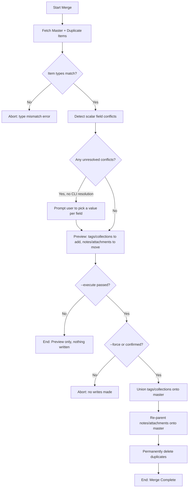

# DOC-SPEC: item merge

## 1. Classification
- **Level:** 🔴 DESTRUCTIVE (Permanent Consolidation)
- **Target Audience:** Researcher / Library Manager

## 2. Logic Flow (Visual Synthesis)

## 3. Synopsis
Merges one or more duplicate items into a chosen master item: unions tags and collection membership, moves notes/attachments onto the master, then permanently deletes the (now emptied) duplicates.

## 4. Description (Instructional Architecture)
`item merge` is the generic, SLR-independent counterpart to Zotero Desktop's own duplicate-merge feature — use `report duplicates` first to find candidate master/duplicate keys, then run this command to actually consolidate them.

Unlike Zotero Desktop, the Zotero Web API only exposes a hard, permanent `DELETE` — there is no documented soft-delete or relations-based merge the way Desktop's internal "equate item IDs" mechanism provides. That means this command's deletions are **permanent and non-reversible**, and any external document (e.g. a Word/LibreOffice manuscript) citing a duplicate's key by that key will break once the duplicate is deleted — Desktop's citation-plugin transparency on merge cannot be replicated here.

By default the command only shows a preview (nothing is written) — pass `--execute` to actually perform the merge, and confirm the interactive prompt (or pass `--force` to skip it). If the master and duplicates disagree on any of title, date, DOI, ISBN, URL, or abstract, you are prompted to pick which value to keep for each conflicting field — there is no silent "first wins" default, since choosing the wrong survivor value for a real methodological attribute (like DOI) can quietly corrupt records. Master and duplicates must share the same Zotero item type, the same rule Zotero Desktop enforces before allowing its own merge.

## 5. Parameter Matrix
| Flag / Parameter | Type | Description | Ergonomic Note |
| :--- | :--- | :--- | :--- |
| `--master` | String | Zotero Key of the item to keep | Required. |
| `--duplicates` | String | Comma-separated Zotero Keys of the duplicate items to merge into `--master` | Required. |
| `--execute` | Boolean | Actually perform the merge | Optional. Default: False (preview only). |
| `--force` | Boolean | Skip the interactive confirmation prompt | Optional. Default: False. Still requires `--execute`. |

## 6. Scenario-Based Examples (Cognitive Anchors)
### Scenario: Consolidating a paper imported twice from different search databases
**Problem:** `report duplicates` found the same paper as items `IEEE_KEY1` (master, more complete) and `SPR_KEY2` (duplicate).
**Action:** `zotero-cli item merge --master "IEEE_KEY1" --duplicates "SPR_KEY2" --execute`
**Result:** `SPR_KEY2`'s tags, collections, notes, and attachments move onto `IEEE_KEY1`; `SPR_KEY2` is permanently deleted.

### Scenario: Previewing a merge before committing
**Problem:** I want to see what a merge would do without touching my library yet.
**Action:** `zotero-cli item merge --master "IEEE_KEY1" --duplicates "SPR_KEY2"`
**Result:** A preview table is shown (tags/collections to add, notes/attachments to move); nothing is written since `--execute` was omitted.

## 7. Cognitive Safeguards
- **Common Failure Modes:** Master and duplicates must share the same item type — mismatched types abort the merge with no writes. Conflicting scalar fields left unresolved also abort with no writes; there is no default resolution.
- **Safety Tips:** This is PERMANENT — the Zotero Web API only supports hard delete, there is no undo the way Zotero Desktop's internal merge has. Always run without `--execute` first to preview. Any citation-management document referencing a duplicate's key by that key will break once merged.
