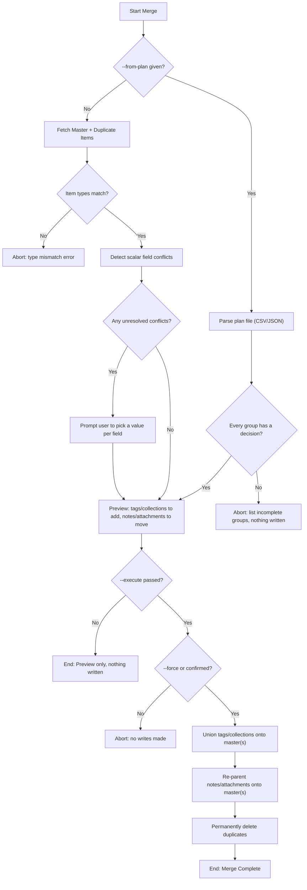

# DOC-SPEC: item merge

## 1. Classification
- **Level:** 🔴 DESTRUCTIVE (Permanent Consolidation)
- **Target Audience:** Researcher / Library Manager

## 2. Logic Flow (Visual Synthesis)

## 3. Synopsis
Merges one or more duplicate items into a chosen master item: unions tags and collection membership, moves notes/attachments onto the master, then permanently deletes the (now emptied) duplicates. Supports a single group (`--master`/`--duplicates`) or bulk execution of many groups at once from a plan file (`--from-plan`).

## 4. Description (Instructional Architecture)
`item merge` is the generic, SLR-independent counterpart to Zotero Desktop's own duplicate-merge feature — use `report duplicates` first to find candidate master/duplicate keys (or `report duplicates --export-plan` to get a bulk-editable file), then run this command to actually consolidate them.

Unlike Zotero Desktop, the Zotero Web API only exposes a hard, permanent `DELETE` — there is no documented soft-delete or relations-based merge the way Desktop's internal "equate item IDs" mechanism provides. That means this command's deletions are **permanent and non-reversible**, and any external document (e.g. a Word/LibreOffice manuscript) citing a duplicate's key by that key will break once the duplicate is deleted — Desktop's citation-plugin transparency on merge cannot be replicated here.

By default the command only shows a preview (nothing is written) — pass `--execute` to actually perform the merge, and confirm the interactive prompt (or pass `--force` to skip it). In the **single-group form**, if the master and duplicates disagree on any of title, date, DOI, ISBN, URL, or abstract, you are prompted to pick which value to keep for each conflicting field — there is no silent "first wins" default, since choosing the wrong survivor value for a real methodological attribute (like DOI) can quietly corrupt records. Master and duplicates must share the same Zotero item type, the same rule Zotero Desktop enforces before allowing its own merge.

In the **`--from-plan` bulk form**, a CSV or JSON file (produced by `report duplicates --export-plan`, then edited to fill in `role`/`reason` per group) drives many merges in one pass. Completeness is all-or-nothing: if even one group in the file is missing a decision, **nothing in the entire plan is written**, not just that group — this matches the "only update Zotero once the full review is complete" model the plan format is designed for (e.g. Corbenic-SLR building its own screening UI on top of the same plan objects, in-memory, with no Zotero writes until the researcher's session is done). Since there's no interactive path in a batch run, conflicting scalar fields are resolved automatically to whatever value the chosen master already has, rather than prompted — the human already made the real decision by choosing which occurrence is master.

## 5. Parameter Matrix
| Flag / Parameter | Type | Description | Ergonomic Note |
| :--- | :--- | :--- | :--- |
| `--master` | String | Zotero Key of the item to keep | Required unless `--from-plan` is given. |
| `--duplicates` | String | Comma-separated Zotero Keys of the duplicate items to merge into `--master` | Required unless `--from-plan` is given. |
| `--from-plan` | String | Path to a merge plan file (`.csv` or `.json`) for bulk execution | Optional. Mutually exclusive in practice with `--master`/`--duplicates`. |
| `--execute` | Boolean | Actually perform the merge | Optional. Default: False (preview only). |
| `--force` | Boolean | Skip the interactive confirmation prompt | Optional. Default: False. Still requires `--execute`. |

## 6. Scenario-Based Examples (Cognitive Anchors)
### Scenario: Consolidating a paper imported twice from different search databases
**Problem:** `report duplicates` found the same paper as items `IEEE_KEY1` (master, more complete) and `SPR_KEY2` (duplicate).
**Action:** `zotero-cli item merge --master "IEEE_KEY1" --duplicates "SPR_KEY2" --execute`
**Result:** `SPR_KEY2`'s tags, collections, notes, and attachments move onto `IEEE_KEY1`; `SPR_KEY2` is permanently deleted.

### Scenario: Previewing a merge before committing
**Problem:** I want to see what a merge would do without touching my library yet.
**Action:** `zotero-cli item merge --master "IEEE_KEY1" --duplicates "SPR_KEY2"`
**Result:** A preview table is shown (tags/collections to add, notes/attachments to move); nothing is written since `--execute` was omitted.

### Scenario: Bulk-resolving a batch of duplicate groups from a plan file
**Problem:** I exported `duplicates.csv` via `report duplicates --export-plan`, filled in the `role`/`reason` columns for every group, and want to commit them all at once.
**Action:** `zotero-cli item merge --from-plan duplicates.csv --execute`
**Result:** Every fully-resolved group is merged in one pass; if any group is still missing a decision, nothing is written and the incomplete groups are listed instead.

## 7. Cognitive Safeguards
- **Common Failure Modes:** Master and duplicates must share the same item type — mismatched types abort the merge with no writes. Conflicting scalar fields left unresolved in the single-group form also abort with no writes; there is no default resolution there. With `--from-plan`, a single incomplete group blocks the *entire* batch, not just that group.
- **Safety Tips:** This is PERMANENT — the Zotero Web API only supports hard delete, there is no undo the way Zotero Desktop's internal merge has. Always run without `--execute` first to preview. Any citation-management document referencing a duplicate's key by that key will break once merged.
