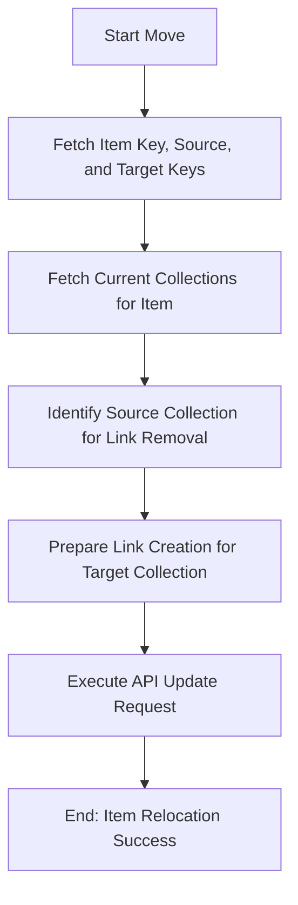

# DOC-SPEC: item move

## 1. Classification
- **Level:** 🟡 MODIFICATION (Library Reorganization)
- **Target Audience:** Researcher / SLR Lead

## 2. Logic Flow (Visual Synthesis)

## 3. Synopsis
Moves a research item from one collection to another by updating its collection links in the Zotero library.

## 4. Description (Instructional Architecture)
The `item move` command is the standard way to reorganize individual items within your folder structure. In the Zotero data model, an item can belong to multiple collections simultaneously. This command performs a two-step process: it creates a link to the `target` collection and removes the link from the `source` collection. 

If the item is only present in a single collection, the `source` parameter may be optional depending on the CLI version's ambiguity detection. Using the unique `Item Key` and `Collection Key` is the recommended method for ensuring precise item relocation. 

## 5. Parameter Matrix
| Flag | Type | Description | Ergonomic Note |
| :--- | :--- | :--- | :--- |
| `--item-id` | String | Unique Zotero Item Key (e.g., `ABCD1234`). | Required. |
| `--source` | String | Name or Key of the origin collection. | Optional. |
| `--target` | String | Name or Key of the destination collection. | Required. |

## 6. Scenario-Based Examples (Cognitive Anchors)
### Scenario: Categorizing a paper into a specific folder
**Problem:** I have a paper in "Incoming Search" (Key: `INC_01`) and I want to move it to my "Methodology" folder (Key: `METH_01`).
**Action:** `zotero-cli item move --item-id "ABCD1234" --source "INC_01" --target "METH_01"`
**Result:** The item is now correctly linked to the "Methodology" folder and removed from "Incoming Search."

## 7. Cognitive Safeguards
- **Common Failure Modes:** Attempting to move an item using a name for the source or target that corresponds to multiple collections. This will lead to an ambiguity error. 
- **Safety Tips:** Always use `item list` or `collection list` to find the exact keys before moving critical items. Moving an item does not affect its metadata or attachments.
