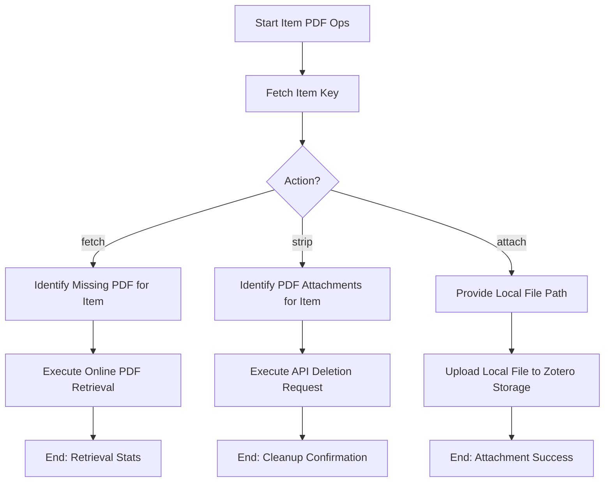

# DOC-SPEC: item pdf

## 1. Classification
- **Level:** [🟡 MODIFICATION (Fetching/Attaching) | 🔴 DESTRUCTIVE (Stripping)]
- **Target Audience:** Researcher / Author

## 2. Logic Flow (Visual Synthesis)

## 3. Synopsis
Manages PDF attachments for a single item in your Zotero library, including fetching files from online sources, removing existing ones, or attaching local files.

## 4. Description (Instructional Architecture)
The `item pdf` command is a versatile tool for handling individual file attachments. It provides three primary operations:
- **`fetch`**: Automatically attempts to retrieve a PDF for the item from the internet using its DOI or ArXiv ID metadata. 
- **`strip`**: Permanently deletes all existing PDF attachments linked to the item from the Zotero library. 
- **`attach`**: Manually uploads a local file from your computer and links it as a child attachment to the item in Zotero. 

## 5. Parameter Matrix
| Command | Flag | Type | Description | Ergonomic Note |
| :--- | :--- | :--- | :--- | :--- |
| `fetch` | `key` | String | Unique Zotero Item Key (e.g., `ABCD1234`). | Required. |
| `strip` | `key` | String | Unique Zotero Item Key (e.g., `ABCD1234`). | Required. |
| `attach` | `key` | String | Unique Zotero Item Key (e.g., `ABCD1234`). | Required. |
| `attach` | `--file` | Path | Local path to the PDF to be attached. | Required. |

## 6. Scenario-Based Examples (Cognitive Anchors)
### Scenario: Manually attaching a downloaded paper
**Problem:** I've manually downloaded a paper ("Manual_Ref.pdf") and want to attach it to its corresponding item (Key: `REF_123`) in Zotero.
**Action:** `zotero-cli item pdf attach "REF_123" --file "Manual_Ref.pdf"`
**Result:** The PDF is uploaded and linked to the item in the Zotero cloud storage.

## 7. Cognitive Safeguards
- **Common Failure Modes:** Attempting to `fetch` for an item without valid DOI metadata or `attach` a file that is too large for your Zotero storage quota. 
- **Safety Tips:** Use `fetch` as your first attempt for mass metadata enrichment. Use `attach` for papers behind paywalls or that require manual authentication for download.
