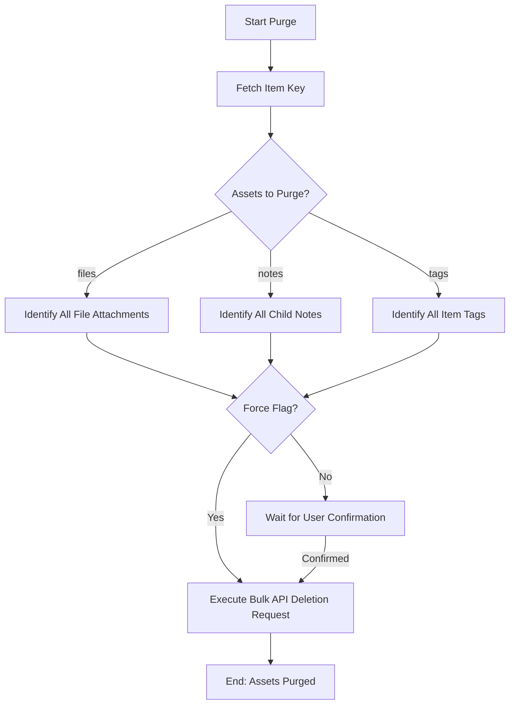

# DOC-SPEC: item purge

## 1. Classification
- **Level:** 🔴 DESTRUCTIVE (Asset Deletion)
- **Target Audience:** Researcher / Library Manager

## 2. Logic Flow (Visual Synthesis)

## 3. Synopsis
Permanently removes specific types of child assets (PDFs, notes, or tags) from a research item without deleting the main bibliographic record itself.

## 4. Description (Instructional Architecture)
The `item purge` command is a surgical cleanup tool. It is designed for researchers who want to "reset" certain aspects of an item's data while keeping the item in their library. 

You can choose to purge file attachments (freeing up storage space), child notes (removing outdated annotations), or all tags associated with the item. By default, the command is interactive and will ask for confirmation before deleting anything. The `--force` flag can be used in automated scripts to bypass this safety check.

## 5. Parameter Matrix
| Flag / Parameter | Type | Description | Ergonomic Note |
| :--- | :--- | :--- | :--- |
| `--files` | Boolean | Purge attachments/files | Optional. Default: False. |
| `--force` | Boolean | Skip confirmation | Optional. Default: False. |
| `--key` | String | Item Key | Required. |
| `--notes` | Boolean | Purge notes | Optional. Default: False. |
| `--tags` | Boolean | Purge tags | Optional. Default: False. |

## 6. Scenario-Based Examples (Cognitive Anchors)
### Scenario: Cleaning up annotations before a re-read
**Problem:** I have a paper (Key: `READ_456`) filled with old notes and tags that are no longer relevant to my current project.
**Action:** `zotero-cli item purge --key "READ_456" --notes --tags`
**Result:** All notes and tags are removed from the paper, providing a clean slate for new analysis.

## 7. Cognitive Safeguards
- **Common Failure Modes:** Attempting to purge assets without providing at least one asset type flag (`--files`, `--notes`, or `--tags`). 
- **Safety Tips:** ALWAYS verify the item key using `item inspect` before purging. This command is irreversible; deleted assets cannot be recovered through the CLI.
