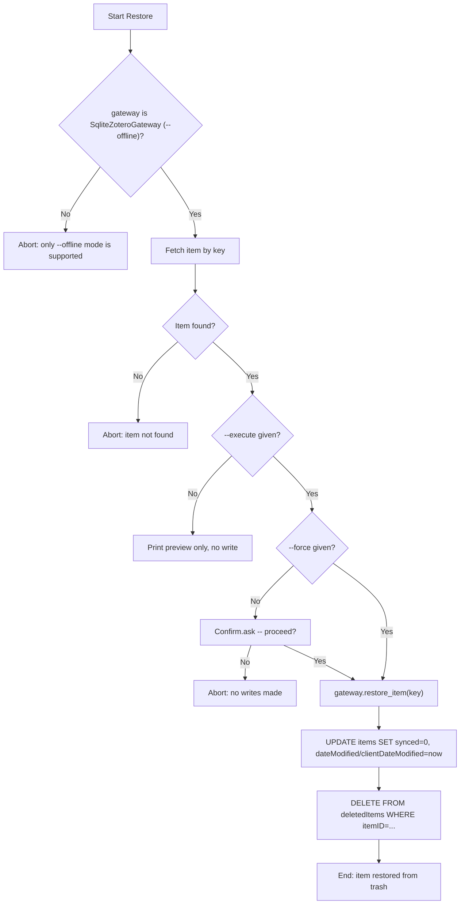

# DOC-SPEC: item restore

## 1. Classification
- **Level:** 🟡 MODIFICATION (writes directly to a live file)
- **Target Audience:** Researcher / Library Manager (offline mode only)

## 2. Logic Flow (Visual Synthesis)

## 3. Synopsis
Removes a single item from Zotero's trash by writing directly to the local `zotero.sqlite`, in `--offline` mode only. Reverses `item trash`.

## 4. Description (Instructional Architecture)
`item restore` replicates what Zotero Desktop's own client code writes when you restore an item from its trash UI (`item.deleted = false; item.save()`, confirmed against Desktop's actual source): it bumps `dateModified`/`clientDateModified`, marks the row dirty (`synced=0`) so Desktop's next real sync pushes the restoration to zotero.org, and removes the item's row from `deletedItems`. `version` is left untouched, same reasoning as `item trash`.

**Known limitation:** Zotero Desktop's own restore also strips any `dc:replaces` relations left on the item by a prior `item merge` (undoing merge history). This command does **not** replicate that - it's a narrow edge case (only matters if the item was previously the loser of a merge), and guessing at the Relations table's on-disk bookkeeping risked writing bad relation data rather than doing nothing. If you restore a previously-merged-away item, its merge relation (if any) is left as-is.

Like `item trash`, this is preview-only by default (`--execute` required), shows a confirmation unless `--force` is given, and is rejected outright against an online/API gateway - there is no restore path for the Web API's `items/trash` (read-only there).

## 5. Parameter Matrix
| Flag / Parameter | Type | Description | Ergonomic Note |
| :--- | :--- | :--- | :--- |
| `--key` | String | The Zotero Item Key to restore | Required. |
| `--execute` | Flag | Actually perform the write | Without it, only a preview is printed. |
| `--force` | Flag | Skip the interactive confirmation prompt | Still requires `--execute`. |

## 6. Scenario-Based Examples (Cognitive Anchors)
### Scenario: Undoing an accidental trash
**Problem:** I ran `item trash --key ABCD1234 --execute` by mistake and want it back.
**Action:** `zotero-cli --offline item restore --key "ABCD1234" --execute`
**Result:** The item is removed from the trash in `zotero.sqlite` and appears normally again in Zotero Desktop.

## 7. Cognitive Safeguards
- **Common Failure Modes:** Running without `--offline`; trying to restore an item that Desktop's "Empty Trash" already permanently deleted - restore only works before that point, since `deletedItems`'s row for it no longer exists.
- **Safety Tips:** Close Zotero Desktop first to avoid a database lock. If the item was previously merged away via `item merge`, its merge-relation bookkeeping is not restored - see the Known Limitation above.
