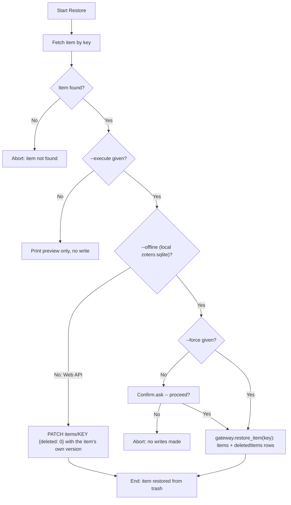

# DOC-SPEC: item restore

## 1. Classification
- **Level:** 🟡 MODIFICATION (with `--offline` writes directly to a live file)
- **Target Audience:** Researcher / Library Manager

## 2. Logic Flow (Visual Synthesis)

```mermaid
graph TD
    A["Start Restore"] --> D["Fetch item by key"]
    D --> E{"Item found?"}
    E -- "No" --> F["Abort: item not found"]
    E -- "Yes" --> G{"--execute given?"}
    G -- "No" --> H["Print preview only, no write"]
    G -- "Yes" --> B{"--offline (local zotero.sqlite)?"}
    B -- "No: Web API" --> L1["PATCH items/KEY {deleted: 0} with the item's own version"]
    B -- "Yes" --> I{"--force given?"}
    I -- "No" --> J["Confirm.ask -- proceed?"]
    J -- "No" --> K["Abort: no writes made"]
    I -- "Yes" --> L2["gateway.restore_item(key): items + deletedItems rows"]
    J -- "Yes" --> L2
    L1 --> O["End: item restored from trash"]
    L2 --> O
```

## 3. Synopsis
Takes a single item out of Zotero's trash, as restoring it in Zotero Desktop would: through the Web API online, or by writing Desktop's own rows to the local `zotero.sqlite` with `--offline`. Reverses `item trash`.

## 4. Description (Instructional Architecture)
**Online** (the default) `item restore` clears the item's `deleted` flag through the Web API, with the item's own version in `If-Unmodified-Since-Version` (Issue #402). The item leaves the trash and is back in the collections it was in. If it changed on the server since it was read, the write is refused and the command exits 1.

**With `--offline`** it replicates what Zotero Desktop's own client code writes when you restore an item from its trash UI (`item.deleted = false; item.save()`, confirmed against Desktop's actual source): it bumps `dateModified`/`clientDateModified`, marks the row dirty (`synced=0`) so Desktop's next real sync pushes the change, and removes the `deletedItems` row.

**Known limitation:** Zotero Desktop's own restore also strips any `dc:replaces` relations left on the item by a prior `item merge` (undoing merge history). This command does **not** replicate that - it's a narrow edge case (only matters if the item was previously the loser of a merge), and guessing at the Relations table's on-disk bookkeeping risked writing bad relation data rather than doing nothing. If you restore a previously-merged-away item, its merge relation (if any) is left as-is.

Like `item trash`, both paths are preview-only by default (`--execute` required); the offline path also asks for confirmation unless `--force` is given.

**Safety (Issue #417, offline only):** writing to `zotero.sqlite` directly is not supported by Zotero, so prefer online mode where you can. Before the first write of a run, zotero-cli copies the database to `zotero.sqlite.zotero-cli-bak` (mode 0600) and says so. Close Zotero Desktop first; if it's busy writing, the command fails with a clear message.

## 5. Parameter Matrix
| Flag / Parameter | Type | Description | Ergonomic Note |
| :--- | :--- | :--- | :--- |
| `--key` | String | The Zotero Item Key to restore | Required. |
| `--execute` | Flag | Actually perform the write | Without it, only a preview is printed. |
| `--force` | Flag | Skip the interactive confirmation prompt | Only asked with `--offline`; still requires `--execute`. |

## 6. Scenario-Based Examples (Cognitive Anchors)
### Scenario: Undoing an accidental trash
**Problem:** I ran `item trash --key ABCD1234 --execute` by mistake and want it back.
**Action:** `zotero-cli item restore --key "ABCD1234" --execute`
**Result:** The item leaves the trash and appears normally again, in its old collections (add `--offline` to do it in the local `zotero.sqlite` instead).

## 7. Cognitive Safeguards
- **Common Failure Modes:** Trying to restore an item that Desktop's "Empty Trash" already permanently deleted - restore only works before that point, since `deletedItems`'s row for it no longer exists.
- **Safety Tips:** With `--offline`, close Zotero Desktop first to avoid a database lock. If the item was previously merged away via `item merge`, its merge-relation bookkeeping is not restored - see the Known Limitation above.
