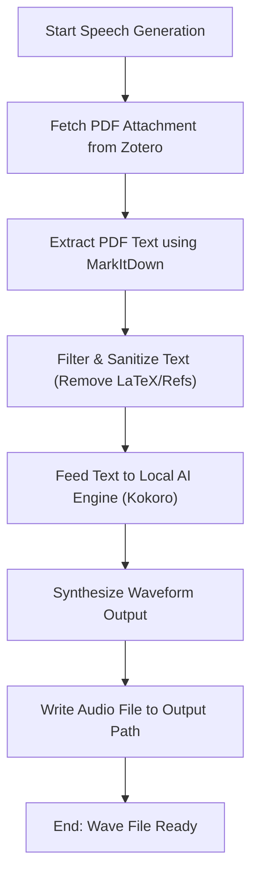

# DOC-SPEC: item speech

## 1. Classification
- **Level:** 🟢 READ-ONLY (Local Audio Synthesis)
- **Target Audience:** Researchers / Auditory Learners

## 2. Logic Flow (Visual Synthesis)

## 3. Synopsis
Extracts full text from an item's PDF attachment, cleans it to remove citation noise, and converts it to spoken audio using a local speech synthesis engine.

## 4. Description (Instructional Architecture)
The `item speech` command converts research articles into audio format for offline auditory review. It uses Microsoft's `markitdown` library to extract plain text from paper PDFs, runs the text through a text cleaning filter (which strips inline citations, URLs, and LaTeX blocks), and synthesizes spoken English using the offline `Kokoro` local speech model.

## 5. Parameter Matrix
| Flag / Parameter | Type | Description | Ergonomic Note |
| :--- | :--- | :--- | :--- |
| `--key` | String | Item Key | Required. |
| `--output` | String | Output audio file path (.wav) | Required. |
| `--voice` | String | Override default voice | Optional. |

## 6. Scenario-Based Examples (Cognitive Anchors)
### Scenario: Converting a newly imported paper to speech
**Problem:** I want to listen to a paper while walking.
**Action:** `zotero-cli item speech --key "ABCD1234" --output "paper.wav"`
**Result:** The PDF is retrieved, parsed, cleaned, and a high-quality `paper.wav` is written locally.

## 7. Cognitive Safeguards
- **Common Failure Modes:** Attempting to run this command when the item has no PDF attachment or when the local AI speech dependencies (like `soundfile` or model weights) are missing.
- **Safety Tips:** Ensure your system has sufficient RAM (around 1GB) and that the `.venv` is fully configured with required packages.
