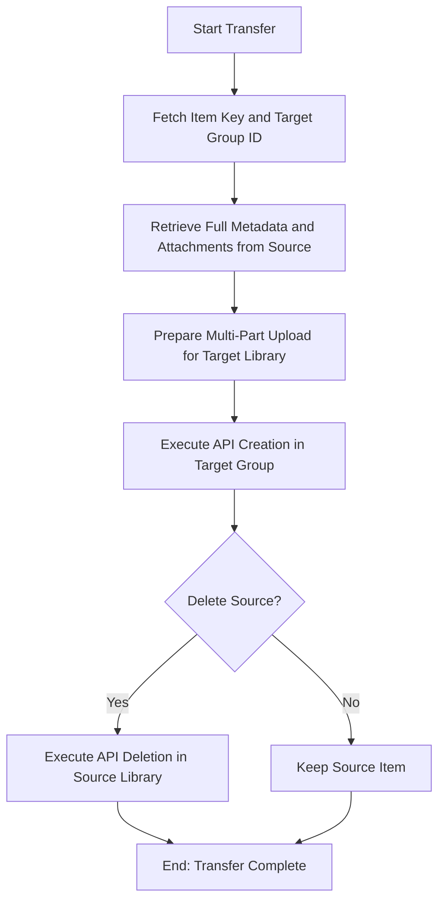

# DOC-SPEC: item transfer

## 1. Classification
- **Level:** [🟡 MODIFICATION (Cross-Library) | 🔴 DESTRUCTIVE (If --delete-source)]
- **Target Audience:** Researcher / Collaborative Lead

## 2. Logic Flow (Visual Synthesis)

## 3. Synopsis
Copies or moves a research item (including its metadata and PDF attachments) from your personal library to a Zotero group library, or between different groups.

## 4. Description (Instructional Architecture)
The `item transfer` command facilitates cross-boundary research collaboration. It bridges the gap between your private research environment and shared group spaces. 

The command performs a "Deep Copy" of the item: it fetches the complete JSON metadata and all physical file attachments from the source library and reconstructs them in the target library. This ensures that no data is lost during the move. If the `--delete-source` flag is used, the command acts as a true move operation by removing the item from the original location once the transfer is verified.

## 5. Parameter Matrix
| Flag | Type | Description | Ergonomic Note |
| :--- | :--- | :--- | :--- |
| `--key` | String | Unique Zotero Item Key (e.g., `ABCD1234`). | Required. |
| `--target-group` | String | The numeric ID or Name of the destination group. | Required. |
| `--delete-source` | Flag | Deletes the item from the source library after successful transfer. | Optional. Defaults to copying. |

## 6. Scenario-Based Examples (Cognitive Anchors)
### Scenario: Moving a paper to a shared project group
**Problem:** I've found a perfect paper in my personal library and I want to share it with my lab's Zotero group (ID: `987654`).
**Action:** `zotero-cli item transfer --key "ABCD1234" --target-group "987654"`
**Result:** A duplicate of the paper and its PDF is created in the lab's group library.

## 7. Cognitive Safeguards
- **Common Failure Modes:** Attempting to transfer to a group for which you do not have "Write" permissions. 
- **Safety Tips:** Always verify that the target group ID is correct by running `system groups`. Cross-library transfers can take time depending on the size of the PDF attachments.
