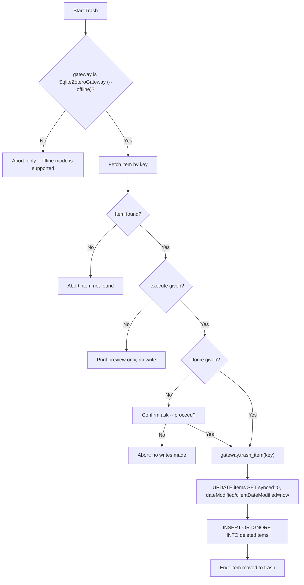

# DOC-SPEC: item trash

## 1. Classification
- **Level:** 🟡 MODIFICATION (Reversible via `item restore`, writes directly to a live file)
- **Target Audience:** Researcher / Library Manager (offline mode only)

## 2. Logic Flow (Visual Synthesis)

## 3. Synopsis
Moves a single item into Zotero's trash by writing directly to the local `zotero.sqlite`, in `--offline` mode only.

## 4. Description (Instructional Architecture)
`item trash` replicates, statement-for-statement, what Zotero Desktop's own client code writes when you delete an item from its UI (`Zotero.Items.trash()`/`trashTx()`, confirmed against Desktop's actual source): it bumps `dateModified`/`clientDateModified`, marks the row dirty (`synced=0`) so Desktop's next real sync pushes the deletion to zotero.org, and adds a row to `deletedItems`. It deliberately does **not** touch `version` - only the server assigns that on a successful sync, and writing a fake bump locally would desync the item from the server's view of history.

This is the **only write path** `SqliteZoteroGateway` exposes today; every other offline mutation is still rejected (`Offline mode is read-only`). It exists because trash/restore is the one operation with genuine round-trip fidelity with Zotero Desktop - the same `zotero.sqlite` file Desktop reads, written the same way Desktop itself writes it.

Because this touches a file Zotero Desktop may have open, the command is preview-only by default: nothing is written until `--execute` is passed, and an interactive confirmation is shown unless `--force` is also given. If Desktop is actively writing to the database when this runs, the write retries briefly and then fails cleanly with a clear "database is locked" message - it cannot corrupt the file, only fail to acquire the lock in time.

Online/API mode is **not supported**: the Zotero Web API has no documented, reversible trash write, only a permanent `DELETE` (see `item delete`). Running this command against an online gateway prints a clear rejection rather than silently doing a hard delete.

## 5. Parameter Matrix
| Flag / Parameter | Type | Description | Ergonomic Note |
| :--- | :--- | :--- | :--- |
| `--key` | String | The Zotero Item Key to trash | Required. |
| `--execute` | Flag | Actually perform the write | Without it, only a preview is printed. |
| `--force` | Flag | Skip the interactive confirmation prompt | Still requires `--execute`. |

## 6. Scenario-Based Examples (Cognitive Anchors)
### Scenario: Cleaning up a duplicate found while working offline
**Problem:** I want to trash item `ABCD1234` in my local library, the same as clicking delete in Zotero Desktop.
**Action:** `zotero-cli item trash --key "ABCD1234" --offline --execute`
**Result:** The item is moved to the trash in `zotero.sqlite`. It appears in Zotero Desktop's trash next time Desktop opens or syncs.

## 7. Cognitive Safeguards
- **Common Failure Modes:** Running without `--offline` (only supported offline today); expecting this to work against the live API. Running it while Zotero Desktop is actively writing to the same file - fails cleanly with a lock error, doesn't corrupt anything.
- **Safety Tips:** Close Zotero Desktop first to avoid a database lock. Reversible via `item restore`, unless you also run Desktop's "Empty Trash" in the meantime.
