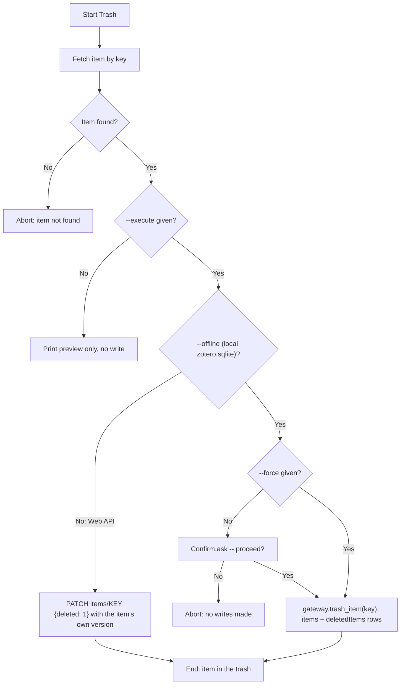

# DOC-SPEC: item trash

## 1. Classification
- **Level:** 🟡 MODIFICATION (Reversible via `item restore`; with `--offline` writes directly to a live file)
- **Target Audience:** Researcher / Library Manager

## 2. Logic Flow (Visual Synthesis)

```mermaid
graph TD
    A["Start Trash"] --> D["Fetch item by key"]
    D --> E{"Item found?"}
    E -- "No" --> F["Abort: item not found"]
    E -- "Yes" --> G{"--execute given?"}
    G -- "No" --> H["Print preview only, no write"]
    G -- "Yes" --> B{"--offline (local zotero.sqlite)?"}
    B -- "No: Web API" --> L1["PATCH items/KEY {deleted: 1} with the item's own version"]
    B -- "Yes" --> I{"--force given?"}
    I -- "No" --> J["Confirm.ask -- proceed?"]
    J -- "No" --> K["Abort: no writes made"]
    I -- "Yes" --> L2["gateway.trash_item(key): items + deletedItems rows"]
    J -- "Yes" --> L2
    L1 --> O["End: item in the trash"]
    L2 --> O
```

## 3. Synopsis
Moves a single item into Zotero's trash, exactly as deleting it in Zotero Desktop would: through the Web API online, or by writing Desktop's own rows to the local `zotero.sqlite` with `--offline`.

## 4. Description (Instructional Architecture)
**Online** (the default) `item trash` sets the item's `deleted` flag through the Web API, with the item's own version in `If-Unmodified-Since-Version` (Issue #402). That is the property Zotero Desktop syncs, so the item shows up in Desktop's trash, keeps its collections, and `item restore` (or Desktop) brings it back. If the item changed on the server since it was read, the write is refused, nothing is trashed, and the command exits 1.

**With `--offline`** it replicates, statement-for-statement, what Zotero Desktop's own client code writes when you delete an item from its UI (`Zotero.Items.trash()`/`trashTx()`, confirmed against Desktop's actual source): it bumps `dateModified`/`clientDateModified`, marks the row dirty (`synced=0`) so Desktop's next real sync pushes the deletion to zotero.org, and adds a row to `deletedItems`. It deliberately does **not** touch `version` - only the server assigns that on a successful sync.

Both paths are preview-only by default: nothing is written until `--execute` is passed. The offline path touches a file Zotero Desktop may have open, so it also asks for confirmation unless `--force` is given; the online path is recoverable and versioned, so `--execute` alone is enough. If Desktop is actively writing to the database when an offline trash runs, the write retries briefly and then fails cleanly with a "database is locked" message - it cannot corrupt the file, only fail to acquire the lock in time.

**Safety (Issue #417, offline only):** writing to `zotero.sqlite` directly is not supported by Zotero, so prefer online mode where you can. Before the first write of a run, zotero-cli copies the database to `zotero.sqlite.zotero-cli-bak` (mode 0600) and says so. The item key is looked up only in your configured library. If that library can't be matched in `zotero.sqlite` and the key exists in more than one synced library, the command refuses instead of guessing. Close Zotero Desktop first; if it's busy writing, the command fails with a clear message.

## 5. Parameter Matrix
| Flag / Parameter | Type | Description | Ergonomic Note |
| :--- | :--- | :--- | :--- |
| `--key` | String | The Zotero Item Key to trash | Required. |
| `--execute` | Flag | Actually perform the write | Without it, only a preview is printed. |
| `--force` | Flag | Skip the interactive confirmation prompt | Only asked with `--offline`; still requires `--execute`. |

## 6. Scenario-Based Examples (Cognitive Anchors)
### Scenario: Getting rid of a duplicate in a way I can undo
**Problem:** I want to trash item `ABCD1234`, the same as clicking delete in Zotero Desktop.
**Action:** `zotero-cli item trash --key "ABCD1234" --execute`
**Result:** The item is in the trash, in the library and in Zotero Desktop after its next sync.

### Scenario: The same, against the local database
**Action:** `zotero-cli --offline item trash --key "ABCD1234" --execute`
**Result:** The item is moved to the trash in `zotero.sqlite`. It appears in Zotero Desktop's trash next time Desktop opens or syncs.

## 7. Cognitive Safeguards
- **Common Failure Modes:** The item changed on the server since it was read (run the command again). With `--offline`: running it while Zotero Desktop is actively writing to the same file - fails cleanly with a lock error, doesn't corrupt anything.
- **Safety Tips:** Reversible via `item restore`, unless you also run Desktop's "Empty Trash" in the meantime. With `--offline`, close Zotero Desktop first to avoid a database lock.
